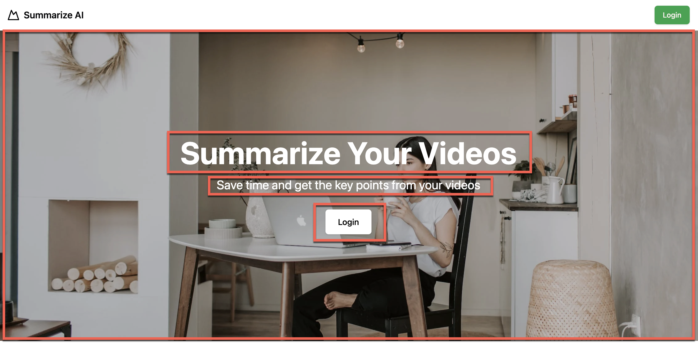
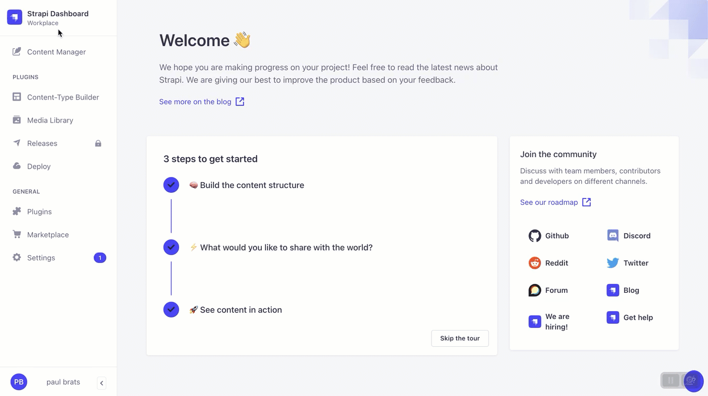
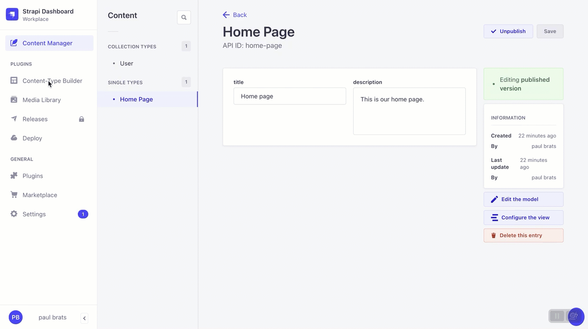
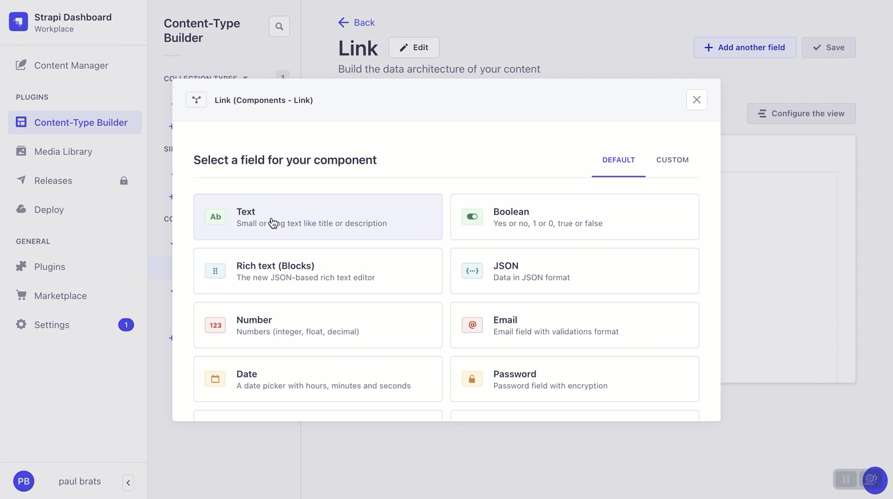
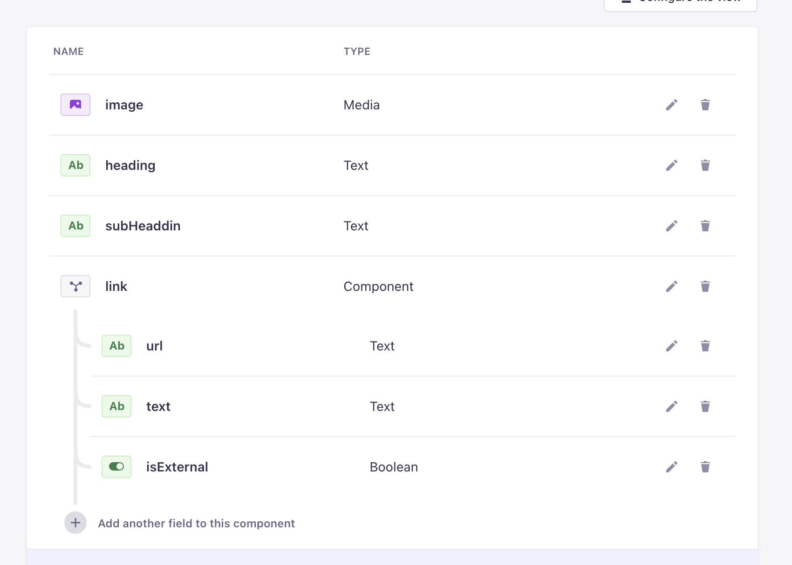
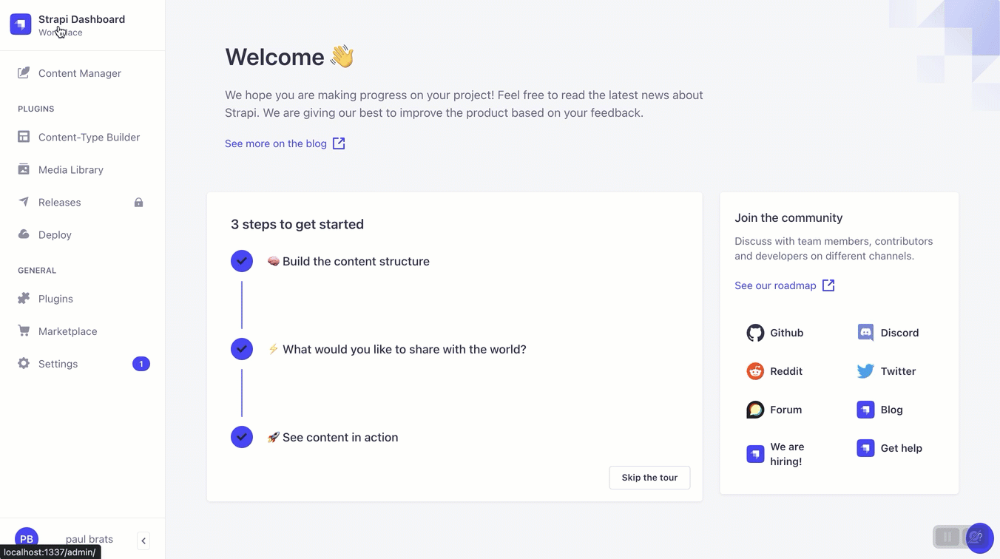
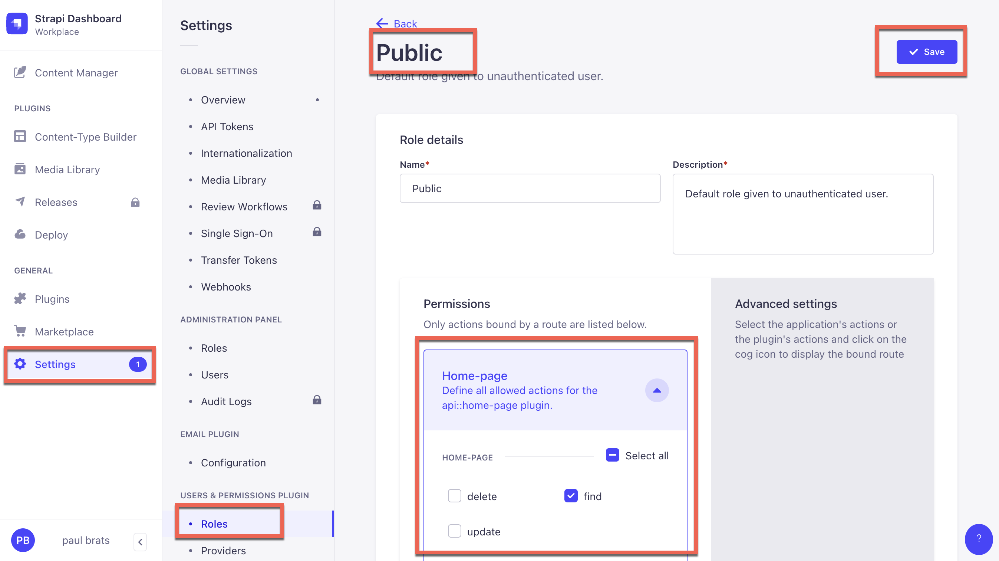
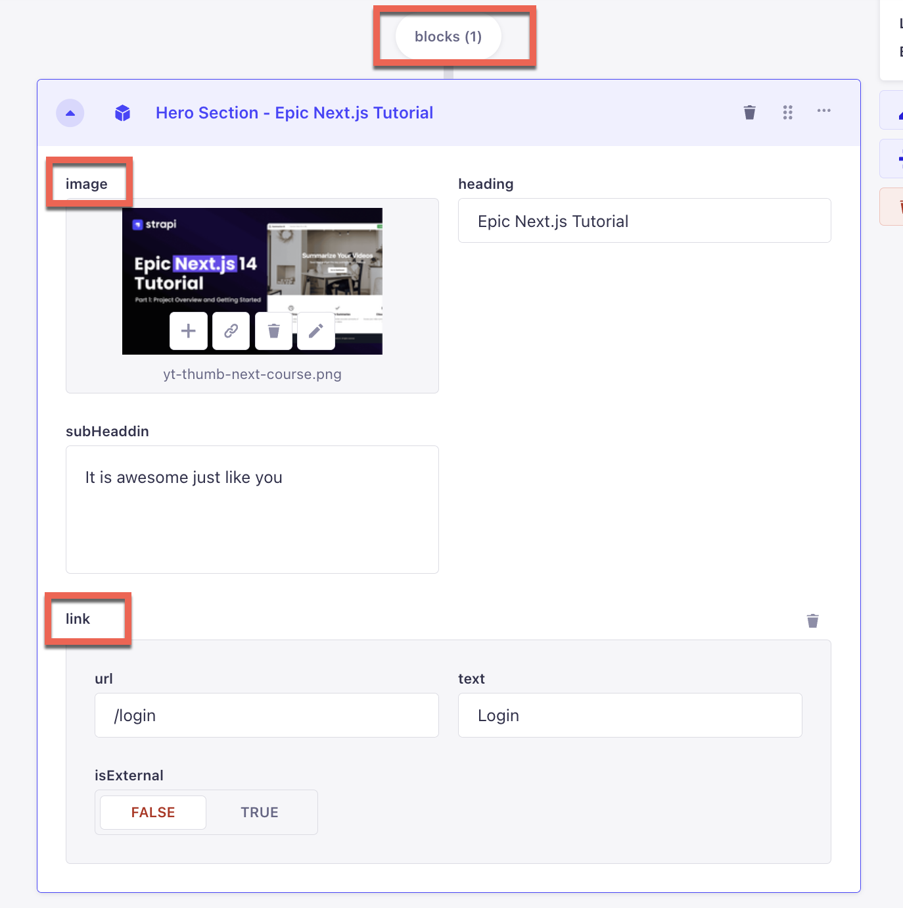
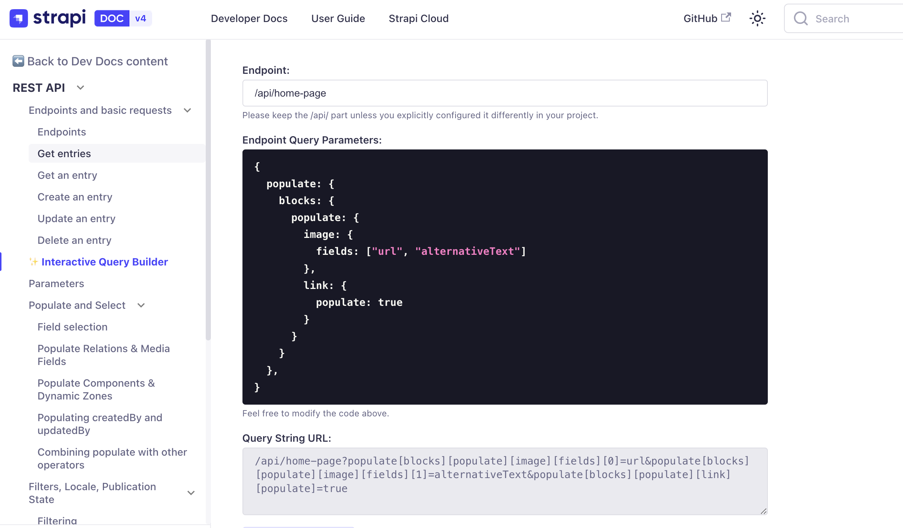
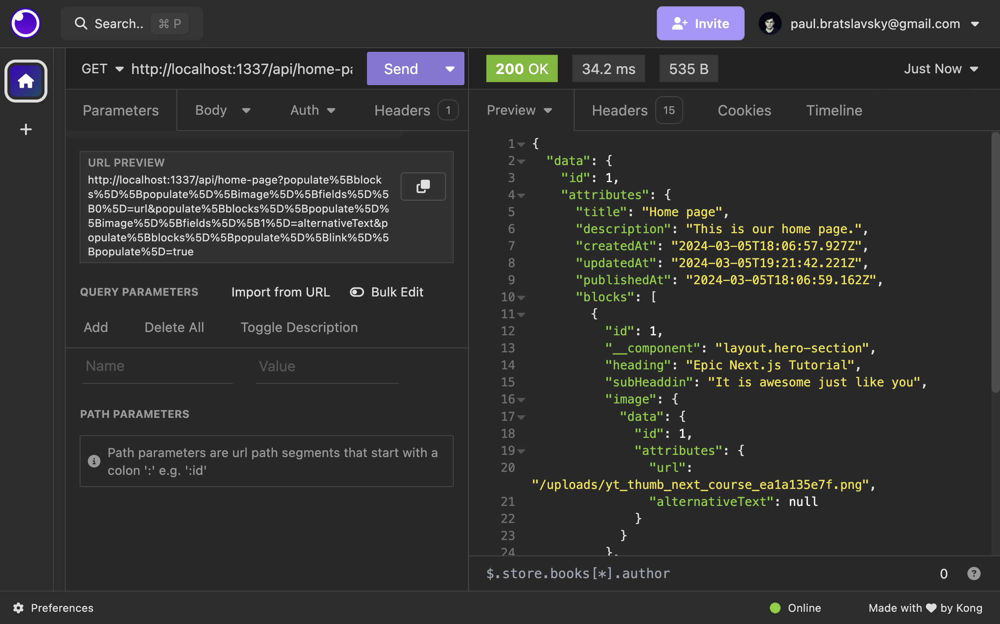

# Epic Next JS 14 Tutorial: Learn Next JS by building a real-life project. Part 1: Building Out The Home Page

In this post, we will start by building our home page. We will focus on the **Hero Component** and **Features Component** and use **Dynamic Zone** to allow our Strapi admins to choose which component they would like to use.


If you missed the first part of this series, you can check it out [here](https://strapi.io/blog/epic-next-js-14-tutorial-learn-next-js-by-building-a-real-life-project-part-1-2).

Once we have our data being returned by our Strapi API we will move on to building out those same components within our Next JS app.

Our goal, is to have both our Hero Section and Features Sections to display on our Next application. So let's get started.

## Structuring Our Data In Strapi

In Strapi there are many ways of structuring your data, you can create `single types`, `collection-types`, as well as `components` that allow you to create reusable content types that you can use in multiple places.

For our Hero Section and Features Section we will build them as components.

Let's start by building out our Hero Section Component.

### Building The Hero Section Component

Looking at our Hero Section UI we can break it down into following parts.



We have the following items:

- Image
- Heading
- Subheading
- Link

So let's jump into our Strapi Admin and create our Hero Component.

Let's start by navigating to `Content-Type Builder` under `COMPONENTS` and clicking on `Create new component.`



We will create the following fields.

Media -> Single Media - image
Text -> Short Text - heading
Text -> Long Text - subHeading

note: for media in advanced setting change to only allow images.


For our link we will create a component that we can reuse.

Go ahead and create a new component called **Link** and save it under **components**.



Our Link component will have the following fields.
Text -> Short Text -> url
Text -> Short Text -> text
Boolean -> isExternal

note: for isExternal in advanced setting change default value to be set to false.

Let's go ahead and add them now.



Finally let's go back to our **Hero Section** component and add our newly created **Link** component.


The following completed fields in our **Hero Section** component should look like the following.



Finally, let's add our newly created component to our **Home Page** via dynamic zones.



We can accomplish this by going to `Content-Type Builder` selecting the **Home Page** under `SINGLE TYPES` and clicking on `Add another field to this single type`.

The select the `Dynamic Zone` field, give it a name called `blocks` and click on `Add components to the zone`.

Finally select `Use an existing component` and select our **Hero Section** component.

Great we now have our first component that has been added to our **Home Page**

Before creating our **Features Section** component let's see if we can get our current component from our API.

### Fetching The Hero Section Component Data

First, let's add some data.


Now make sure that we have proper permission in the **Settings**



Now let's test our API call in **Insomnia**. But before we do, we need to specify strapi all the items that we would like to populate.

Looking at our content, we need to tell Strapi to populate the following items `blocks`, `image`, and `link`.



Remember we can use the [Strapi Query Builder](https://docs.strapi.io/dev-docs/api/rest/interactive-query-builder) to construct our query.

We can populate our data with this following query.

```js
{
  populate: {
    blocks: {
      populate: {
        image: {
          fields: ["url", "alternativeText"]
        },
        link: {
          populate: true
        }
      }
    }
  },
}

```

Using the query builder it will generate the following LHS syntax query.



`/api/home-page?populate[blocks][populate][image][fields][0]=url&populate[blocks][populate][image][fields][1]=alternativeText&populate[blocks][populate][link][populate]=true`

To learn more about populate and filtering you can read the following [blog post](https://strapi.io/blog/demystifying-strapi-s-populate-and-filtering).

Here is the [complete URL](http://localhost:1337/api/home-page?populate[blocks][populate][image][fields][0]=url&populate[blocks][populate][image][fields][1]=alternativeText&populate[blocks][populate][link][populate]=true)



After making a `GET` request in **Insomnia** we will get the following data.

```json
{
  "data": {
    "id": 1,
    "attributes": {
      "title": "Home page",
      "description": "This is our home page.",
      "createdAt": "2024-03-05T18:06:57.927Z",
      "updatedAt": "2024-03-05T19:21:42.221Z",
      "publishedAt": "2024-03-05T18:06:59.162Z",
      "blocks": [
        {
          "id": 1,
          "__component": "layout.hero-section",
          "heading": "Epic Next.js Tutorial",
          "subHeaddin": "It is awesome just like you",
          "image": {
            "data": {
              "id": 1,
              "attributes": {
                "url": "/uploads/yt_thumb_next_course_ea1a135e7f.png",
                "alternativeText": null
              }
            }
          },
          "link": {
            "id": 1,
            "url": "/login",
            "text": "Login",
            "isExternal": false
          }
        }
      ]
    }
  },
  "meta": {}
}
```

Now that we know our Strapi API works, let's move in to the frontend of our project fetch our new data and create our **Hero Section** React component.

## Fetching Our Home Page Data In The Frontend

