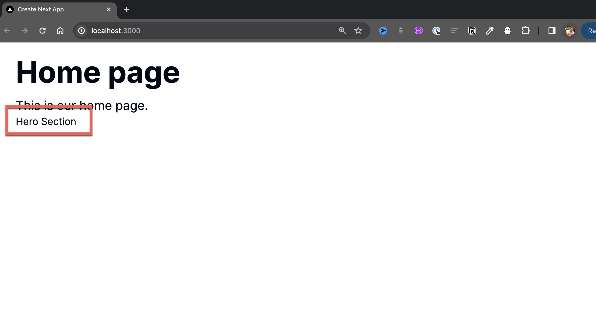

# Epic Next JS 14 Tutorial: Learn Next JS by building a real-life project. Part 2: Building Out The Home Page

In this post, we will start by building our home page. We will focus on the **Hero Component** and **Features Component** and use **Dynamic Zone** to allow our Strapi admins to choose which component they want to use.


If you missed the first part of this series, you can check it out [here](https://strapi.io/blog/epic-next-js-14-tutorial-learn-next-js-by-building-a-real-life-project-part-1-2).

Once our data is returned by our Strapi API, we will build out those same components within our Next JS app.

Our goal is to display our Hero Section and Features Sections on our Next application. So let's get started.

## Structuring Our Data In Strapi

In Strapi, there are many ways of structuring your data; you can create `single types,` `collection types,` and `components` that allow you to create reusable content types that you can use in multiple places.

We will build our Hero Section and Features Section as components.

Let's start by building out our Hero Section Component.

### Building The Hero Section Component

Looking at our Hero Section UI, we can break it down into the following parts.


We have the following items:

- Image
- Heading
- Subheading
- Link

So, let's jump into our Strapi Admin and create our Hero Component.

Let's start by navigating to `Content-Type Builder` under `COMPONENTS` and clicking on `Create new component.`


We will create the following fields.

Media -> Single Media - image
Text -> Short Text - heading
Text -> Long Text - subHeading

Note: Change it to only allow images for media in advanced settings.


For our link, we will create a component that we can reuse.

Go ahead and create a new component called **Link** and save it under **components**.


Our Link component will have the following fields.
Text -> Short Text -> url
Text -> Short Text -> text
Boolean -> isExternal

Note: for isExternal in the advanced setting, change the default value to be set to false.

Let's go ahead and add them now.


Finally, please return to our **Hero Section** component and add our newly created **Link** component.


The completed fields in our **Hero Section** component should look like the following:


Finally, let's add our newly created component to our **Home Page** via dynamic zones.


We can accomplish this by going to `Content-Type Builder,` selecting the **Home Page** under `SINGLE TYPES` and clicking on `Add another field to this single type.`

Select the `Dynamic Zone` field, give it a name called `blocks,` and click `Add components to the zone.`

Finally, select `Use an existing component` and choose our **Hero Section** component.

Great, we now have our first component that has been added to our **Home Page**

Before creating our **Features Section** component, let's see if we can get our current component from our API.

### Fetching The Hero Section Component Data

First, let's add some data.


Now make sure that we have proper permission in the **Settings**


Now, let's test our API call in **Insomnia**. But before we do, we need to specify strapi all the items we would like to populate.

Looking at our content, we need to tell Strapi to populate the following items: `blocks,` `image,` and `link.`


Remember, we can construct our query using the [Strapi Query Builder](https://docs.strapi.io/dev-docs/api/rest/interactive-query-builder).

We can populate our data with the following query.

```js
{
  populate: {
    blocks: {
      populate: {
        image: {
          fields: ["url", "alternativeText"]
        },
        link: {
          populate: true
        }
      }
    }
  },
}

```

Using the query builder, the following LHS syntax query will be generated.


`/api/home-page?populate[blocks][populate][image][fields][0]=url&populate[blocks][populate][image][fields][1]=alternativeText&populate[blocks][populate][link][populate]=true`

To learn more about populating and filtering, read the following [blog post](https://strapi.io/blog/demystifying-strapi-s-populate-and-filtering).

Here is the [complete URL](http://localhost:1337/api/home-page?populate[blocks][populate][image][fields][0]=url&populate[blocks][populate][image][fields][1]=alternativeText&populate[blocks][populate][link][populate]=true)


We will get the following data after making a `GET` request in **Insomnia**.

```json
{
  "data": {
    "id": 1,
    "attributes": {
      "title": "Home page",
      "description": "This is our home page.",
      "createdAt": "2024-03-05T18:06:57.927Z",
      "updatedAt": "2024-03-05T19:21:42.221Z",
      "publishedAt": "2024-03-05T18:06:59.162Z",
      "blocks": [
        {
          "id": 1,
          "__component": "layout.hero-section",
          "heading": "Epic Next.js Tutorial",
          "subHeading": "It is awesome just like you",
          "image": {
            "data": {
              "id": 1,
              "attributes": {
                "url": "/uploads/yt_thumb_next_course_ea1a135e7f.png",
                "alternativeText": null
              }
            }
          },
          "link": {
            "id": 1,
            "url": "/login",
            "text": "Login",
            "isExternal": false
          }
        }
      ]
    }
  },
  "meta": {}
}
```

Now that we know our Strapi API works, let's move into the frontend of our project, fetch our new data, and create our **Hero Section** React component.

## Fetching Our Home Page Data In The Frontend

Taking a look at our frontend code, this is what we have so far.

```jsx
async function getStrapiData(path: string) {
  const baseUrl = "http://localhost:1337";
  try {
    const response = await fetch(baseUrl + path);
    const data = await response.json();
    return data;
  } catch (error) {
    console.error(error);
  }
}

export default async function Home() {
  const strapiData = await getStrapiData("/api/home-page");

  const { title, description } = strapiData.data.attributes;

  return (
    <main className="container mx-auto py-6">
      <h1 className="text-5xl font-bold">{title}</h1>
      <p className="text-xl mt-4">{description}</p>
    </main>
  );
}
```

If we console log `strapiData,` we will notice that we are not yet getting all our fields.

```js
{
  data: {
    id: 1,
    attributes: {
      title: 'Home page',
      description: 'This is our home page.',
      createdAt: '2024-03-05T18:06:57.927Z',
      updatedAt: '2024-03-05T18:06:59.164Z',
      publishedAt: '2024-03-05T18:06:59.162Z'
    }
  },
  meta: {}
}
```

That is because we need to tell Strapi what items we would like to populate. We already know how to do this; it is what we did earlier in the section when using Strapi Query Builder.

We will use the previous query that we defined previously.

```js
{
  populate: {
    blocks: {
      populate: {
        image: {
          fields: ["url", "alternativeText"]
        },
        link: {
          populate: true
        }
      }
    }
  },
}

```

But to make this work, we must first install the `qs` package from NPM. You can learn more about it [here](https://www.npmjs.com/package/qs).

It will allow us to generate our query string by passing our object from above.

Let's run the following two commands in the front end of our project.

This will add `qs`.

```bash
  yarn add qs
```

This will add the types.

```bash
  yarn add @types/qs
```

Now that we have installed our `qs` package, we can construct our query and refactor our `getStrapiData` function.

Let's add the following changes to your `page.tsx` file.

First let's import the `qs` library.

```jsx
import qs from "qs";
```

Define our query.

```jsx
const homePageQuery = qs.stringify({
  populate: {
    blocks: {
      populate: {
        image: {
          fields: ["url", "alternativeText"],
        },
        link: {
          populate: true,
        },
      },
    },
  },
});
```

Finally, let's update our `getStrapiData` function.

We will use the `URL` to construct our final path; you can learn more about it in the [MDN docs](https://developer.mozilla.org/en-US/docs/Web/API/URL/URL).

Our updated function will look like the following.

```jsx
async function getStrapiData(path: string) {
  const baseUrl = "http://localhost:1337";

  const url = new URL(path, baseUrl);
  url.search = homePageQuery;

  try {
    const response = await fetch(url.href);
    const data = await response.json();
    return data;
  } catch (error) {
    console.error(error);
  }
}
```

The final code will look as follows:

```jsx
import qs from "qs";

const homePageQuery = qs.stringify({
  populate: {
    blocks: {
      populate: {
        image: {
          fields: ["url", "alternativeText"],
        },
        link: {
          populate: true,
        },
      },
    },
  },
});

async function getStrapiData(path: string) {
  const baseUrl = "http://localhost:1337";

  const url = new URL(path, baseUrl);
  url.search = homePageQuery;

  try {
    const response = await fetch(url.href);
    const data = await response.json();
    return data;
  } catch (error) {
    console.error(error);
  }
}

export default async function Home() {
  const strapiData = await getStrapiData("/api/home-page");

  console.dir(strapiData, { depth: null });

  const { title, description } = strapiData.data.attributes;

  return (
    <main className="container mx-auto py-6">
      <h1 className="text-5xl font-bold">{title}</h1>
      <p className="text-xl mt-4">{description}</p>
    </main>
  );
}
```

When we look at our response in the terminal, we should see that Strapi has returned all of our requested data.

```js
{
  data: {
    id: 1,
    attributes: {
      title: 'Home page',
      description: 'This is our home page.',
      createdAt: '2024-03-05T18:06:57.927Z',
      updatedAt: '2024-03-05T19:21:42.221Z',
      publishedAt: '2024-03-05T18:06:59.162Z',
      blocks: [
        {
          id: 1,
          __component: 'layout.hero-section',
          heading: 'Epic Next.js Tutorial',
          subHeading: 'It is awesome just like you',
          image: {
            data: {
              id: 1,
              attributes: {
                url: '/uploads/yt_thumb_next_course_ea1a135e7f.png',
                alternativeText: null
              }
            }
          },
          link: { id: 1, url: '/login', text: 'Login', isExternal: false }
        }
      ]
    }
  },
  meta: {}
}

```

## Let's Create Our Hero Section Component

Before we can render our section data, let's create our **Hero Section** component.

We will start with the basics to ensure that we can display our data, and then we will style the UI with Tailwind and Shadcn.

Inside the `components` let's create a new folder called `custom`, this is where we will add all of our components that we will create.

Inside the `custom` folder let's create a bare component called `HeroSection.tsx`.

We will add the following code to get started.

```jsx
export function HeroSection({ data } : { readonly data: any }) {
  console.dir(data, { depth: null })
  return (
    <div>Hero Section</div>
  )
}
```

We will update the types later, but for now we will do the `I don't know TS` and just use `any`;

Now that we have our basic component, let's imported in our home page.

```jsx
import qs from "qs";
import { HeroSection } from "@/components/custom/HeroSection";

const homePageQuery = qs.stringify({
  populate: {
    blocks: {
      populate: {
        image: {
          fields: ["url", "alternativeText"],
        },
        link: {
          populate: true,
        },
      },
    },
  },
});

async function getStrapiData(path: string) {
  const baseUrl = "http://localhost:1337";

  const url = new URL(path, baseUrl);
  url.search = homePageQuery;

  try {
    const response = await fetch(url.href);
    const data = await response.json();
    return data;
  } catch (error) {
    console.error(error);
  }
}

export default async function Home() {
  const strapiData = await getStrapiData("/api/home-page");

  const { title, description, blocks } = strapiData.data.attributes;

  console.dir(blocks, { depth: null });

  return (
    <main className="container mx-auto py-6">
      <h1 className="text-5xl font-bold">{title}</h1>
      <p className="text-xl mt-4">{description}</p>
      <HeroSection data={blocks[0]} />
    </main>
  );
}
```

We should see the following output when running our app. Notice we are able to see our **HeroSection** component.



Now let's build out our component. Let's add the following code to get us started.

```jsx
import Link from "next/link";

export function HeroSection({ data }: { readonly data: any }) {
  console.dir(data, { depth: null });
  return (
    <header className="relative h-[600px] overflow-hidden">
      
      <div className="relative z-10 flex flex-col items-center justify-center h-full text-center text-white bg-black bg-opacity-20">
        <h1 className="text-4xl font-bold md:text-5xl lg:text-6xl">
          Summarize Your Videos
        </h1>
        <p className="mt-4 text-lg md:text-xl lg:text-2xl">
          Save time and get the key points from your videos
        </p>
        <Link
          className="mt-8 inline-flex items-center justify-center px-6 py-3 text-base font-medium text-black bg-white rounded-md shadow hover:bg-gray-100"
          href="/login"
        >
          Login
        </Link>
      </div>
    </header>
  );
}
```

Everything is currently hardcoded but we will fix it in just a little bit.

And do make sure that everything looks good, let's update our code in `page.tsx` to remove the original styles we added in the `<main>` html tag.

```jsx
return (
  <main>
    <HeroSection data={blocks[0]} />
  </main>
);
```

Now our UI should look like the following.


And the final code in the `page.tsx` file should reflect the following changes.

```jsx
import qs from "qs";
import { HeroSection } from "@/components/custom/HeroSection";

const homePageQuery = qs.stringify({
  populate: {
    blocks: {
      populate: {
        image: {
          fields: ["url", "alternativeText"],
        },
        link: {
          populate: true,
        },
      },
    },
  },
});

async function getStrapiData(path: string) {
  const baseUrl = "http://localhost:1337";

  const url = new URL(path, baseUrl);
  url.search = homePageQuery;

  try {
    const response = await fetch(url.href);
    const data = await response.json();
    return data;
  } catch (error) {
    console.error(error);
  }
}

export default async function Home() {
  const strapiData = await getStrapiData("/api/home-page");

  const { blocks } = strapiData.data.attributes;

  console.dir(blocks, { depth: null });

  return (
    <main>
      <HeroSection data={blocks[0]} />
    </main>
  );
}
```

Before we continue, let's do a small quality of live improvement change.

## Flatten Our Strapi Response

If we take a look at our Strapi response, we will notice that we have `data` and `attributes` fields, and if we had a deeper nested response, it would have deeply nested structure that would follow the `data` -> `attributes` pattern.

```js
{
  id: 1,
  __component: 'layout.hero-section',
  heading: 'Epic Next.js Tutorial',
  subHeading: 'It is awesome just like you',
  image: {
    data: {
      id: 1,
      attributes: {
        url: '/uploads/yt_thumb_next_course_ea1a135e7f.png',
        alternativeText: null
      }
    }
  },
  link: { id: 1, url: '/login', text: 'Login', isExternal: false }
}

```

Let's use a flattenData function to have our response look like the following.

```js
{
  id: 1,
  __component: 'layout.hero-section',
  heading: 'Epic Next.js Tutorial',
  subHeading: 'It is awesome just like you',
  image: {
    id: 1,
    url: '/uploads/yt_thumb_next_course_ea1a135e7f.png',
    alternativeText: null
  },
  link: { id: 1, url: '/login', text: 'Login', isExternal: false }
}

```

I already created the function for us. Let's navigate to `src/lib/utils.ts` and add the following function.

```ts
export function flattenAttributes(data: any): any {
  // Check if data is a plain object; return as is if not
  if (
    typeof data !== "object" ||
    data === null ||
    data instanceof Date ||
    typeof data === "function"
  ) {
    return data;
  }

  // If data is an array, apply flattenAttributes to each element and return as array
  if (Array.isArray(data)) {
    return data.map((item) => flattenAttributes(item));
  }

  // Initialize an object with an index signature for the flattened structure
  let flattened: { [key: string]: any } = {};

  // Iterate over each key in the object
  for (let key in data) {
    // Skip inherited properties from the prototype chain
    if (!data.hasOwnProperty(key)) continue;

    // If the key is 'attributes' or 'data', and its value is an object, merge their contents
    if (
      (key === "attributes" || key === "data") &&
      typeof data[key] === "object" &&
      !Array.isArray(data[key])
    ) {
      Object.assign(flattened, flattenAttributes(data[key]));
    } else {
      // For other keys, copy the value, applying flattenAttributes if it's an object
      flattened[key] = flattenAttributes(data[key]);
    }
  }

  return flattened;
}
```

Now that we have this function, let's update our `getStrapiData` function to the following. But first, make sure that you are importing our newly created function.

```jsx
import { flattenAttributes } from "@/lib/utils";
```

And let's update our `getStrapiData` function to the following.

```jsx
async function getStrapiData(path: string) {
  const baseUrl = "http://localhost:1337";

  const url = new URL(path, baseUrl);
  url.search = homePageQuery;

  try {
    const response = await fetch(url.href);
    const data = await response.json();
    const flattenedData = flattenAttributes(data);
    return flattenedData;
  } catch (error) {
    console.error(error);
  }
}
```

And finally let's update the **Home** component with the following.

```jsx
export default async function Home() {
  const strapiData = await getStrapiData("/api/home-page");

  const { blocks } = strapiData;

  console.dir(blocks, { depth: null });

  return (
    <main>
      <HeroSection data={blocks[0]} />
    </main>
  );
}
```

Our final code in out `page.tsx` file should look like the following.

```jsx
import qs from "qs";
import { flattenAttributes } from "@/lib/utils";

import { HeroSection } from "@/components/custom/HeroSection";

const homePageQuery = qs.stringify({
  populate: {
    blocks: {
      populate: {
        image: {
          fields: ["url", "alternativeText"],
        },
        link: {
          populate: true,
        },
      },
    },
  },
});

async function getStrapiData(path: string) {
  const baseUrl = "http://localhost:1337";

  const url = new URL(path, baseUrl);
  url.search = homePageQuery;

  try {
    const response = await fetch(url.href);
    const data = await response.json();
    const flattenedData = flattenAttributes(data);
    return flattenedData;
  } catch (error) {
    console.error(error);
  }
}

export default async function Home() {
  const strapiData = await getStrapiData("/api/home-page");

  const { blocks } = strapiData;

  console.dir(blocks, { depth: null });

  return (
    <main>
      <HeroSection data={blocks[0]} />
    </main>
  );
}
```

## Continue Working On Our Hero Section Component

Going back to the `HeroSection.tsx` file, let's go ahead and display our Strapi data.

Also, you should not see our flattened response, that will make it easier for us.

```js
{
  id: 1,
  __component: 'layout.hero-section',
  heading: 'Epic Next.js Tutorial',
  subHeading: 'It is awesome just like you',
  image: {
    id: 1,
    url: '/uploads/yt_thumb_next_course_ea1a135e7f.png',
    alternativeText: null
  },
  link: { id: 1, url: '/login', text: 'Login', isExternal: false }
}
```

Let's use this response structure do define our interface.

Let's create the following interfaces.

```jsx
interface Image {
  id: number;
  url: string;
  alternativeText: string | null;
}

interface Link {
  id: number;
  url: string;
  label: string;
}

interface HeroSectionProps {
  id: number;
  __component: string;
  heading: string;
  subHeading: string;
  image: Image;
  link: Link;
}
```

And update our **HeroSection** component use our types.

```js
export function HeroSection({ data }: { readonly data: HeroSectionProps }) {
  // ...rest of the code
}

```

Finally, let's add our data from Strapi instead of hard coding it by making the following changes to our **HeroSection** component.

```jsx
import Link from "next/link";

interface Image {
  id: number;
  url: string;
  alternativeText: string | null;
}

interface Link {
  id: number;
  url: string;
  text: string;
}

interface HeroSectionProps {
  id: number;
  __component: string;
  heading: string;
  subHeading: string;
  image: Image;
  link: Link;
}

export function HeroSection({ data }: { readonly data: HeroSectionProps }) {
  console.dir(data, { depth: null });
  const { heading, subHeading, image, link } = data;
  const imageURL = "http://localhost:1337" + image.url;
  return (
    <header className="relative h-[600px] overflow-hidden">
      
      <div className="relative z-10 flex flex-col items-center justify-center h-full text-center text-white bg-black bg-opacity-20">
        <h1 className="text-4xl font-bold md:text-5xl lg:text-6xl">
          {heading}
        </h1>
        <p className="mt-4 text-lg md:text-xl lg:text-2xl">
          {subHeading}
        </p>
        <Link
          className="mt-8 inline-flex items-center justify-center px-6 py-3 text-base font-medium text-black bg-white rounded-md shadow hover:bg-gray-100"
          href={link.url}
        >
          {link.text}
        </Link>
      </div>
    </header>
  );
}
```

We are now getting and displaying our data from Strapi. There are still more improvements that we must make in this component.

Like to use Next **Image** and not have to hard code "http://localhost:1337" path that we append to our image url but instead should get it from our `.env` variable.

We will do this in the next post, where we will finish up our **Hero Section** component and start working on the **Features Component**

But before I go, let's touch briefly on Next.js caching.

## We Have A Small Problem

Out of the box, Next.js caches things by default.   For instance, if we go to our Strapi Admin, update the image inside our **Hero Section** and restart our app. We will see that the image will not update.


To solve this issue, when we deploy our Strapi app, we will have a hook that will every time we add new content and update our app on Vercel.

But for now, we can disable this feature by using "no-store" flag.

You can read more about it on the Next.js [docs](https://nextjs.org/docs/app/building-your-application/data-fetching/fetching-caching-and-revalidating#opting-out-of-data-caching).

We can make the following update in our `getStrapiData` function inside our `page.tsx` file.

By passing `{ cache: 'no-store' }` inside our fetch, we will opt out of data caching by Next.

``` jsx
async function getStrapiData(path: string) {
  const baseUrl = "http://localhost:1337";

  const url = new URL(path, baseUrl);
  url.search = homePageQuery;

  try {
    const response = await fetch(url.href, { cache: 'no-store' });
    const data = await response.json();
    const flattenedData = flattenAttributes(data);
    return flattenedData;
  } catch (error) {
    console.error(error);
  }
}
```

When we restart our app, we should see the new hero image.


## Conclusion

We are making some great progress. In this post, we started working on displaying our **Hero Section** content.  

In the next post, we will create the **StrapiImage** component using the Next **Image** component to make rendering Strapi images easier. 

Finish up our **Hero Section** and start working on our **Features Section**.

I hope you are enjoying this series so far. Thank you for your time, and I will see you in the next one.

You can find the code in the following repo:
You can find the complimentary video here:


