# Epic Next JS 14 Tutorial: Learn Next JS by building a real-life project. Part 2: Building Out The Home Page

In this part 3 of our series, let's finish up building out our home page. We will finish up our **Hero Section** then move to our **Features Section** and finally add our **Top Navigation** and **Footer**.

Let's start by refactoring our **Hero Section** to use **Next Image** component.

Instead of using it directly. We going to create a new component called **StrapiImage** where we can add few additional quality of live improvements.

Inside `src/app/components` create a new file called `StrapiImage.tsx` and paste in the following code.

```tsx
import Image from "next/image";
import { getStrapiMedia } from "@/lib/utils";

interface StrapiImageProps {
  src: string;
  alt: string;
  height: number;
  width: number;
  className?: string;
}

export function StrapiImage({
  src,
  alt,
  height,
  width,
  className,
}: Readonly<StrapiImageProps>) {
  if (!src) return null;
  const imageUrl = getStrapiMedia(src);
  const imageFallback = `https://placehold.co/${width}x${height}`;

  return (
    <Image
      src={imageUrl ?? imageFallback}
      alt={alt}
      height={height}
      width={width}
      className={className}
    />
  );
}
```

You will notice that we have a helper function called `getStrapiMedia`, let's first add it in our `src/lib/utils.ts` file and then go over what it does.

```ts
export function getStrapiURL() {
  return process.env.NEXT_PUBLIC_STRAPI_URL ?? "http://localhost:1337";
}

export function getStrapiMedia(url: string | null) {
  if (url == null) return null;
  if (url.startsWith("data:")) return url;
  if (url.startsWith("http") || url.startsWith("//")) return url;
  return `${getStrapiURL()}${url}`;
}
```

**getStrapiURL()**:
This is a function that returns the URL of the Strapi API. We are setting our env name to `NEXT_PUBLIC_` which will be both available in server and client components.

**Note:** only set public for none private items when using `NEXT_PUBLIC_`, they will be seen by all. You can learn more in Next.js [docs](https://nextjs.org/docs/app/building-your-application/configuring/environment-variables#bundling-environment-variables-for-the-browser).

**getStrapiMedia()**:
This function is designed to process media URLs from the Strapi CMS. It accepts a URL as a string or null.

If the input url is null, the function returns null. This could be used in cases where an image or media file is optional.

If the input url starts with "data:", it is returned as-is. This condition checks for data URLs, which are URLs that contain actual data (e.g., base64 encoded images) instead of linking to an external resource. This is often used for embedding small images directly in the HTML or CSS to reduce the number of HTTP requests.

If the input url starts with "http" or "//", it is also returned as-is. This covers absolute URLs, meaning the media is hosted outside the Strapi backend (possibly on another domain or CDN).

If none of the above conditions are met, the function assumes the url is a relative path to a resource on the Strapi backend.

In essence, these functions help manage and resolve media URLs in a Next.js application that uses Strapi as a headless CMS, making sure that the application can handle both local and external media resources effectively.

Now that we have our **StrapiImage** component, let's use it in our Hero Section.

Navigate to `src/app/components/custom/HeroSection.tsx` and make the following changes.

Fist import our newly created component.

```jsx
import { StrapiImage } from "@/components/custom/StrapiImage";
```

Second replace the `img` tag with the following.

```jsx
<StrapiImage
  alt="Background"
  className="absolute inset-0 object-cover w-full h-full aspect/16:9"
  src={imageURL}
  height={1080}
  width={1920}
/>
```

Restart the application and... you will see the following error.

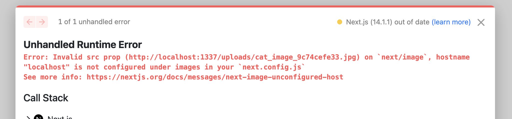

Clicking on the link in the error will take you [here](https://nextjs.org/docs/messages/next-image-unconfigured-host)

Which will explain the steps we need to take to fix this.

Inside the root of you project locate `next.config.mjs` file and make the following change.

```mjs
/** @type {import('next').NextConfig} */
const nextConfig = {
  images: {
    remotePatterns: [
      {
        protocol: "http",
        hostname: "localhost",
        port: "1337",
        pathname: "/uploads/**/*",
      },
      {
        protocol: "https",
        hostname: "placehold.co",
      },
    ],
  },
};

export default nextConfig;
```

Since we have a fall back URL inside our image, we are referencing it here as well.

Now when you restart your application, you should see the following.


Nice, now let's work on our **Features Section**

## Building Out Our Features Section

### Modeling Our Features Section Data In Strapi

Looking at our Features Section UI, we can break it down into the following parts.

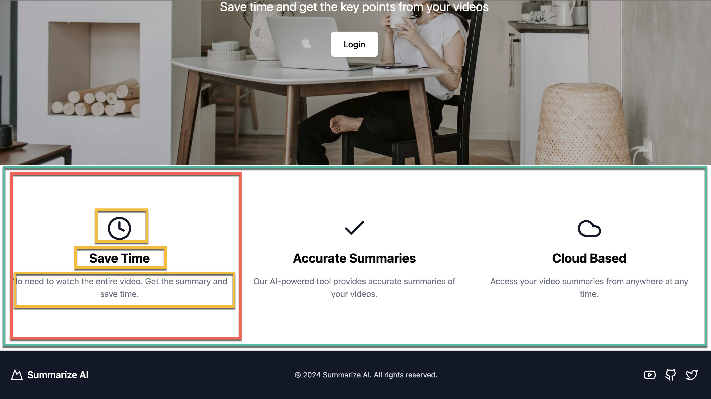

We have a section that has repeatable components with the following items.

- Icon
- Heading
- Subheading

So, let's jump into our Strapi Admin and create our **Features Section** Component.

Let's start by navigating to `Content-Type Builder` under `COMPONENTS`, clicking on `Create new component` and let's call it **Features Section** and save it under `layout` category.

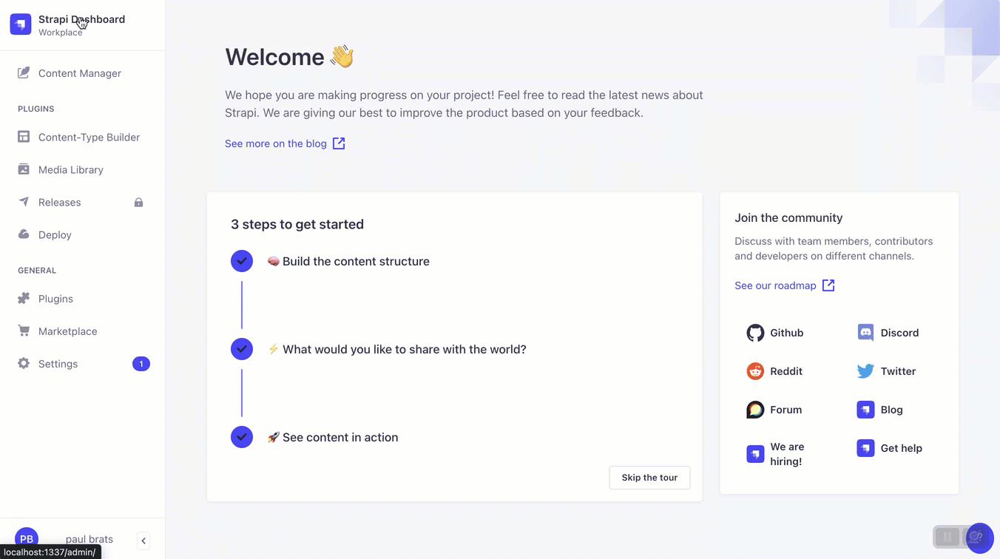

We will create the following fields.

Text -> Short Text - title
Text -> Long Text - description

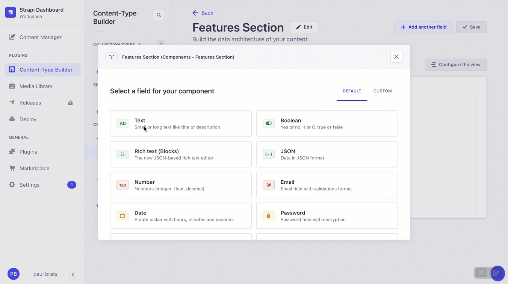

Finally let's create a repeatable component called **Feature** and save it under **components**

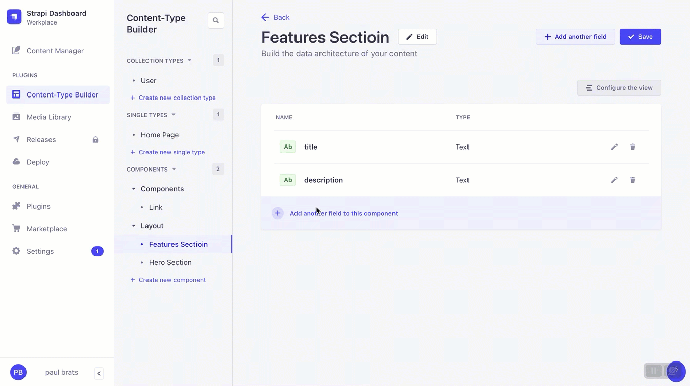

And now and add the following fields

Text -> Short Text - heading
Text -> Long Text - subHeading
Enum -> with the following options

- CLOCK_ICON
- CHECK_ICON
- CLOUD_ICON

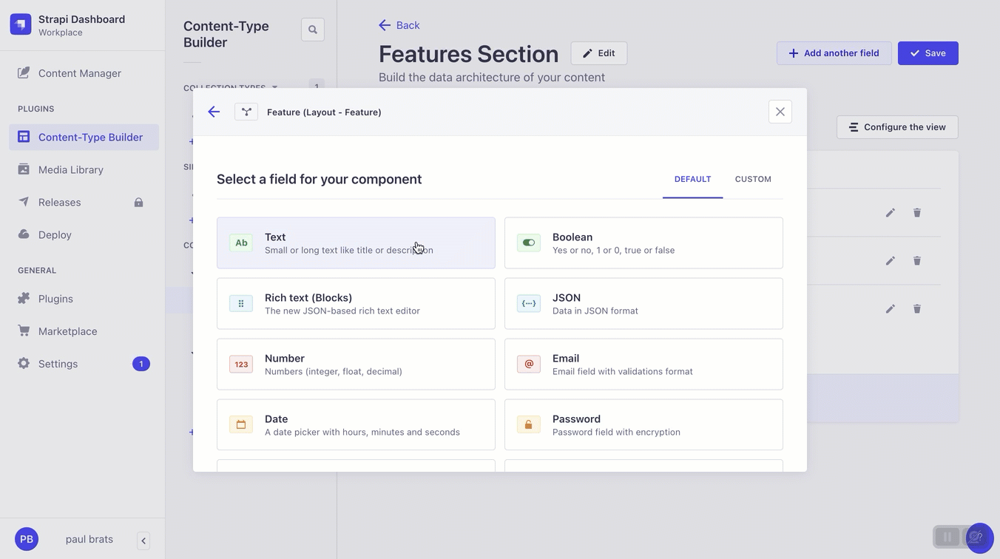

Now, let's add our newly created **Feature Section** component to our home page.

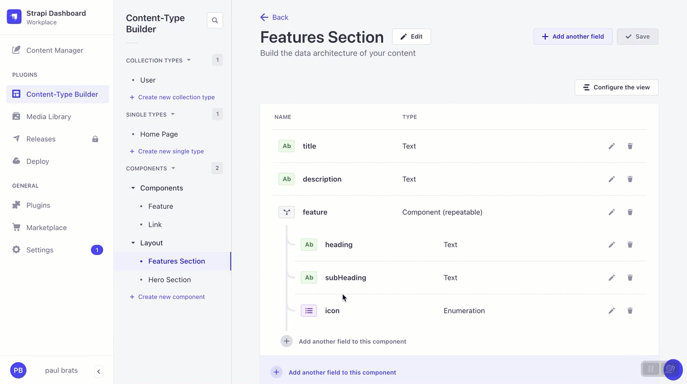

Now, let's add some features data and save.

Navigate to **Content Manager** select the **Home Page** add the new **Features Section** block and fill in your features.


We are already getting our page data, let's navigate to `src/app/page.tsx` and update our query to populate our `feature` repeatable component.

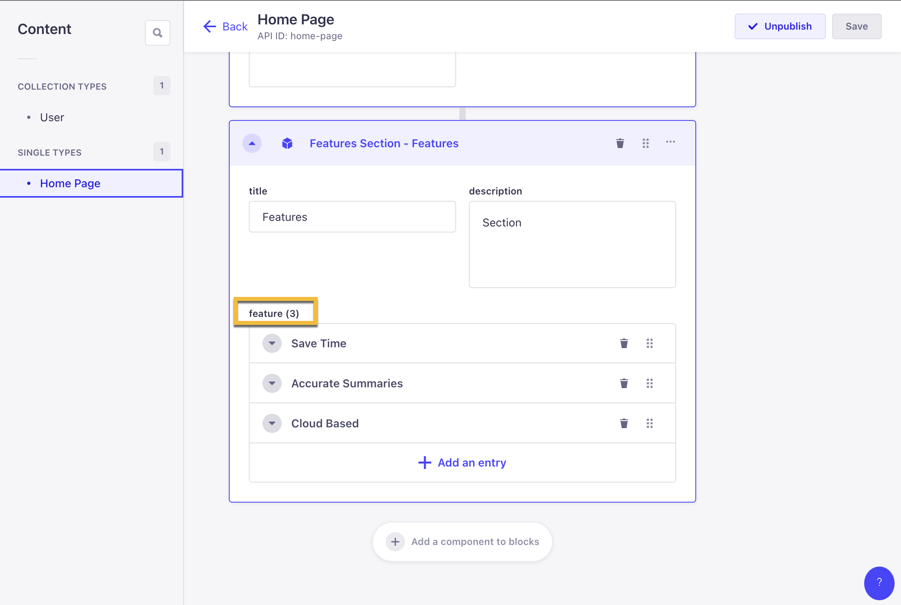

Let's update the `homePageQuery` query with the following changes.

```jsx
const homePageQuery = qs.stringify({
  populate: {
    blocks: {
      populate: {
        image: {
          fields: ["url", "alternativeText"],
        },
        link: {
          populate: true,
        },
        feature: {
          populate: true,
        },
      },
    },
  },
});
```

Also, let's update our `getStrapiData` function to use our new helper method `getStrapiURL`. So it will look like the following.

```jsx
async function getStrapiData(path: string) {
  const baseUrl = getStrapiURL();

  const url = new URL(path, baseUrl);
  url.search = homePageQuery;

  try {
    const response = await fetch(url.href, { cache: "no-store" });
    const data = await response.json();
    const flattenedData = flattenAttributes(data);
    return flattenedData;
  } catch (error) {
    console.error(error);
  }
}
```

Now let's console log our `block` and see what the response looks like.

```jsx
console.dir(blocks, { depth: null });
```

We should see the following data.

```jsx
[
  {
    id: 1,
    __component: "layout.hero-section",
    heading: "Epic Next.js Tutorial",
    subHeading: "You are all awesome.",
    image: {
      id: 3,
      url: "/uploads/cat_image_9c74cefe33.jpg",
      alternativeText: null,
    },
    link: { id: 1, url: "/login", text: "Login", isExternal: false },
  },
  {
    id: 1,
    __component: "layout.features-section",
    title: "Features",
    description: "Section",
    feature: [
      {
        id: 1,
        heading: "Save Time",
        subHeading:
          "No need to watch the entire video. Get the summary and save time.",
        icon: "CLOCK_ICON",
      },
      {
        id: 2,
        heading: "Accurate Summaries",
        subHeading:
          "Our AI-powered tool provides accurate summaries of your videos.",
        icon: "CHECK_ICON",
      },
      {
        id: 3,
        heading: "Cloud Based ",
        subHeading: "Access your video summaries from anywhere at any time.",
        icon: "CLOUD_ICON",
      },
    ],
  },
];
```

Notice that we are getting both our **Hero Section** and **Features Section**

Now let's create a component to display our features data.

### Building Our Features Section Data In Next.js

Let's navigate to `src/app/components/custom` and create a file called `FeaturesSection.tsx` and paste in the following code.

```jsx
function getIcon(name: string) {
  switch (name) {
    case "CLOCK_ICON":
      return ClockIcon;
    case "CHECK_ICON":
      return CheckIcon;
    case "CLOUD_ICON":
      return CloudIcon;
    default:
      return null;
  }
}

export function FeatureSection() {
  return (
    <div className="">
      <div className="flex-1">
        <section className="container px-4 py-6 mx-auto md:px-6 lg:py-24">
          <div className="grid gap-8 md:grid-cols-3">
            <div className="flex flex-col items-center text-center">
              <ClockIcon className="w-12 h-12 mb-4 text-gray-900" />
              <h2 className="mb-4 text-2xl font-bold">Save Time</h2>
              <p className="text-gray-500">
                No need to watch the entire video. Get the summary and save
                time.
              </p>
            </div>
            <div className="flex flex-col items-center text-center">
              <CheckIcon className="w-12 h-12 mb-4 text-gray-900" />
              <h2 className="mb-4 text-2xl font-bold">Accurate Summaries</h2>
              <p className="text-gray-500">
                Our AI-powered tool provides accurate summaries of your videos.
              </p>
            </div>
            <div className="flex flex-col items-center text-center">
              <CloudIcon className="w-12 h-12 mb-4 text-gray-900" />
              <h2 className="mb-4 text-2xl font-bold">Cloud Based</h2>
              <p className="text-gray-500">
                Access your video summaries from anywhere at any time.
              </p>
            </div>
          </div>
        </section>
      </div>
    </div>
  );
}

function CheckIcon(props: any) {
  return (
    <svg
      {...props}
      xmlns="http://www.w3.org/2000/svg"
      width="24"
      height="24"
      viewBox="0 0 24 24"
      fill="none"
      stroke="currentColor"
      strokeWidth="2"
      strokeLinecap="round"
      strokeLinejoin="round"
    >
      <polyline points="20 6 9 17 4 12" />
    </svg>
  );
}

function ClockIcon(props: any) {
  return (
    <svg
      {...props}
      xmlns="http://www.w3.org/2000/svg"
      width="24"
      height="24"
      viewBox="0 0 24 24"
      fill="none"
      stroke="currentColor"
      strokeWidth="2"
      strokeLinecap="round"
      strokeLinejoin="round"
    >
      <circle cx="12" cy="12" r="10" />
      <polyline points="12 6 12 12 16 14" />
    </svg>
  );
}

function CloudIcon(props: any) {
  return (
    <svg
      {...props}
      xmlns="http://www.w3.org/2000/svg"
      width="24"
      height="24"
      viewBox="0 0 24 24"
      fill="none"
      stroke="currentColor"
      strokeWidth="2"
      strokeLinecap="round"
      strokeLinejoin="round"
    >
      <path d="M17.5 19H9a7 7 0 1 1 6.71-9h1.79a4.5 4.5 0 1 1 0 9Z" />
    </svg>
  );
}
```

Currently we are hard coding our data which we will update in a moment. But let's navigate to `src/app/page.tsx` and import our newly created component and see what we get.

```jsx
import { FeatureSection } from "@/components/custom/FeaturesSection";
```

And update the `return` statement with the following code.

```jsx
return (
  <main>
    <HeroSection data={blocks[0]} />
    <FeatureSection />
  </main>
);
```

When we restart our application we should see the following.

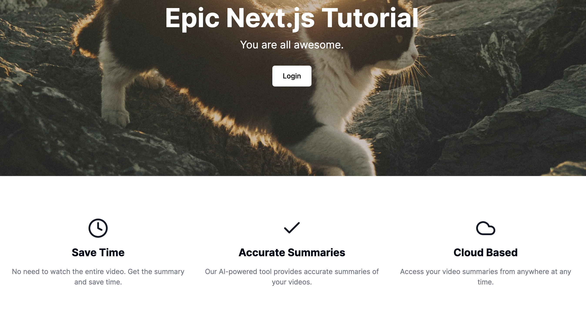

Now, let's pass our data to our component and refactor our **Features Section** component to consume our data from Strapi.

```jsx
return (
  <main>
    <HeroSection data={blocks[0]} />
    <FeatureSection data={blocks[1]} />
  </main>
);
```

And update our **Features Component** code with the following.

```jsx
function getIcon(name: string) {
  switch (name) {
    case "CLOCK_ICON":
      return <ClockIcon className="w-12 h-12 mb-4 text-gray-900" />;
    case "CHECK_ICON":
      return <CheckIcon className="w-12 h-12 mb-4 text-gray-900" />;
    case "CLOUD_ICON":
      return <CloudIcon className="w-12 h-12 mb-4 text-gray-900" />;
    default:
      return null;
  }
}

interface FeatureProps {
  id: number;
  heading: string;
  subHeading: string;
  icon: string;
}

interface FeatureSectionProps {
  id: number;
  __component: string;
  title: string;
  description: string;
  feature: FeatureProps[];
}

export function FeatureSection({
  data,
}: {
  readonly data: FeatureSectionProps;
}) {
  const { feature } = data;
  console.dir(feature, { depth: null });
  return (
    <div className="">
      <div className="flex-1">
        <section className="container px-4 py-6 mx-auto md:px-6 lg:py-24">
          <div className="grid gap-8 md:grid-cols-3">
            {feature.map((feature) => (
              <div
                key={feature.id}
                className="flex flex-col items-center text-center"
              >
                {getIcon(feature.icon)}
                <h2 className="mb-4 text-2xl font-bold">Save Time</h2>
                <p className="text-gray-500">
                  No need to watch the entire video. Get the summary and save
                  time.
                </p>
              </div>
            ))}
          </div>
        </section>
      </div>
    </div>
  );
}

function CheckIcon(props: any) {
  return (
    <svg
      {...props}
      xmlns="http://www.w3.org/2000/svg"
      width="24"
      height="24"
      viewBox="0 0 24 24"
      fill="none"
      stroke="currentColor"
      strokeWidth="2"
      strokeLinecap="round"
      strokeLinejoin="round"
    >
      <polyline points="20 6 9 17 4 12" />
    </svg>
  );
}

function ClockIcon(props: any) {
  return (
    <svg
      {...props}
      xmlns="http://www.w3.org/2000/svg"
      width="24"
      height="24"
      viewBox="0 0 24 24"
      fill="none"
      stroke="currentColor"
      strokeWidth="2"
      strokeLinecap="round"
      strokeLinejoin="round"
    >
      <circle cx="12" cy="12" r="10" />
      <polyline points="12 6 12 12 16 14" />
    </svg>
  );
}

function CloudIcon(props: any) {
  return (
    <svg
      {...props}
      xmlns="http://www.w3.org/2000/svg"
      width="24"
      height="24"
      viewBox="0 0 24 24"
      fill="none"
      stroke="currentColor"
      strokeWidth="2"
      strokeLinecap="round"
      strokeLinejoin="round"
    >
      <path d="M17.5 19H9a7 7 0 1 1 6.71-9h1.79a4.5 4.5 0 1 1 0 9Z" />
    </svg>
  );
}

```

Our features component should now be utilizing our Strapi data.

We do have to make one more change in the `page.tsx` file make our code to dynamically display our **blocks** based on what we are getting from our response.

To accomplish this, we will create a new function called `blockRenderer`. We will defined it here in the `page.tsx` file.

```jsx
function blockRenderer(block: any) {
  switch (block.__component) {
    case "layout.hero-section":
      return <HeroSection key={block.id} data={block} />;
    case "layout.features-section":
      return <FeatureSection key={block.id} data={block} />;
    default:
      return null;
  }
}
```

Now we can refactor the code in our `Home` component with the following code.

```jsx
export default async function Home() {
  const strapiData = await getStrapiData("/api/home-page");

  const { blocks } = strapiData;
  if (!blocks) return <p>No sections found</p>;

  return <main>{blocks.map(blockRenderer)}</main>;
}
```

The completed code in the `page.tsx` file should look like the following.

```jsx
import qs from "qs";
import { flattenAttributes, getStrapiURL } from "@/lib/utils";

import { HeroSection } from "@/components/custom/HeroSection";
import { FeatureSection } from "@/components/custom/FeaturesSection";

const homePageQuery = qs.stringify({
  populate: {
    blocks: {
      populate: {
        image: {
          fields: ["url", "alternativeText"],
        },
        link: {
          populate: true,
        },
        feature: {
          populate: true,
        },
      },
    },
  },
});

async function getStrapiData(path: string) {
  const baseUrl = getStrapiURL();

  const url = new URL(path, baseUrl);
  url.search = homePageQuery;

  try {
    const response = await fetch(url.href, { cache: "no-store" });
    const data = await response.json();
    const flattenedData = flattenAttributes(data);
    return flattenedData;
  } catch (error) {
    console.error(error);
  }
}

function blockRenderer(block: any) {
  switch (block.__component) {
    case "layout.hero-section":
      return <HeroSection key={block.id} data={block} />;
    case "layout.features-section":
      return <FeatureSection key={block.id} data={block} />;
    default:
      return null;
  }
}

export default async function Home() {
  const strapiData = await getStrapiData("/api/home-page");

  const { blocks } = strapiData;
  if (!blocks) return <p>No sections found</p>;

  return <main>{blocks.map(blockRenderer)}</main>;
}
```

Let's do one more quick refactor. In `src` create a new folder named `data` with a file called `loaders.tsx`.

And add the following code.

```ts
import qs from "qs";
import { flattenAttributes, getStrapiURL } from "@/lib/utils";

const baseUrl = getStrapiURL();

async function fetchData(url: string) {
  const authToken = null; // we will implement this later getAuthToken() later
  const headers = {
    method: "GET",
    headers: {
      "Content-Type": "application/json",
      Authorization: `Bearer ${authToken}`,
    },
  };

  try {
    const response = await fetch(url, authToken ? headers : {});
    const data = await response.json();
    return flattenAttributes(data);
  } catch (error) {
    console.error("Error fetching data:", error);
    throw error; // or return null;
  }
}
```

We will create a reusable function that will help us construct additional methods to load data.

And finally, let's create a new function `getHomePageData` to load our home page data.

```jsx
export async function getHomePageData() {
  const url = new URL("/api/home-page", baseUrl);

  url.search = qs.stringify({
    populate: {
      blocks: {
        populate: {
          image: {
            fields: ["url", "alternativeText"],
          },
          link: {
            populate: true,
          },
          feature: {
            populate: true,
          },
        },
      },
    },
  });

  return await fetchData(url.href);
}
```

And finally in the `pate.tsx` file let's import this new function and delete the previous one.

Our final code should look like the following.

```jsx
import { getHomePageData } from "@/data/loaders";

import { HeroSection } from "@/components/custom/HeroSection";
import { FeatureSection } from "@/components/custom/FeaturesSection";

function blockRenderer(block: any) {
  switch (block.__component) {
    case "layout.hero-section":
      return <HeroSection key={block.id} data={block} />;
    case "layout.features-section":
      return <FeatureSection key={block.id} data={block} />;
    default:
      return null;
  }
}

export default async function Home() {
  const strapiData = await getHomePageData();

  const { blocks } = strapiData;
  if (!blocks) return <p>No sections found</p>;

  return <main>{blocks.map(blockRenderer)}</main>;
}
```

Nice. Let's move on and start working on our **Header** and **Footer**

## Building Our Header and Footer With Strapi and Next.js

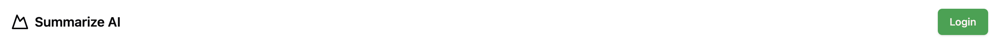
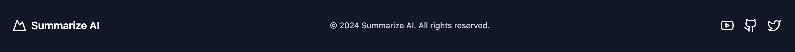

Taking a quick look at our **Header** and **Footer** we see that they are not too complex.  In the header we have two items, `logo text` and `button`.

And in the footer, we have `logo text`, `text` and `social icons`.

Let's first start by taking a look on how we have represent this data in Strapi.

### Modeling Our Header and Footer Data in Strapi

To store our data for our **Header** and **Footer** we are going to use a `single type`. 

Navigating to `Content-Type Builder` under `SINGLE TYPE` and clicking on `Create new single type.`

We are going to call it `Global`.  Go ahead and add the following fields.

Text -> Short Text - title
Text -> Long Text - description

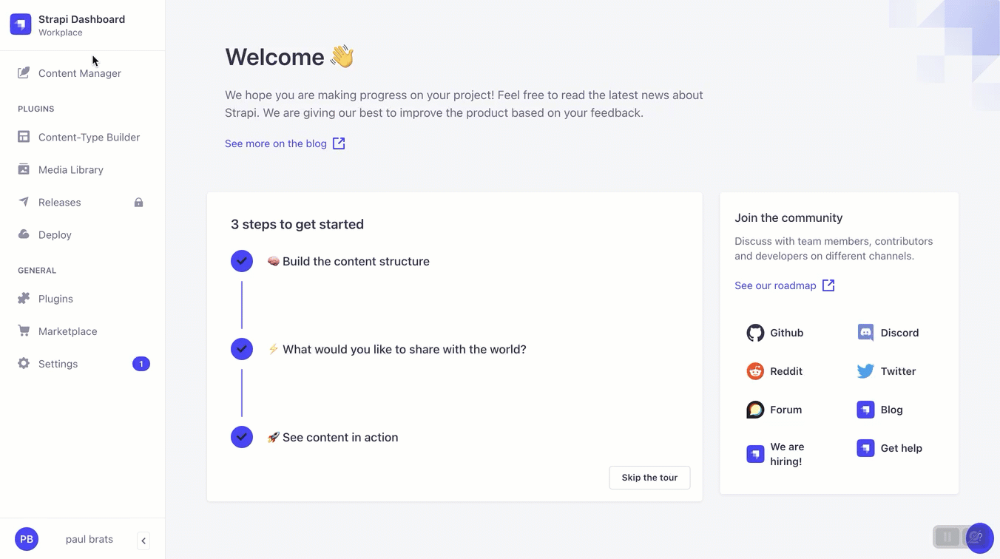

Now let's create or **Header** component, it will have two links to start with.  Logo text and a `call to action` button.


In Strapi, inside the global page lets add the following component.

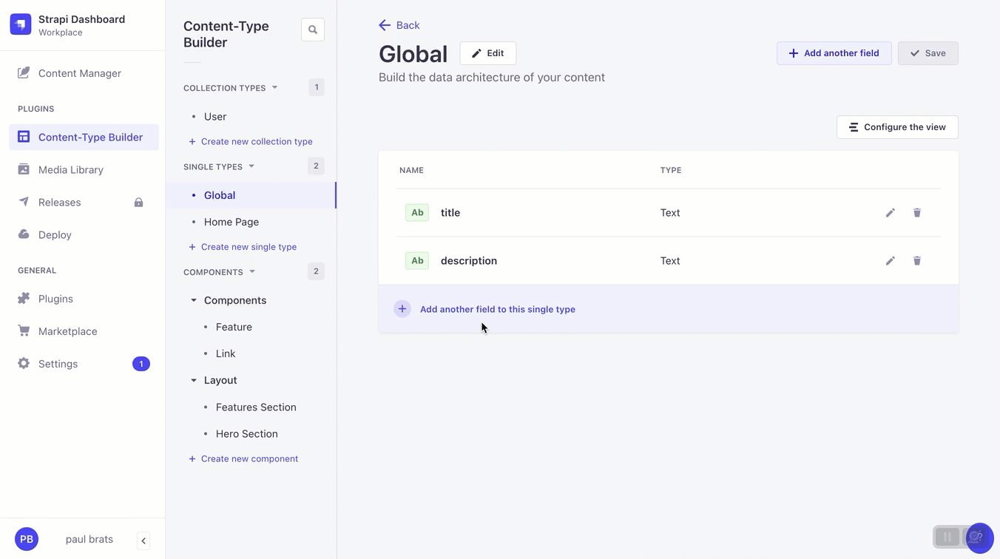

- Click on `add another field to this single type`
- Select `Component` field type
- `Display Name` will be **Header**
- Select `Category` will be `layout`
- Click on `Configure the component` button
- In the `Name` field we will enter **header**
- Finally click on the `Add first field to component` button

Now let's create our first header field to store our logo text, since it will be a link, we can reuse a previously created **Link** component.

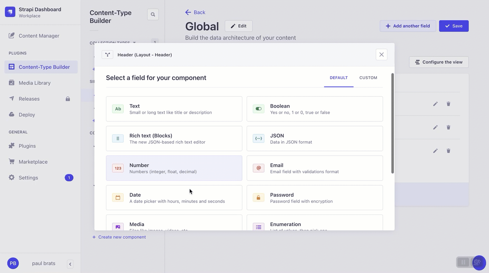

- Select `Component` field type
- Click on `Use an existing component`
- Click on `Select component` button
- Inside the `Select a component` field select **Link** component
- In the `Name` field we will enter **logoText**
- Select `Single component` and click `Finish` button

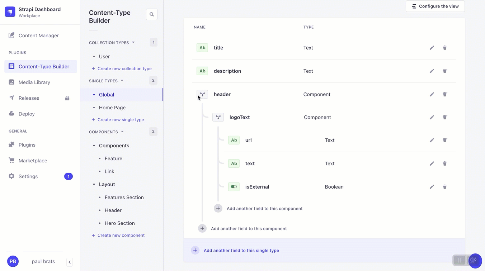

- Select `Add another field to this component`
- Select `Component` field type
- Click on `Use an existing component`
- - Click on `Select a component` button
- In the `Name` field we will enter **ctaButton**
- Inside the `Select a component` field select **Link** component
- Select `Single component` and click `Finish` button
- Select Single component and click Finish button

The final **Header** component should look like the following.

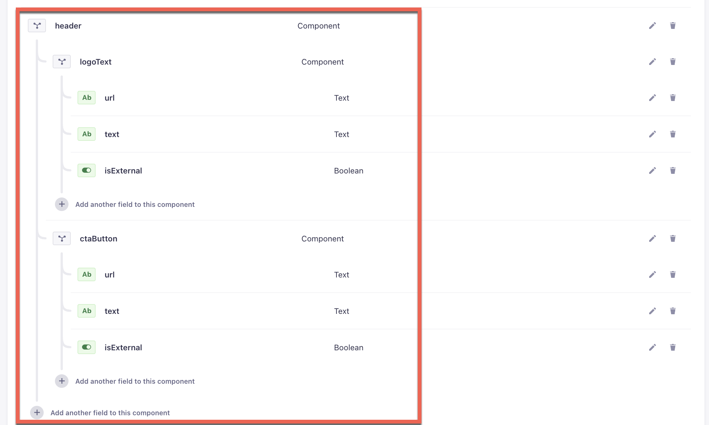

Now that we are getting the hang of modeling content, think about how we can represent our footer.

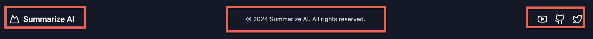

Our footer has the three following items.

- logoText
- text
- socialLink

We can create the **Footer** the same way we created our **Header**

Se if you can do it on your own?

Our **Footer** will have the following fields.

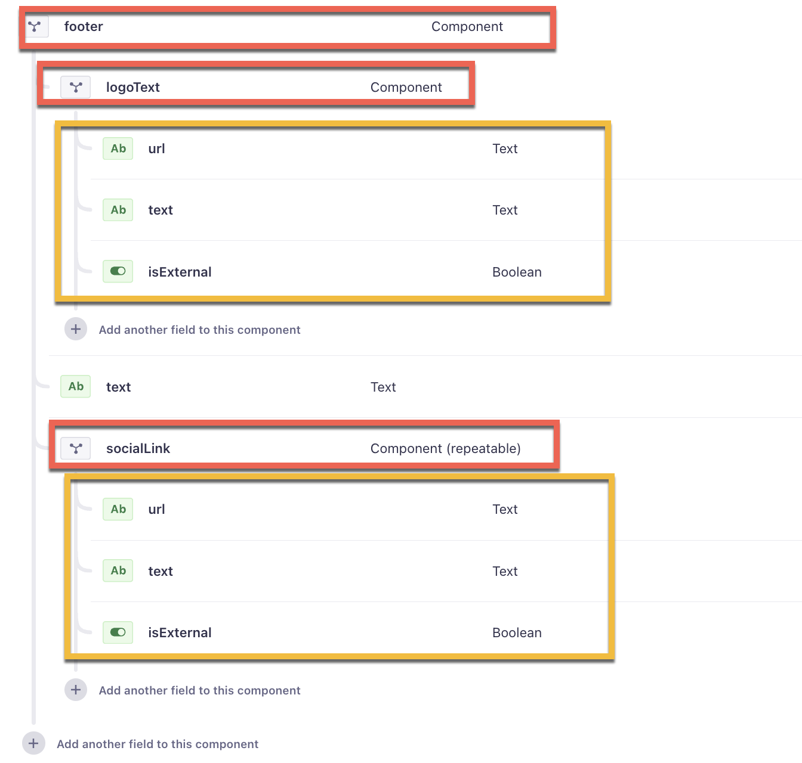

If you get stuck at any point, you can always ask in the comments or join us at **Strapi Open Office** hours on [Discord](https://discord.com/invite/strapi) 12:30pm CST Monday - Friday.

