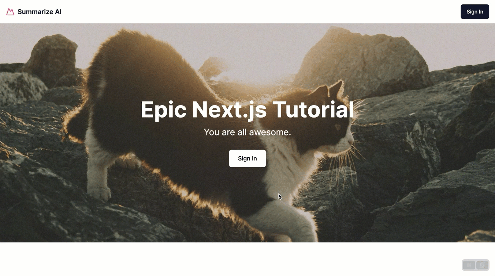
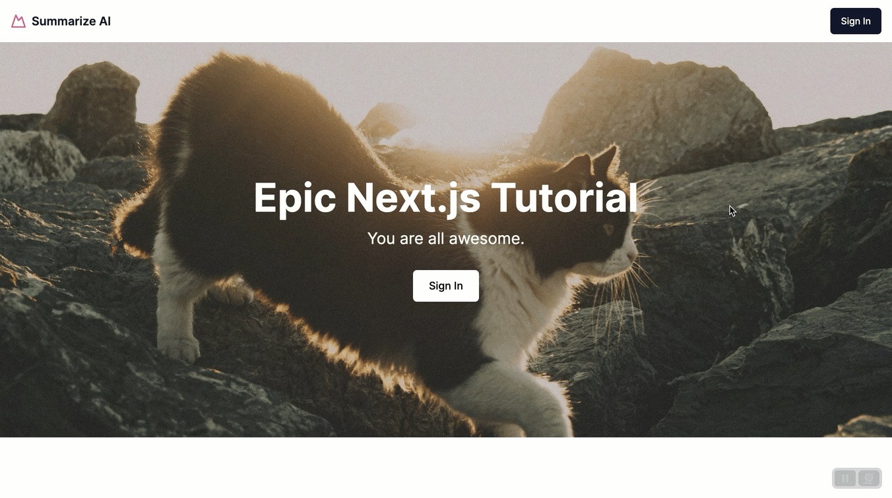

# Epic Next JS 14 Tutorial: Learn Next JS by building a real-life project. Part 4: Building The Login and Registration Page

In the previous tutorial, we finished our **Home Page**, so we will build out our **Sign In** and **Sign Up** Pages and hook up the logic to allow us to sign in and sign up.

- Getting Started with the Project
- Building Out The Hero Section
- Building Out The Features Section, TopNavigation and Footer
- **Building Out the Register and Sign In Page**
- Building out the Dashboard page
- Get Video Transcript with OpenAI Function
- Strapi CRUD permissions
- Search & pagination
- Backend deployment to Strapi Cloud and frontend deployment to Vercel



Let's start by creating our routes.

## How To Group Routes In Next.js

Next, we can group our routes and create shared layouts; you can read more [here](https://nextjs.org/docs/app/building-your-application/routing/colocation#route-groups), but for our use case, we will create a route group called `auth`, to make a route a group, you will create a folder whose name will be between parentheses.

Our folder structure will look like the following.


Inside `src/app`, create the following.

- Folder named `(auth)`
- Inside the `(auth)` folder, create two additional folders, `signin` and `signup`, with a blank `page.tsx` file.
- Finally, inside the `(auth)` folder, create a file called `layout.tsx` to function as our shared layout between our `signin` and `signup` pages.

You can learn more about the `layout.tsx` file in Next.js docs [here](https://nextjs.org/docs/app/building-your-application/routing/pages-and-layouts#layouts)

Now that we have our basic folder structure. Let's create the following components.

In the `layout.tsx` file, paste the following code.

```jsx
export default function AuthLayout({ children }: {
  readonly children: React.ReactNode;
}) {
  return (
    <div className="flex flex-col items-center justify-center min-h-screen bg-gray-100 dark:bg-gray-900">
      {children}
    </div>
  );
}
```

Paste the following code in the `signin/page.tsx` file.

```jsx
export default function SignInRoute() {
  return <div>Sing In Route</div>;
}
```

Paste the following code in the `signup/page.tsx` file.

```jsx
export default function SingUpRoute() {
  return <div>Sing Up Route</div>;
}
```

After creating the following components you should be able to navigate to our `signin` page via the link.



Great. Let's now work on our `signin` and `signup` forms.

## Building Our Signin and Signup Form

Let's navigate to `app/components` and create a new folder called `forms`. Inside that folder, create two new files called `SigninForm.tsx` and `SignupForm.tsx` and paste the following code for the respective components.

`SigninForm.tsx`

```jsx
"use client";

import Link from "next/link";

import {
  CardTitle,
  CardDescription,
  CardHeader,
  CardContent,
  CardFooter,
  Card,
} from "@/components/ui/card";

import { Label } from "@/components/ui/label";
import { Input } from "@/components/ui/input";

export function SigninForm() {
  return (
    <div className="w-full max-w-md">
      <form>
        <Card>
          <CardHeader className="space-y-1">
            <CardTitle className="text-3xl font-bold">Sign In</CardTitle>
            <CardDescription>
              Enter your details to sign in to your account
            </CardDescription>
          </CardHeader>
          <CardContent className="space-y-4">
            <div className="space-y-2">
              <Label htmlFor="email">Email</Label>
              <Input
                id="identifier"
                name="identifier"
                type="text"
                placeholder="username or email"
              />
            </div>
            <div className="space-y-2">
              <Label htmlFor="password">Password</Label>
              <Input
                id="password"
                name="password"
                type="password"
                placeholder="password"
              />
            </div>
          </CardContent>
          <CardFooter className="flex flex-col">
            <button className="w-full">Sign In</button>
          </CardFooter>
        </Card>
        <div className="mt-4 text-center text-sm">
          Don't have an account?
          <Link className="underline ml-2" href="signup">
            Sign Up
          </Link>
        </div>
      </form>
    </div>
  );
}
```

`SignupForm.tsx`

```jsx
"use client";

import Link from "next/link";

import {
  CardTitle,
  CardDescription,
  CardHeader,
  CardContent,
  CardFooter,
  Card,
} from "@/components/ui/card";

import { Label } from "@/components/ui/label";
import { Input } from "@/components/ui/input";

export function SignupForm() {
  return (
    <div className="w-full max-w-md">
      <form>
        <Card>
          <CardHeader className="space-y-1">
            <CardTitle className="text-3xl font-bold">Sign Up</CardTitle>
            <CardDescription>
              Enter your details to create a new account
            </CardDescription>
          </CardHeader>
          <CardContent className="space-y-4">
            <div className="space-y-2">
              <Label htmlFor="username">Username</Label>
              <Input
                id="username"
                name="username"
                type="text"
                placeholder="username"
              />
            </div>
            <div className="space-y-2">
              <Label htmlFor="email">Email</Label>
              <Input
                id="email"
                name="email"
                type="email"
                placeholder="name@example.com"
              />
            </div>

            <div className="space-y-2">
              <Label htmlFor="password">Password</Label>
              <Input
                id="password"
                name="password"
                type="password"
                placeholder="password"
              />
            </div>
          </CardContent>
          <CardFooter className="flex flex-col">
            <button className="w-full">Sign Up</button>
          </CardFooter>
        </Card>
        <div className="mt-4 text-center text-sm">
          Have an account?
          <Link className="underline ml-2" href="signin">
            Sing In
          </Link>
        </div>
      </form>
    </div>
  );
}
```

Since we are using **Shadcn UI**, we need to install the `card`, `input`, and `label` components since we are using them in the code above.

You can learn more about **Shadcn UI** [here](https://ui.shadcn.com/docs)

We can install the components by running the following code.

```bash
  npx shadcn-ui@latest add card label input
```

Now that we have installed our components, let's navigate to `app/(auth)/signin/page.tsx` and import and add our newly created `SigninForm` component.

The final code should look like the following.

```jsx
import { SigninForm } from "@/components/forms/SigninForm";

export default function SingInRoute() {
  return <SigninForm />;
}
```

Let's do the same inside the `signup/page.tsx` file by updating the following.

```jsx
import { SignupForm } from "@/components/forms/SignupForm";

export default function SingUoRoute() {
  return <SignupForm />;
}
```

Now restart your frontend Next.js application. You should see the following when navigating the **Sign In** page.


Nice, we now have both of our forms. Before getting into the details of how to implement our form submission via **Server Actions**, here are some great resources to learn more about the process [MDN HTML Forms](https://developer.mozilla.org/en-US/docs/Web/HTML/Element/form) and specific to Next.js [Server Action & Mutations](https://nextjs.org/docs/app/building-your-application/data-fetching/server-actions-and-mutations)

Now let's dive in in building out our `SignupForm`.

## Form Submission In Next.js Using Server Actions

We will first focus on our `SignupForm`, and then, after we understand how things work, we will make the same changes inside our `SigninForm`.

While building our form, let's consider these items in the context of Next.js.

- we can get form values via the `name` attribute in the `input` fields inside the form.
- the form will have an action attribute pointing to a server action.
- when we click the `button` with the submit, it will submit the form and trigger our action.
- we will be able to access our data inside server action via FormData
- Inside the server action, our business logic will handle our signup via our **Strapi** backend.

Let's start by defining our first server action. Navigate to `src/app/data` and create a new folder called `actions` and a file name `auth-actions.ts`.

Inside our newly created file, let's paste the following code.

```ts
"use server";

export async function registerUserAction(formData: FormData) {
  console.log("Hello From Register User Action");
}
```

Now let's import our `registerUserAction` inside our `SignupForm.tsx` file and add it to our form action.

```jsx
import { registerUserAction } from "@/data/actions/auth-actions";
```

Update the form attribute with the following:

```jsx
{
  /*  rest of our code  */
}
<form action={registerUserAction}>{/*  rest of our code  */}</form>;
{
  /*  rest of our code  */
}
```

Now, you should be able to click the `Sign Up` button, and we should see our console log in our terminal since it is being executed on the server.


Nice. We don't know if we can trigger our `server action` via our form submission. Let's examine how we can access our form data via our **FormData**.

## How To Access FormData Inside Next.js Server Action

For additional reading, I recommend checking out [this post](https://developer.mozilla.org/en-US/docs/Web/API/FormData) about **FormData** on MDN, but we will be using the `get` method to get our values.

When we submit our form, the values will be passed down to our server action via the form data using the input `name` attribute as the key to our value.

For example, we can retrieve our data using `FormData.get("username")` for the following input.


With the following code, let's update our `registerUserAction` action in the `auth-actions.ts` file.

```ts
"use server";

export async function registerUserAction(formData: FormData) {
  console.log("Hello From Register User Action");

  const fields = {
    username: formData.get("username"),
    password: formData.get("password"),
    email: formData.get("email"),
  };

  console.log("#############");
  console.log(fields);
  console.log("#############");
}
```


Now, fill out the fields in the **Signup form** and click the **Sign Up** button. You should see the following console log in your terminal.

```bash
Hello From Register User Action
#############
{
  username: 'testuser',
  password: 'Monkey1234!',
  email: 'testuser@email.com'
}
#############
```

We can now get our data in our `server action`, but how do we return or validate it?

Well, that is what we will do in our next section.

## How To Get Form State With useFormState Hook

We will use React's `useFormState` hook to return data from our `server action`. You can learn more [here](https://react.dev/reference/react-dom/hooks/useFormState).

Let's first start in the `SignupForm.tsx` file.

We will first import our `useFormState` hook from `react-dom`.

```jsx
import { useFormState } from "react-dom";
```

Now, let's create a variable to store our initial state.

```jsx
const INITIAL_STATE = {
  data: null,
};
```

Now let's use our `useFormState` hook.

```jsx
const [formState, formAction] = useFormState(registerUserAction, INITIAL_STATE);
```

And update the `form` action attribute with the following.

```jsx
  <form action={formAction}>
```

The completed code should look like the following.

```jsx
"use client";

import Link from "next/link";
import { useFormState } from "react-dom"; // <---  add this

import { registerUserAction } from "@/data/actions/auth-actions";

import {
  CardTitle,
  CardDescription,
  CardHeader,
  CardContent,
  CardFooter,
  Card,
} from "@/components/ui/card";

import { Label } from "@/components/ui/label";
import { Input } from "@/components/ui/input";

const INITIAL_STATE = {
  data: null,
}; // <---  add this

export function SignupForm() {
  const [formState, formAction] = useFormState(
    registerUserAction,
    INITIAL_STATE
  ); // <---  add this

  console.log(formState); // <---  add this

  return (
    <div className="w-full max-w-md">
      <form action={formAction}> // <--- update this
        {/* Rest of your code */}
      </form>
    </div>
  );
}
```

Finally, we have to update our `registerUserAction` action in the `auth-actions.ts` file using the following code:

```ts
"use server";

export async function registerUserAction(prevState: any, formData: FormData) {
  console.log("Hello From Register User Action");

  const fields = {
    username: formData.get("username"),
    password: formData.get("password"),
    email: formData.get("email"),
  };

  return {
    ...prevState,
    data: fields,
  };
}
```

When you submit the form, you should see our data console logged in our frontend via our `console.log(formState);` that we have in our `SignupForm.tsx` file.


This is great. We are able to pass data to our `server action` and return it via `useFormState`.

Before we see how to submit our form and sign in via our Strapi backend, let's examine how to handle form validation with Zod.

## Form Validation In Next.js with Zod

You can learn more about **Zod** on their website [here](https://zod.dev).

**Zod** is a validation library designed for use with TypeScript and JavaScript.

It offers an expressive syntax for creating complex validation schema, which makes Zod particularly useful for validating user-generated data, such as information submitted through forms or received from API requests, to ensure the data aligns with your application's expected structures and types.

Let's examine how we can add Zod validation for our forms. We will choose to do the validation inside of our `server action`.

Let's start by installing **Zod** with the following command.

```bash
yarn add zod
```

Once the installation is complete, restart your app, navigate to our `auth-actions.ts` file, and import it with the following command.

```ts
import { z } from "zod";
```

Next, let's define our schema. You can learn more about **Zod** schemas [here](https://zod.dev/?id=basic-usage).

```ts
const schemaRegister = z.object({
  username: z.string().min(3).max(20, {
    message: "Username must be between 3 and 20 characters",
  }),
  password: z.string().min(6).max(100, {
    message: "Password must be between 6 and 100 characters",
  }),
  email: z.string().email({
    message: "Please enter a valid email address",
  }),
});
```

Here, we are adding simple validation and message.

Now, let's update our `registerUserAction` to use our schema to validate our fields by making the following changes.

```ts
export async function registerUserAction(prevState: any, formData: FormData) {
  console.log("Hello From Register User Action");

  const validatedFields = schemaRegister.safeParse({
    username: formData.get("username"),
    password: formData.get("password"),
    email: formData.get("email"),
  });

  if (!validatedFields.success) {
    return {
      ...prevState,
      zodErrors: validatedFields.error.flatten().fieldErrors,
      strapiErrors: null,
      message: "Missing Fields. Failed to Register.",
    };
  }

  return {
    ...prevState,
    data: "ok",
  };
}
```

We are using **Zod** in the above code to validate our user registration data.

The `schemaRegister.safeParse` function validates username, password, and email fields extracted from formData.

If validation fails (indicated by validatedFields.success being false), the function returns the previous state, Zod validation errors (zodErrors), and a failure message.

If validation succeeds, it returns the previous state updated with a success indicator.

This Zod validation process ensures that user data meets the application's requirements before proceeding.

Let's test our form by not adding any of our fields and submitting it.


Notice we can see our errors in the front end. Let's create a new component called `ZodErrors` to help us display them inside our `SignupForm.tsx` file.

First, navigate to `src/app/components/custom`, create a new file called `ZodErrors.tsx`, and paste it into the following code.

```jsx
export function ZodErrors({ error }: { error: string[] }) {
  if (!error) return null;
  return error.map((err: string, index: number) => (
    <div key={index} className="text-pink-500 text-xs italic mt-1 py-2">
      {err}
    </div>
  ));
}
```

Now, navigate to `src/app/components/forms/SignupForm.tsx` and let's use the following component.

We will import and add it to our form and pass the zod errors we are getting back from our `formState`.

The updated `SignupForm.tsx` code should look like the following.

```jsx
"use client";

import Link from "next/link";
import { useFormState } from "react-dom";
import { registerUserAction } from "@/data/actions/auth-actions";

import {
  CardTitle,
  CardDescription,
  CardHeader,
  CardContent,
  CardFooter,
  Card,
} from "@/components/ui/card";

import { Label } from "@/components/ui/label";
import { Input } from "@/components/ui/input";
import { ZodErrors } from "@/components/custom/ZodErrors";

const INITIAL_STATE = {
  data: null,
};

export function SignupForm() {
  const [formState, formAction] = useFormState(
    registerUserAction,
    INITIAL_STATE
  );
  console.log(formState);
  return (
    <div className="w-full max-w-md">
      <form action={formAction}>
        <Card>
          <CardHeader className="space-y-1">
            <CardTitle className="text-3xl font-bold">Sign Up</CardTitle>
            <CardDescription>
              Enter your details to create a new account
            </CardDescription>
          </CardHeader>
          <CardContent className="space-y-4">
            <div className="space-y-2">
              <Label htmlFor="username">Username</Label>
              <Input
                id="username"
                name="username"
                type="text"
                placeholder="username"
              />
              <ZodErrors error={formState?.zodErrors?.username} />
            </div>
            <div className="space-y-2">
              <Label htmlFor="email">Email</Label>
              <Input
                id="email"
                name="email"
                type="email"
                placeholder="name@example.com"
              />
              <ZodErrors error={formState?.zodErrors?.email} />
            </div>

            <div className="space-y-2">
              <Label htmlFor="password">Password</Label>
              <Input
                id="password"
                name="password"
                type="password"
                placeholder="password"
              />
              <ZodErrors error={formState?.zodErrors?.password} />
            </div>
          </CardContent>
          <CardFooter className="flex flex-col">
            <button className="w-full">Sign Up</button>
          </CardFooter>
        </Card>
        <div className="mt-4 text-center text-sm">
          Have an account?
          <Link className="underline ml-2" href="signin">
            Sing In
          </Link>
        </div>
      </form>
    </div>
  );
}
```

Now, restart your frontend Next.js project and try submitting the form without entering any data; you should see the following errors.


Nice. We don't know if our form validation works, so let's move on and create a service that will handle our Strapi Auth Login.

## Authentication with Next.js and Strapi

Now, let's register our user via our **Strapi API**. You can find the process explained [here](https://docs.strapi.io/dev-docs/plugins/users-permissions#registration)

The basic overview,

- request to register user to Strapi
- after the user is created, we will get back a JWT token
- save the cookie via the `httpOnly` cookie
- redirect the user to the `dashboard`.
- handle Strapi errors if any exist

Let's start by creating a service that will handle Strapi User Registration.

Navigate to `src/app/data` and create a new folder called `services` inside. Create the file `auth-service.ts` and paste it into the following code.

```jsx
import { getStrapiURL } from "@/lib/utils";

interface RegisterUserProps {
  username: string;
  password: string;
  email: string;
}

interface LoginUserProps {
  identifier: string;
  password: string;
}

const baseUrl = getStrapiURL();

export async function registerUserService(userData: RegisterUserProps) {
  const url = new URL("/api/auth/local/register", baseUrl);

  try {
    const response = await fetch(url, {
      method: "POST",
      headers: {
        "Content-Type": "application/json",
      },
      body: JSON.stringify({ ...userData }),
      cache: "no-cache",
    });

    return response.json();
  } catch (error) {
    console.error("Registration Service Error:", error);
  }
}

export async function loginUserService(userData: LoginUserProps) {
  const url = new URL("/api/auth/local", baseUrl);

  try {
    const response = await fetch(url, {
      method: "POST",
      headers: {
        "Content-Type": "application/json",
      },
      body: JSON.stringify({ ...userData }),
      cache: "no-cache",
    });

    return response.json();
  } catch (error) {
    console.error("Login Service Error:", error);
    throw error;
  }
}
```

This includes both our `registerUserService` and `loginUserService`, which is based on what you can find in the Strapi Docs [here](https://docs.strapi.io/dev-docs/plugins/users-permissions#authentication).

Now, we can utilize our `registerUserService` service inside our `auth-actions.ts` file. Let's navigate to that file and add the following to our `registerUserAction`.

```ts
const responseData = await registerUserService(validatedFields.data);

if (!responseData) {
  return {
    ...prevState,
    strapiErrors: null,
    zodErrors: null,
    message: "Ops! Something went wrong. Please try again.",
  };
}

if (responseData.error) {
  return {
    ...prevState,
    strapiErrors: responseData.error,
    zodErrors: null,
    message: "Failed to Register.",
  };
}
```

Don't forget to import our `registerUserService` with the following.

```ts
import { registerUserService } from "@/data/services/auth-service";
```

The completed code should look like the following.

```ts
"use server";
import { z } from "zod";
import { registerUserService } from "@/data/services/auth-service";

const schemaRegister = z.object({
  username: z.string().min(3).max(20, {
    message: "Username must be between 3 and 20 characters",
  }),
  password: z.string().min(6).max(100, {
    message: "Password must be between 6 and 100 characters",
  }),
  email: z.string().email({
    message: "Please enter a valid email address",
  }),
});

export async function registerUserAction(prevState: any, formData: FormData) {
  console.log("Hello From Register User Action");

  const validatedFields = schemaRegister.safeParse({
    username: formData.get("username"),
    password: formData.get("password"),
    email: formData.get("email"),
  });

  if (!validatedFields.success) {
    return {
      ...prevState,
      zodErrors: validatedFields.error.flatten().fieldErrors,
      strapiErrors: null,
      message: "Missing Fields. Failed to Register.",
    };
  }

  const responseData = await registerUserService(validatedFields.data);

  if (!responseData) {
    return {
      ...prevState,
      strapiErrors: null,
      zodErrors: null,
      message: "Ops! Something went wrong. Please try again.",
    };
  }

  if (responseData.error) {
    return {
      ...prevState,
      strapiErrors: responseData.error,
      zodErrors: null,
      message: "Failed to Register.",
    };
  }

  console.log("#############");
  console.log("User Registered Successfully", responseData.jwt);
  console.log("#############");
}
```

Notice in the code above, inside of our return we are now returning `strapiErrors`. We will see how to render them in the front in just a moment, but first, let's test our form and see if we can see our `jwt` token being returned in our terminal console.


Nice, we are able to create a new user and register. Before moving on to handling redirects and setting the `httpOnly` cookie, let's create a component to render our Strapi Errors and Make our Submit Button cooler.

## Handling Strapi Errors in Next.js

Navigate to `src/app/components/custom`, create a new file named `StrapiErrors.tsx`, and paste the following code.

```jsx
interface StrapiErrorsProps {
  message: string | null;
  name: string;
  status: string | null;
}

export function StrapiErrors( { error }: { readonly error: StrapiErrorsProps }) {
  if (!error?.message) return null;
  return <div className="text-pink-500 text-md italic py-2">{error.message}</div>;
}

```

Now navigate back to our `SignupForm.tsx` file, import our newly created component, and add it right after our' submit' button.

```jsx
import { StrapiErrors } from "@/components/custom/StrapiErrors";
```

```jsx
<CardFooter className="flex flex-col">
  <button className="w-full">Sign Up</button>
  <StrapiErrors error={formState?.strapiErrors} />
</CardFooter>
```

Let's test and see if we can see our Strapi Errors. Try creating another user with an email you used to make your first user.

You should see the following message.


Let's improve our `submit` button by adding a pending state and making it prettier.

## How To Handle Pending State In Next.js With useFormStatus

When we submit a form, it may be in a pending state, and we would like to show a spinner for a better user experience.

Let's look at how we can accomplish this by creating a `SubmitButton` component that will utilize the `useFormStatus` hook. The Next.js docs provide more details [here](https://nextjs.org/docs/app/building-your-application/data-fetching/server-actions-and-mutations#pending-states).

The `useFormStatus` Hook gives you the status information of the last form submission. We will use that to get the status of our form and show our loading spinner.

Let's start by navigating to `app/components/custom`, creating the following file name `SubmitButton.tsx`, and adding the following code.

```jsx
"use client";
import { useFormStatus } from "react-dom";
import { cn } from "@/lib/utils";
import { Button } from "@/components/ui/button";
import { Loader2 } from "lucide-react";

function Loader({ text }: { readonly text: string }) {
  return (
    <div className="flex items-center space-x-2">
      <Loader2 className="mr-2 h-4 w-4 animate-spin" />
      <p>{text}</p>
    </div>
  );
}

interface SubmitButtonProps {
  text: string;
  loadingText: string;
  className?: string;
  loading?: boolean;
}

export function SubmitButton({
  text,
  loadingText,
  loading,
  className,
}: Readonly<SubmitButtonProps>) {
  const status = useFormStatus();
  return (
    <Button
      type="submit"
      aria-disabled={status.pending || loading}
      disabled={status.pending || loading}
      className={cn(className)}
    >
      {status.pending || loading ? <Loader text={loadingText} /> : text}
    </Button>
  );
}
```

Now that we have our new **SubmitButton** component, let's use it inside our `signupForm.tsx` file.

Let's replace our boring `button` with the following, but first, ensure you import it.

```jsx
import { SubmitButton } from "@/components/custom/SubmitButton";
```

Inside our `CardFooter`, let's update you with the following:

```jsx
<CardFooter className="flex flex-col">
  <SubmitButton className="w-full" text="Sign Up" loadingText="Loading" />
  <StrapiErrors error={formState?.strapiErrors} />
</CardFooter>
```

Now let's test our new beautiful button.


It's beautiful.

The last two things we need to do are to look at how to set our **JWT** token as a `httpOnly` cookie, handle redirects, and set up protected routes with the `middleware.ts` file.

## How To Set HTTP Only Cookie in Next.js

We will add this logic to our `auth-actions.ts` file and our `registerUserAction` function.

You can learn more about setting cookies in Next.js on their docs [here](https://nextjs.org/docs/app/api-reference/functions/cookies)

Let's make the following change inside of our `registerUserAction` file.

First import `cookies` from Next:

```ts
import { cookies } from "next/headers";
```

Next, create a variable to store our `cookies` config.

```ts
const config = {
  maxAge: 60 * 60 * 24 * 7, // 1 week
  path: "/",
  domain: process.env.HOST ?? "localhost",
  httpOnly: true,
  secure: process.env.NODE_ENV === "production",
};
```

Finally, use the following code to set the cookie.

```ts
cookies().set("jwt", responseData.jwt, config);
```

Finally, let's add a redirect to our `dashboard`; first, we must create the page, so let's do that now.

Inside the `app` folder, create the `dashboard` folder with a `page.tsx` file containing the following code.

```jsx
export default function DashboardRoute() {
  return (
    <div className="flex flex-col items-center justify-center min-h-screen bg-gray-100 dark:bg-gray-900">
      <h1>Dashboard</h1>
    </div>
  );
}
```

Now, inside of our `auth-actions.ts` file inside of our `registerUserAction` function, let's add our redirect; you can learn more [here](https://nextjs.org/docs/app/building-your-application/routing/redirecting#redirect-function).

First, import the `redirect` function from Next.

```ts
import { redirect } from "next/navigation";
```

And add the following line right after where we set the cookie.

```ts
cookies().set("jwt", responseData.jwt, config);
redirect("/dashboard");
```

The completed code in the `auth-actions.ts` file should look like the following.

```ts
"use server";
import { z } from "zod";
import { cookies } from "next/headers";
import { redirect } from "next/navigation";

import { registerUserService } from "@/data/services/auth-service";

const config = {
  maxAge: 60 * 60 * 24 * 7, // 1 week
  path: "/",
  domain: process.env.HOST ?? "localhost",
  httpOnly: true,
  secure: process.env.NODE_ENV === "production",
};

const schemaRegister = z.object({
  username: z.string().min(3).max(20, {
    message: "Username must be between 3 and 20 characters",
  }),
  password: z.string().min(6).max(100, {
    message: "Password must be between 6 and 100 characters",
  }),
  email: z.string().email({
    message: "Please enter a valid email address",
  }),
});

export async function registerUserAction(prevState: any, formData: FormData) {
  console.log("Hello From Register User Action");

  const validatedFields = schemaRegister.safeParse({
    username: formData.get("username"),
    password: formData.get("password"),
    email: formData.get("email"),
  });

  if (!validatedFields.success) {
    return {
      ...prevState,
      zodErrors: validatedFields.error.flatten().fieldErrors,
      strapiErrors: null,
      message: "Missing Fields. Failed to Register.",
    };
  }

  const responseData = await registerUserService(validatedFields.data);

  if (!responseData) {
    return {
      ...prevState,
      strapiErrors: null,
      zodErrors: null,
      message: "Ops! Something went wrong. Please try again.",
    };
  }

  if (responseData.error) {
    return {
      ...prevState,
      strapiErrors: responseData.error,
      zodErrors: null,
      message: "Failed to Register.",
    };
  }

  cookies().set("jwt", responseData.jwt, config);
  redirect("/dashboard");
}
```

Let's create another user and see our redirect in action and our cookies set.


You can see here that we are saving it as an `httpOnly` cookie.


Nice. We are almost done with the authentication flow, but we still have a small issue. If I remove the cookie, we are still able to navigate to the `dashboard,` but that should be a protected route.


## How To Protect Your Routes in Next.js via Middleware

We will use Next.js `middleware` to protect our routes. You can learn more [here](https://nextjs.org/docs/app/api-reference/file-conventions/middleware).

In the `src` folder, create a file called `middleware.ts` and paste it into the following code.

```jsx
import { NextResponse } from "next/server";
import type { NextRequest } from "next/server";
import { getUserMeLoader } from "@/data/services/get-user-me-loader";

export async function middleware(request: NextRequest) {
  const user = await getUserMeLoader();
  const currentPath = request.nextUrl.pathname;

  if (currentPath.startsWith("/dashboard") && user.ok === false) {
    return NextResponse.redirect(new URL("/signin", request.url));
  }

  return NextResponse.next();
}
```

In the code above, we are using the `getUserMeLoader` function, which we will create in just a minute, to call our Strapi API to see if the user is still logged in.

If so, we will have the user's information. If the user information does not exist, we will redirect the user to the signin page.

Now, navigate to our `services` folder and create the following files.

First, let's create a helpful function to get our `JWT` token.

Create a file inside the `services` folder called `get-token.ts` and add the following code.

```ts
import { cookies } from "next/headers";

export async function getAuthToken() {
  const authToken = cookies().get("jwt")?.value;
  return authToken;
}
```

Create another file called `get-user-me-loader.ts` and paste it into the following code.

```ts
import { getAuthToken } from "./get-token";
import { getStrapiURL } from "@/lib/utils";
import qs from "qs";

const query = qs.stringify({
  populate: { image: { fields: ["url", "alternativeText"] } },
});

export async function getUserMeLoader() {
  const baseUrl = getStrapiURL();

  const url = new URL("/api/users/me", baseUrl);
  url.search = query;

  const authToken = await getAuthToken();
  if (!authToken) return { ok: false, data: null, error: null };

  try {
    const response = await fetch(url.href, {
      method: "GET",
      headers: {
        "Content-Type": "application/json",
        Authorization: `Bearer ${authToken}`,
      },
      cache: "no-cache",
    });
    const data = await response.json();
    if (data.error) return { ok: false, data: null, error: data.error };
    return { ok: true, data: data, error: null };
  } catch (error) {
    console.log(error);
    return { ok: false, data: null, error: error };
  }
}
```

Now, restart your application, delete your previous cookie, and try to navigate to `dashboard`. We will be redirected back to the `sign-in page.


Nice. Now that we know our `middleware` is working, let's make the updates in our `SigninForm` instead of going step by step like we did. Since we will basically do the same thing we did in the `SignupForm,` we are just going to paste in the completed code.

Let's start in the `auth-actions.ts` file and replace it with the following code.

```ts
"use server";
import { z } from "zod";
import { cookies } from "next/headers";
import { redirect } from "next/navigation";

import {
  registerUserService,
  loginUserService,
} from "@/data/services/auth-service";

const config = {
  maxAge: 60 * 60 * 24 * 7, // 1 week
  path: "/",
  domain: process.env.HOST ?? "localhost",
  httpOnly: true,
  secure: process.env.NODE_ENV === "production",
};

const schemaRegister = z.object({
  username: z.string().min(3).max(20, {
    message: "Username must be between 3 and 20 characters",
  }),
  password: z.string().min(6).max(100, {
    message: "Password must be between 6 and 100 characters",
  }),
  email: z.string().email({
    message: "Please enter a valid email address",
  }),
});

export async function registerUserAction(prevState: any, formData: FormData) {
  const validatedFields = schemaRegister.safeParse({
    username: formData.get("username"),
    password: formData.get("password"),
    email: formData.get("email"),
  });

  if (!validatedFields.success) {
    return {
      ...prevState,
      zodErrors: validatedFields.error.flatten().fieldErrors,
      strapiErrors: null,
      message: "Missing Fields. Failed to Register.",
    };
  }

  const responseData = await registerUserService(validatedFields.data);

  if (!responseData) {
    return {
      ...prevState,
      strapiErrors: null,
      zodErrors: null,
      message: "Ops! Something went wrong. Please try again.",
    };
  }

  if (responseData.error) {
    return {
      ...prevState,
      strapiErrors: responseData.error,
      zodErrors: null,
      message: "Failed to Register.",
    };
  }

  cookies().set("jwt", responseData.jwt, config);
  redirect("/dashboard");
}

const schemaLogin = z.object({
  identifier: z
    .string()
    .min(3, {
      message: "Identifier must have at least 3 or more characters",
    })
    .max(20, {
      message: "Please enter a valid username or email address",
    }),
  password: z
    .string()
    .min(6, {
      message: "Password must have at least 6 or more characters",
    })
    .max(100, {
      message: "Password must be between 6 and 100 characters",
    }),
});

export async function loginUserAction(prevState: any, formData: FormData) {
  const validatedFields = schemaLogin.safeParse({
    identifier: formData.get("identifier"),
    password: formData.get("password"),
  });

  if (!validatedFields.success) {
    return {
      ...prevState,
      zodErrors: validatedFields.error.flatten().fieldErrors,
      message: "Missing Fields. Failed to Login.",
    };
  }

  const responseData = await loginUserService(validatedFields.data);

  if (!responseData) {
    return {
      ...prevState,
      strapiErrors: responseData.error,
      zodErrors: null,
      message: "Ops! Something went wrong. Please try again.",
    };
  }

  if (responseData.error) {
    return {
      ...prevState,
      strapiErrors: responseData.error,
      zodErrors: null,
      message: "Failed to Login.",
    };
  }

  cookies().set("jwt", responseData.jwt);
  redirect("/dashboard");
}

export async function logoutAction() {
  cookies().set("jwt", "", { ...config, maxAge: 0 });
  redirect("/");
}
```

Next, navigate to our `SigninForm.tsx` file and paste the following code.

```jsx
"use client";

import Link from "next/link";
import { useFormState } from "react-dom";
import { loginUserAction } from "@/data/actions/auth-actions";

import {
  CardTitle,
  CardDescription,
  CardHeader,
  CardContent,
  CardFooter,
  Card,
} from "@/components/ui/card";

import { Label } from "@/components/ui/label";
import { Input } from "@/components/ui/input";
import { ZodErrors } from "@/components/custom/ZodErrors";
import { StrapiErrors } from "@/components/custom/StrapiErrors";
import { SubmitButton } from "@/components/custom/SubmitButton";

const INITIAL_STATE = {
  zodErrors: null,
  strapiErrors: null,
  data: null,
  message: null,
};

export function SigninForm() {
  const [formState, formAction] = useFormState(loginUserAction, INITIAL_STATE);
  return (
    <div className="w-full max-w-md">
      <form action={formAction}>
        <Card>
          <CardHeader className="space-y-1">
            <CardTitle className="text-3xl font-bold">Sign In</CardTitle>
            <CardDescription>
              Enter your details to sign in to your account
            </CardDescription>
          </CardHeader>
          <CardContent className="space-y-4">
            <div className="space-y-2">
              <Label htmlFor="email">Email</Label>
              <Input
                id="identifier"
                name="identifier"
                type="text"
                placeholder="username or email"
              />
              <ZodErrors error={formState?.zodErrors?.identifier} />
            </div>
            <div className="space-y-2">
              <Label htmlFor="password">Password</Label>
              <Input
                id="password"
                name="password"
                type="password"
                placeholder="password"
              />
              <ZodErrors error={formState.zodErrors?.password} />
            </div>
          </CardContent>
          <CardFooter className="flex flex-col">
            <SubmitButton
              className="w-full"
              text="Sign In"
              loadingText="Loading"
            />
            <StrapiErrors error={formState?.strapiErrors} />
          </CardFooter>
        </Card>
        <div className="mt-4 text-center text-sm">
          Don't have an account?
          <Link className="underline ml-2" href="signup">
            Sign Up
          </Link>
        </div>
      </form>
    </div>
  );
}
```

Finally, let's create a **Logout Button**. Navigate to `app/components/custom`, create a file called `LogoutButton.tsx,` and add the following code.

```jsx
import { logoutAction } from "@/data/actions/auth-actions";
import { LogOut } from "lucide-react";

export function LogoutButton() {
  return (
    <form action={logoutAction}>
      <button type="submit">
        <LogOut className="w-6 h-6 hover:text-primary" />
      </button>
    </form>
  );
}
```

Finally, let's import this button into our `app/dashboard/page.tsx` file for now.

The code should look like the following.

```jsx
import { LogoutButton } from "@/components/custom/LogoutButton";

export default function DashboardRoute() {
  return (
    <div className="flex flex-col items-center justify-center min-h-screen bg-gray-100 dark:bg-gray-900">
      <h1>Dashboard</h1>
      <LogoutButton />
    </div>
  );
}
```

Only some things are in place, so let's test our **Sign In** page.


Nice. Great job.

## Conclusion

In this Next.js tutorial, we successfully built the Sign In and Sign Up pages for a Next.js application.

We implemented custom Sign In and Sign Up forms with error handling and integrated them with a backend using server actions.

Using useFormState and Zod for form validation ensured data integrity and provided user feedback.

We also covered setting up httpOnly cookies for secure authentication and protecting routes through Next.js middleware, establishing a solid foundation for user authentication flows in Next.js applications.

Thank you for your time, and I hope you are enjoying these tutorials.

If you have any questions, you can ask them in the comments or stop by Strapi's `open office` on Discord from 12:30 pm CST to 1:30 pm CST Monday through Friday.

See you in the next post, where we will work on building our dashboard.

