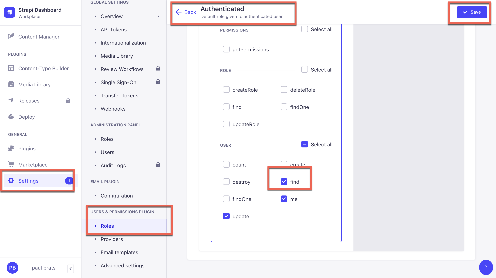
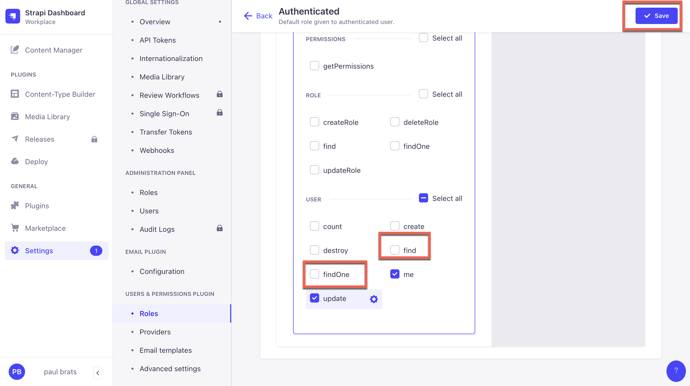
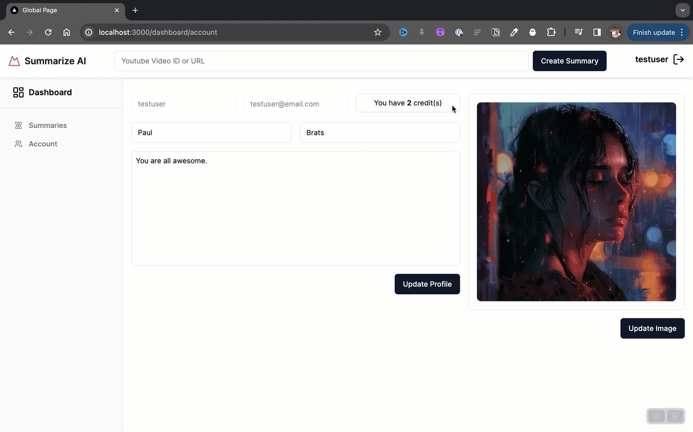

# Epic Next JS 14 TutorialPart 6: Create Video Summary with Next.js, LangChain, and Open AI.

In the previous tutorial, we completed our **Dashboard** and **Account** pages, in this section we will work on generating our video summary using Open AI and LangChain.

- Getting Started with the Project
- Building Out The Hero Section
- Building Out The Features Section, TopNavigation and Footer
- Building Out the Register and Sign In Page
- Building Out the Dashboard page
- **Get Video Transcript with OpenAI Function**
- Strapi CRUD permissions
- Search & pagination
- Backend deployment to Strapi Cloud and frontend deployment to Vercel


We are going to kick of the tutorial by starting to work on our **SummaryForm** component. This time around, instead of using a `server action` we will explore how to create and **api** route in Next.js.

You can learn more about Next.js route handlers [here](https://nextjs.org/docs/app/building-your-application/routing/route-handlers)

But first, let's start by creating our **Summary Form** that we can use to submit the request.

Navigate to `src/components/forms` and create a new file called `SummaryForm.tsx` and paste in the following code as the starting point.

```jsx
"use client";

import { useState } from "react";
import { toast } from "sonner";
import { cn } from "@/lib/utils";

import { Input } from "@/components/ui/input";
import { SubmitButton } from "@/components/custom/SubmitButton";

interface StrapiErrorsProps {
  message: string | null;
  name: string;
  status: string | null;
}

const INITIAL_STATE = {
  message: null,
  name: "",
  status: null,
};

export function SummaryForm() {
  const [loading, setLoading] = useState(false);
  const [error, setError] = useState < StrapiErrorsProps > INITIAL_STATE;
  const [value, setValue] = useState < string > "";

  async function handleFormSubmit(event: React.FormEvent<HTMLFormElement>) {
    event.preventDefault();
    setLoading(true);
    toast.success("Summary Created");
    setLoading(false);
  }

  function clearError() {
    setError(INITIAL_STATE);
    if (error.message) setValue("");
  }

  const errorStyles = error.message
    ? "outline-1 outline outline-red-500 placeholder:text-red-700"
    : "";

  return (
    <div className="w-full max-w-[960px]">
      <form
        onSubmit={handleFormSubmit}
        className="flex gap-2 items-center justify-center"
      >
        <Input
          name="videoId"
          placeholder={
            error.message ? error.message : "Youtube Video ID or URL"
          }
          value={value}
          onChange={(e) => setValue(e.target.value)}
          onMouseDown={clearError}
          className={cn(
            "w-full focus:text-black focus-visible:ring-pink-500",
            errorStyles
          )}
          required
        />

        <SubmitButton
          text="Create Summary"
          loadingText="Creating Summary"
          loading={loading}
        />
      </form>
    </div>
  );
}
```

The above code contains a basic form UI, and a `handleFormSubmit` function which has not been implemented yet.

We are also using **Sonner** one of my favorite toast libraries. You can learn more about it [here](https://sonner.emilkowal.ski/).

But we are not using it directly, and instead using the **Chadcn UI** component that you can find [here](https://ui.shadcn.com/docs/components/sonner).

```bash
npx shadcn-ui@latest add sonner
```

Once **Sonner** is installed, let's implemented in our main `layout.tsx` file by adding the following import.

```jsx
import { Toaster } from "@/components/ui/sonner";
```

And adding the code below above our `TopNav`.

```jsx
<body className={inter.className}>
  <Toaster position="bottom-center" />
  <Header data={globalData.header} />
  <div>{children}</div>
  <Footer data={globalData.footer} />
</body>
```

Now, let's add this form to our top navigation by navigating to `src/components/custom/Header.tsx` file and making the following changes.

```jsx
// import the form
import { SummaryForm } from "@/components/forms/SummaryForm";

// rest of the code

export async function Header({ data }: Readonly<HeaderProps>) {
  const user = await getUserMeLoader();
  const { logoText, ctaButton } = data;
  return (
    <div className="flex items-center justify-between px-4 py-3 bg-white shadow-md dark:bg-gray-800">
      <Logo text={logoText.text} />
      {user.ok && <SummaryForm />} {/* --> add this */}
      <div className="flex items-center gap-4">
        {user.ok ? (
          <LoggedInUser userData={user.data} />
        ) : (
          <Link href={ctaButton.url}>
            <Button>{ctaButton.text}</Button>
          </Link>
        )}
      </div>
    </div>
  );
}
```

Now let's restart our frontend project and see if it is showing up.


Now that we have our basic form working. Let's take a look how we can set up our first API Handler Route in Next.js

## How To Create A Route Handler in Next.js

We will have the Next.js [docs](https://nextjs.org/docs/app/building-your-application/routing/route-handlers) open as reference.

Let's start by creating a new folder inside our `app` directory called `api` with a folder called `summarize` with a file called `route.ts` and paste in the following code.

```ts
import { NextRequest } from "next/server";

export async function POST(req: NextRequest) {
  console.log("FROM OUR ROUTE HANDLER:", req.body);
  try {
    return new Response(
      JSON.stringify({ data: "return from our handler", error: null }),
      {
        status: 200,
      }
    );
  } catch (error) {
    console.error("Error processing request:", error);
    if (error instanceof Error)
      return new Response(JSON.stringify({ error: error }));
    return new Response(JSON.stringify({ error: "Unknown error" }));
  }
}
```

Now that we have our basic route handler, let's go back to our `SummaryForm.tsx` file and see if we can make a request to this endpoint.

But first let's navigate to `src/data/services` and create a new file called `summary-service.ts` and inside create a new service called `generateSummaryService.ts` and add the following code.

```ts
export async function generateSummaryService(videoId: string) {
  const url = "/api/summarize";
  try {
    const response = await fetch(url, {
      method: "POST",
      body: JSON.stringify({ videoId: videoId }),
    });
    return await response.json();
  } catch (error) {
    console.error("Failed to generate summary:", error);
    if (error instanceof Error) return { error: { message: error.message } };
    return { data: null, error: { message: "Unknown error" } };
  }
}
```

The following service allow us to call our newly created route handler located at `api/summarize` endpoint. It expects us to pass a `videoId` for the video that we would like to summarize.

Now, let's modify our `handleFormSubmit` to use our newly created service with the following code. Don't forget to import the `generateSummaryService` service.

```jsx
async function handleFormSubmit(event: React.FormEvent<HTMLFormElement>) {
    event.preventDefault();
    setLoading(true);

    const formData = new FormData(event.currentTarget);
    const videoId = formData.get("videoId") as string;

    console.log(videoId);

    const summaryResponseData = await generateSummaryService(videoId);
    console.log(summaryResponseData, "Response from route handler");

    toast.success("Testing Toast");
    setLoading(false);
  }

```

Now when you submit your form, inside our console log you should see the message being returned from our route handler.


Now that we know that our **Summary Form** and our **Route Handler** are connected we can move on to work on the logic responsible that will summarize our video.

## Using Next.js Route Handler LangChain and Open AI To Create A Summary.

In this section we will take a look on how to create a video summary based on the video transcript.

We will be using couple of service to help us accomplish this.

Prerequesit: you will need to have an account with **Open AI** if you don't have one, go [here](https://platform.openai.com/docs/introduction) and create one.

### Getting Transcript From YouTube

In the past, I have use ['youtube-transcript']() library, interestingly just recently it broke. You can read through the issues [here](https://github.com/Kakulukian/youtube-transcript/issues/19#issuecomment-2041204365).

Luckily the amazing community created a work around, so that is what we are going to use in our code.

For all who are reading this in the future, the fix might of been merged so you would be able to update your code and use the `youtube-transcript` package directly.

Just a quick note: when using other libraries especially ones that are not officially supported, it can lead to breaking changes, something to keep in mind.

So if you need a service to be guaranteed it may be valuable to create your own implementation.

I started building a plugin in Strapi to create transcripts using OpenAi whisper service once it is done, I will create a blog post around it.

But for this video we will just go with the following, start by navigating to `src/lib` and create a file name `youtube-transcript.ts` and paste in the following code.

```ts
import { parse } from "node-html-parser";

const RE_YOUTUBE =
  /(?:youtube\.com\/(?:[^\/]+\/.+\/|(?:v|e(?:mbed)?)\/|.*[?&]v=)|youtu\.be\/)([^"&?\/\s]{11})/i;
const USER_AGENT =
  "Mozilla/5.0 (Macintosh; Intel Mac OS X 10_15_4) AppleWebKit/537.36 (KHTML, like Gecko) Chrome/85.0.4183.83 Safari/537.36,gzip(gfe)";

class YoutubeTranscriptError extends Error {
  constructor(message: string) {
    super(`[YoutubeTranscript] ${message}`);
  }
}

type YtFetchConfig = {
  lang?: string; // Object with lang param (eg: en, es, hk, uk) format.
};

async function fetchTranscript(videoId: string, config: YtFetchConfig = {}) {
  const identifier = retrieveVideoId(videoId);
  const lang = config?.lang ?? "en";
  try {
    const transcriptUrl = await fetch(
      `https://www.youtube.com/watch?v=${identifier}`,
      {
        headers: {
          "User-Agent": USER_AGENT,
        },
      }
    )
      .then((res) => res.text())
      .then((html) => parse(html))
      .then((html) => parseTranscriptEndpoint(html, lang));

    if (!transcriptUrl)
      throw new Error("Failed to locate a transcript for this video!");

    // Result is hopefully some XML.
    const transcriptXML = await fetch(transcriptUrl)
      .then((res) => res.text())
      .then((xml) => parse(xml));

    const chunks = transcriptXML.getElementsByTagName("text");

    let transcriptions = [];
    for (const chunk of chunks) {
      const [offset, duration] = chunk.rawAttrs.split(" ");
      transcriptions.push({
        text: chunk.text,
        offset: convertToMs(offset),
        duration: convertToMs(duration),
      });
    }
    return transcriptions;
  } catch (e: any) {
    throw new YoutubeTranscriptError(e);
  }
}

function convertToMs(text: string) {
  const float = parseFloat(text.split("=")[1].replace(/"/g, "")) * 1000;
  return Math.round(float);
}

function parseTranscriptEndpoint(document: any, langCode?: string) {
  try {
    // Get all script tags on document page
    const scripts = document.getElementsByTagName("script");

    // find the player data script.
    const playerScript = scripts.find((script: any) =>
      script.textContent.includes("var ytInitialPlayerResponse = {")
    );

    const dataString =
      playerScript.textContent
        ?.split("var ytInitialPlayerResponse = ")?.[1] //get the start of the object {....
        ?.split("};")?.[0] + // chunk off any code after object closure.
      "}"; // add back that curly brace we just cut.

    const data = JSON.parse(dataString.trim()); // Attempt a JSON parse
    const availableCaptions =
      data?.captions?.playerCaptionsTracklistRenderer?.captionTracks || [];

    // If languageCode was specified then search for it's code, otherwise get the first.
    let captionTrack = availableCaptions?.[0];
    if (langCode)
      captionTrack =
        availableCaptions.find((track: any) =>
          track.languageCode.includes(langCode)
        ) ?? availableCaptions?.[0];

    return captionTrack?.baseUrl;
  } catch (e: any) {
    console.error(`parseTranscriptEndpoint Error: ${e.message}`);
    return null;
  }
}

function retrieveVideoId(videoId: string) {
  const regex =
    /(?:youtube\.com\/(?:[^\/]+\/.+\/|(?:v|e(?:mbed)?)\/|.*[?&]v=|shorts\/)|youtu\.be\/)([^"&?\/\s]{11})/i;
  const matchId = videoId.match(regex);
  if (matchId && matchId.length) {
    return matchId[1];
  }
  throw new YoutubeTranscriptError("Impossible to retrieve Youtube video ID.");
}

export { fetchTranscript, YoutubeTranscriptError };
```

You will need to install the `node-html-parser` dependency.

```bash
yarn add 'node-html-parser';
```

Once everything is installed, let's implement this in our route handles and see if we can get your YouTube transcript.

Navigate to `src/app/api/summarize/route.ts` and let's import our `fetchTranscript` function that we just created from `src/lib/youtube-transcript.ts`.

We will also create a wrapper function that will call this service. Here is what it will look like.

```ts
async function getTranscript(id: string) {
  try {
    return await fetchTranscript(id);
  } catch (error) {
    console.error("Failed to get transcript:", error);
    throw error;
  }
}
```

Inside our route handle in the try/catch blog we will add the following.

```ts
const body = await req.json();
const videoId = body.videoId;
const transcript = await getTranscript(videoId);
console.log("Transcript:", transcript);
```

We will get our `videoId` from the `req` and pass it into our `getTranscript` function.

The completed code should look like the following.

```ts
import { NextRequest } from "next/server";
import { fetchTranscript } from "@/lib/youtube-transcript";

async function getTranscript(id: string) {
  try {
    return await fetchTranscript(id);
  } catch (error) {
    console.error("Failed to get transcript:", error);
    throw error;
  }
}

export async function POST(req: NextRequest) {
  try {
    const body = await req.json();
    const videoId = body.videoId;
    const transcript = await getTranscript(videoId);
    console.log("Transcript:", transcript);

    return new Response(
      JSON.stringify({ data: "return from our handler", error: null }),
      {
        status: 200,
      }
    );
  } catch (error) {
    console.error("Error processing request:", error);
    if (error instanceof Error)
      return new Response(JSON.stringify({ error: error }));
    return new Response(JSON.stringify({ error: "Unknown error" }));
  }
}
```

Now, let's test our frontend.


Once we submit our form, we should see the following output in our console.

```js
Transcript: [
  {
    text: "In the last chapter, you and I started to step ",
    offset: 0,
    duration: 2009,
  },
  {
    text: "through the internal workings of a transformer.",
    offset: 2009,
    duration: 2010,
  },
  {
    text: "This is one of the key pieces of technology inside large language models, ",
    offset: 4560,
    duration: 3365,
  },
  // rest of the items
];
```

Nice, we are getting our transcript, but it is an array which also includes time code. But we just want the text. Let's create a utility function to do this conversion for us.

Let's add this function to the top of our code in our route handler.

```ts
function transformData(data: any[]) {
  let text = "";

  data.forEach((item) => {
    text += item.text + " ";
  });

  return {
    data: data,
    text: text.trim(),
  };
}
```

Now let's use it.

```ts
const transcriptText = transformData(transcript);
console.log(transcriptText);
```

The updated code should look like the following.

```ts
import { NextRequest } from "next/server";
import { fetchTranscript } from "@/lib/youtube-transcript";

async function getTranscript(id: string) {
  try {
    return await fetchTranscript(id);
  } catch (error) {
    console.error("Failed to get transcript:", error);
    throw error;
  }
}

function transformData(data: any[]) {
  let text = "";

  data.forEach((item) => {
    text += item.text + " ";
  });

  return {
    data: data,
    text: text.trim(),
  };
}

export async function POST(req: NextRequest) {
  try {
    const body = await req.json();
    const videoId = body.videoId;
    const transcript = await getTranscript(videoId);
    const transcriptText = transformData(transcript);
    console.log(transcriptText);

    return new Response(
      JSON.stringify({ data: "return from our handler", error: null }),
      {
        status: 200,
      }
    );
  } catch (error) {
    console.error("Error processing request:", error);
    if (error instanceof Error)
      return new Response(JSON.stringify({ error: error }));
    return new Response(JSON.stringify({ error: "Unknown error" }));
  }
}
```

Let's test it out. We should not see a response containing just out text.

```bash
  text: 'In the last chapter, you and I started to step  through the internal workings of a transformer. This is one of the key pieces of technology inside large language models,  and a lot of other tools in the modern wave of AI. It first hit the scene in a now-famous 2017 paper called Attention is All You Need,  and in this chapter you and I will dig '... 18362 more characters
```

Nice, now that we have our transcript, we can use it to get our summary.

But first let's add some basic validation.

Let's do a check in our form to make sure we are providing a proper video Id or video Url.

Then we will check if out user is logged in and has credits.

### Form Validation and Submission

First, let's add a util function to extract a valid videoId from our YouTube url. We will use to validate YouTube video id and ulr.

And the following inside of our `utils.ts` file.

```ts
export function extractYouTubeID(urlOrID: string): string | null {
  // Regular expression for YouTube ID format
  const regExpID = /^[a-zA-Z0-9_-]{11}$/;

  // Check if the input is a YouTube ID
  if (regExpID.test(urlOrID)) {
    return urlOrID;
  }

  // Regular expression for standard YouTube links
  const regExpStandard = /youtube\.com\/watch\?v=([a-zA-Z0-9_-]+)/;

  // Regular expression for YouTube Shorts links
  const regExpShorts = /youtube\.com\/shorts\/([a-zA-Z0-9_-]+)/;

  // Check for standard YouTube link
  const matchStandard = urlOrID.match(regExpStandard);
  if (matchStandard) {
    return matchStandard[1];
  }

  // Check for YouTube Shorts link
  const matchShorts = urlOrID.match(regExpShorts);
  if (matchShorts) {
    return matchShorts[1];
  }

  // Return null if no match is found
  return null;
}
```

Let's navigate to our `SummaryForm.tsx` file and update it with the following changes inside of our `handleFormSubmit` function.

```jsx
async function handleFormSubmit(event: React.FormEvent<HTMLFormElement>) {
    event.preventDefault();
    setLoading(true);
    toast.success("Submitting Form");

    const formData = new FormData(event.currentTarget);
    const videoId = formData.get("videoId") as string;

    const processedVideoId = extractYouTubeID(videoId);

    if (!processedVideoId) {
      toast.error("Invalid Youtube Video ID");
      setLoading(false);
      setValue("");
      setError({
        ...INITIAL_STATE,
        message: "Invalid Youtube Video ID",
        name: "Invalid Id",
      });
      return;
    }

    toast.success("Generating Summary");

    const summaryResponseData = await generateSummaryService(videoId);
    console.log(summaryResponseData, "Response from route handler");

    toast.success("Summary Created");
    setLoading(false);
  }

```

Let's test our the front end.


Nice we are able to check if we have proper Url or ID.

Now let's navigate to our route handler at `src/app/api/summarize/route.ts` and add a check to check if user is logged in and has available credits.

First import the following helper methods.

```ts
import { getUserMeLoader } from "@/data/services/get-user-me-loader";
import { getAuthToken } from "@/data/services/get-token";
```

And the following lines inside the `POST` function.

```ts
export async function POST(req: NextRequest) {
  const user = await getUserMeLoader();
  const token = await getAuthToken();

  if (!user.ok || !token)
    return new Response(
      JSON.stringify({ data: null, error: "Not authenticated" }),
      { status: 401 }
    );

  if (user.data.credits < 1)
    return new Response(
      JSON.stringify({
        data: null,
        error: "Insufficient credits",
      }),
      { status: 402 }
    );

  // rest of code
}
```

The final code should look like the following.

```ts
export async function POST(req: NextRequest) {
  const user = await getUserMeLoader();
  const token = await getAuthToken();

  if (!user.ok || !token)
    return new Response(
      JSON.stringify({ data: null, error: "Not authenticated" }),
      { status: 401 }
    );

  if (user.data.credits < 1)
    return new Response(
      JSON.stringify({
        data: null,
        error: "Insufficient credits",
      }),
      { status: 402 }
    );

  try {
    const body = await req.json();
    const videoId = body.videoId;
    const transcript = await getTranscript(videoId);
    const transcriptText = transformData(transcript);
    console.log(transcriptText);

    return new Response(
      JSON.stringify({ data: "return from our handler", error: null }),
      {
        status: 200,
      }
    );
  } catch (error) {
    console.error("Error processing request:", error);
    if (error instanceof Error)
      return new Response(JSON.stringify({ error: error }));
    return new Response(JSON.stringify({ error: "Unknown error" }));
  }
}
```

Now we have to add a check in our `SummaryForm.tsx` file to handle the errors inside of our `handleFormSubmit` function.

Let's add the following code after this line.

```jsx
const summaryResponseData = await generateSummaryService(videoId);

// add the following

if (summaryResponseData.error) {
  setValue("");
  toast.error(summaryResponseData.error);
  setError({
    ...INITIAL_STATE,
    message: summaryResponseData.error,
    name: "Summary Error",
  });
  setLoading(false);
  return;
}

// rest of the code
```

The completed code should look like the following.

```jsx
async function handleFormSubmit(event: React.FormEvent<HTMLFormElement>) {
    event.preventDefault();
    setLoading(true);
    toast.success("Submitting Form");

    const formData = new FormData(event.currentTarget);
    const videoId = formData.get("videoId") as string;

    const processedVideoId = extractYouTubeID(videoId);

    if (!processedVideoId) {
      toast.error("Invalid Youtube Video ID");
      setLoading(false);
      setValue("");
      setError({
        ...INITIAL_STATE,
        message: "Invalid Youtube Video ID",
        name: "Invalid Id",
      });
      return;
    }

    toast.success("Generating Summary");

    const summaryResponseData = await generateSummaryService(videoId);

    if (summaryResponseData.error) {
      setValue("");
      toast.error(summaryResponseData.error);
      setError({
        ...INITIAL_STATE,
        message: summaryResponseData.error,
        name: "Summary Error",
      });
      setLoading(false);
      return;
    }

    toast.success("Summary Created");
    setLoading(false);
  }

```

Now let's test our form.


Nice, it is working. Now we are ready to implement our logic to get our summary. Let's do it.

### Generate Summary with LangChain and OpenAI in Next.js

Now let's write our logic to handle our summary generation with OpenAi and LangChain.

If you never used LangChain before, it is a tool that helps your to simplify building AI powered apps. You can learn about it [here](https://js.langchain.com/docs/get_started/introduction).


Before getting started, let's install the following packages `@langchain/openai` and `langchain` with the following command.

```bash
yarn add @langchain/openai langchain
```

Nice, now let's make the following changes in our route handler, navigate to `src/app/api/summarize/route.ts` and let's make the following changes.

Fist let's import all the required dependencies.

```ts
import { ChatOpenAI } from "@langchain/openai";
import { PromptTemplate } from "@langchain/core/prompts";
import { StringOutputParser } from "@langchain/core/output_parsers";
```

Next let's create a function called `generateSummary` with the following code.

```ts
async function generateSummary(content: string, template: string) {
  const prompt = PromptTemplate.fromTemplate(template);

  const model = new ChatOpenAI({
    openAIApiKey: process.env.OPENAI_API_KEY,
    modelName: process.env.OPENAI_MODEL ?? "gpt-4-turbo-preview",
    temperature: process.env.OPENAI_TEMPERATURE
      ? parseFloat(process.env.OPENAI_TEMPERATURE)
      : 0.7,
    maxTokens: process.env.OPENAI_MAX_TOKENS
      ? parseInt(process.env.OPENAI_MAX_TOKENS)
      : 4000,
  });

  const outputParser = new StringOutputParser();
  const chain = prompt.pipe(model).pipe(outputParser);

  try {
    const summary = await chain.invoke({ text: content });
    return summary;
  } catch (error) {
    console.error("Error generating summary:", error);
  }
}
```

Now let's create a prompt template.

```ts
const TEMPLATE = `
INSTRUCTIONS: 
  For the this {text} complete the following steps.
  Generate the title for based on the content provided
  Summarize the following content and include 5 key topics, writing in first person using normal tone of voice.
  
  Write youtube video description
    - Include heading and sections.  
    - Incorporate keywords and key takeaways

  Generate bulleted list of key points and benefits

  Return possible and best recommended key words
`;
```

Now, let's use `generateSummary` function inside of our `POST` function. Update the code with the following.

The updated `POST` function should look like the following.

```ts
export async function POST(req: NextRequest) {
  const user = await getUserMeLoader();
  const token = await getAuthToken();

  if (!user.ok || !token)
    return new Response(
      JSON.stringify({ data: null, error: "Not authenticated" }),
      { status: 401 }
    );

  if (user.data.credits < 1)
    return new Response(
      JSON.stringify({
        data: null,
        error: "Insufficient credits",
      }),
      { status: 402 }
    );

  try {
    const body = await req.json();
    const videoId = body.videoId;
    const transcript = await getTranscript(videoId);
    const transcriptText = transformData(transcript);

    const summary = await generateSummary(transcriptText.text, TEMPLATE);
    console.log(summary);

    if (!summary) {
      return new Response(
        JSON.stringify({ data: null, error: "Failed to generate summary" }),
        { status: 500 }
      );
    }

    return new Response(JSON.stringify({ data: summary, error: null }), {
      status: 200,
    });
  } catch (error) {
    console.error("Error processing request:", error);
    if (error instanceof Error)
      return new Response(JSON.stringify({ error: error }));
    return new Response(JSON.stringify({ error: "Unknown error" }));
  }
}
```

In the code above we implemented our `generateSummary` function. Which will be in charge of generating our summary and sending it back you our form where we will create a server action to be responsible for saving our data into our Strapi backend.

But first let's console.log the output to see if we are getting back our summery.

First create a `.env.local` file and add our Open AI API key.

**WARNING**: Make sure your `.gitignore` file is ignoring `.env*.local` file from your commit, so you don't leak your Open AI key.

```
# local env files
.env*.local
```

```bash
OPENAI_API_KEY=ADD_YOUR_KEY_HERE
```

Now let's test out our form and see if we are able to get our summary.

Nice, we are able to see our output in the console.

```markdown
**Title:** Quickstart Guide to Launching Your Project with Strapi in Just 3 Minutes

**YouTube Video Description:**

**Heading:** Fast Track Your Development with Strapi: A 3-Minute Quickstart Guide

**Introduction:**
Join me today as we dive into how to get your project up and running with Strapi in just three minutes! Strapi is an open-source headless CMS that simplifies the process of building, managing, and deploying your content. Whether you're a developer, content creator, or project manager, this guide is designed to help you kickstart your project effortlessly.

**Sections:**

- **Setting Up Your Strapi Project:**
  - Learn how to create a new Strapi project using the quickstart command to leverage default configurations, including setting up an SQLite database.

rest of summary...
```

Now that we know we are getting our summary, the last step is to save it to Strapi and deduct 1 credit.

### Saving Our Summary To Strapi

Let's first start by creating a new `collection-type` in Strapi admin to save our summary.

Navigate to the content builder page and create a new collection named `Summary` with the following fields.


Let's add the following fields.

| Name    | Field     | Type        |
| ------- | --------- | ----------- |
| videoId | Text      | Short Text  |
| title   | Text      | Short Text  |
| summary | Rich Text | Markdown    |
| user    | Relation  | One to many |

When creating user relation make sure you select appropriate relation.


Here is what the final fields will look like.


And now navigate to `Setting` and add the following permissions.


Now, that we have our **Summary** `collection-type`, let's create a server action to handle saving our data to Strapi.

Let's start by navigating to `srs/data/actions` and creating a new file called `summary-actions.ts` and adding the following code.

```ts
"use server";

import { getAuthToken } from "@/data/services/get-token";
import { mutateData } from "@/data/services/mutate-data";
import { flattenAttributes } from "@/lib/utils";
import { revalidatePath } from "next/cache";
import { redirect } from "next/navigation";

interface Payload {
  data: {
    videoId: string;
    summary: string;
  };
}

export async function createSummaryAction(payload: Payload) {
  const authToken = await getAuthToken();
  if (!authToken) throw new Error("No auth token found");

  const data = await mutateData("POST", "/api/summaries", payload);
  const flattenedData = flattenAttributes(data);
  revalidatePath("/");
  redirect("/dashboard/summaries/" + flattenedData.id);
}
```

Now that we have our `createSummaryAction` let's use it in our `handleFormSubmit` found in our form named `SummaryForm`.

Update the `handleFormSubmit` with the following code.

```jsx
async function handleFormSubmit(event: React.FormEvent<HTMLFormElement>) {
    event.preventDefault();
    setLoading(true);
    toast.success("Submitting Form");

    const formData = new FormData(event.currentTarget);
    const videoId = formData.get("videoId") as string;

    const processedVideoId = extractYouTubeID(videoId);

    if (!processedVideoId) {
      toast.error("Invalid Youtube Video ID");
      setLoading(false);
      setValue("");
      setError({
        ...INITIAL_STATE,
        message: "Invalid Youtube Video ID",
        name: "Invalid Id",
      });
      return;
    }

    toast.success("Generating Summary");

    const summaryResponseData = await generateSummaryService(videoId);

    if (summaryResponseData.error) {
      setValue("");
      toast.error(summaryResponseData.error);
      setError({
        ...INITIAL_STATE,
        message: summaryResponseData.error,
        name: "Summary Error",
      });
      setLoading(false);
      return;
    }

    toast.success("Summary Generated");

    const payload = {
      data: {
        videoId: processedVideoId,
        summary: summaryResponseData.data,
      },
    };

    await createSummaryAction(payload);
    toast.success("Summary Saved");

    setValue("");
    setLoading(false);
  }
```

The above code will be responsible for saving our data into Strapi.


Before testing out our form, we need to update user permissions to allows us to set user relation to our summary.



Even though this will work, there is more secure way of handling this, and instead of setting this relationship in our frontend we can handle it via Strapi middleware.

We will circle back to this and refactor after all the Next js frontend logic is done.

Now, let's test out our form.

We should be redirected to our `summaries` route that we are yet to create.


So we will get our not found page, but this is something we will fix in the next section.

## Create Summary Page Card View

Let's navigate to our `dashboard` folder and inside create another folder named `summaries` with a fille named `page.tsx` and paste in the following code.

```jsx
import Link from "next/link";

import { getSummaries } from "@/data/loaders";

import { Card, CardContent, CardHeader, CardTitle } from "@/components/ui/card";

interface LinkCardProps {
  id: string;
  title: string;
  summary: string;
}

function LinkCard({ id, title, summary }: LinkCardProps) {
  return (
    <Link href={`/dashboard/summaries/${id}`}>
      <Card className="relative">
        <CardHeader>
          <CardTitle className="leading-5">
            {title || "Video Summary"}
          </CardTitle>
        </CardHeader>
        <CardContent>
          <p className="w-full mb-4 ">
            {summary.slice(0, 164) + " [read more]"}
          </p>
        </CardContent>
      </Card>
    </Link>
  );
}

export default async function SummariesRoute() {
  const { data } = await getSummaries();
  if (!data) return null;
  return (
    <div className="grid grid-cols-1 gap-4 p-4">
      <div className="grid grid-cols-1 sm:grid-cols-2 md:grid-cols-3 lg:grid-cols-4 gap-4">
        {data.map((item: LinkCardProps) => (
          <LinkCard key={item.id} {...item} />
        ))}
      </div>
    </div>
  );
}
```

Before this component will work we need to create `getSummaries` function to load our data.

Let's navigate to our `loaders.ts` file and make the following changes.

First, import the following method to give us access to our auth token for authorized requests.

```ts
import { getAuthToken } from "./services/get-token";
```

Next update `fetchData` function with the following code.

```ts
async function fetchData(url: string) {
  const authToken = await getAuthToken();

  const headers = {
    method: "GET",
    headers: {
      "Content-Type": "application/json",
      Authorization: `Bearer ${authToken}`,
    },
  };

  try {
    const response = await fetch(url, authToken ? headers : {});
    const data = await response.json();
    return flattenAttributes(data);
  } catch (error) {
    console.error("Error fetching data:", error);
    throw error; // or return null;
  }
}
```

Now let's add this code at end of the file to get our summaries.

```ts
export async function getSummaries() {
  const url = new URL("/api/summaries", baseUrl);
  return fetchData(url.href);
}
```

Now, we need to update the following permissions in Strapi dashboard.


Now we should be able to see the list view.

Now, let's create the Single Card view.

1. inside summaries create a new folder called `[videoId]`
2. create a `layout.tsx` file with the following code.

```jsx
import { extractYouTubeID } from "@/lib/utils";

export default async function SummarySingleRoute({
  params,
  children,
}: {
  readonly params: any;
  readonly children: React.ReactNode;
}) {
  return (
    <div>
      <div className="h-full grid gap-4 grid-cols-5 px-6">
        <div className="col-span-3">{children}</div>
        <div className="col-span-2">
          <div className="rounded-lg overflow-hidden">
            <p>Video will go here</p>
          </div>
        </div>
      </div>
    </div>
  );
}

```

3. Create `page.tsx` file with the following.

```jsx
interface ParamsProps {
  params: {
    videoId: string,
  };
}

export default async function SummaryCardRoute({
  params,
}: Readonly<ParamsProps>) {
  return <p>Summary card with go here: {params.videoId}</p>;
}
```

Now that we know that our pages work let's create the loaders to get the appropriate data.

### Fetching And Displaying Our Single Video and Summary

Let's start by navigating to our `loaders.ts` file and add the following functions.

```jsx
export async function getSummaryById(summaryId: string) {
  return fetchData(`${baseUrl}/api/summaries/${summaryId}`);
}
```

Now, before we use our `getSummaryById` function let's install our our video player. We are going to use **React Player** that you can find [here](https://www.npmjs.com/package/react-player).

Let's start by installing it with the following command.

```bash
yarn add react-player
```

Now, let's create a wrapper component that will use our **React Player** inside `components/custom` folder create a file called `YouTubePlayer.tsx` and paste in the following code.

```jsx
"use client";
import ReactPlayer from "react-player/youtube";

function generateYouTubeUrl(videoId: string) {
  const baseUrl = new URL("https://www.youtube.com/watch");
  baseUrl.searchParams.append("v", videoId);
  return baseUrl.href;
}

interface YouTubePlayerProps {
  videoId: string | null;
}

export default function YouTubePlayer({
  videoId,
}: Readonly<YouTubePlayerProps>) {
  if (!videoId) return null;
  const videoUrl = generateYouTubeUrl(videoId);

  return (
    <div className="relative aspect-w-16 aspect-h-9">
      <ReactPlayer
        url={videoUrl}
        width="100%"
        height="100%"
        controls
        className="absolute top-0 left-0"
      />
    </div>
  );
}
```

Now, that we have our react player, let's updated `layout.tsx` file with the following code.

```jsx
import dynamic from "next/dynamic";

import { extractYouTubeID } from "@/lib/utils";
import { getSummaryById } from "@/data/loaders";

const NoSSR = dynamic(() => import("@/components/custom/YouTubePlayer"), {
  ssr: false,
});

export default async function SummarySingleRoute({
  params,
  children,
}: {
  readonly params: any;
  readonly children: React.ReactNode;
}) {
  const data = await getSummaryById(params.videoId);
  const videoId = extractYouTubeID(data.videoId);
  if (!data) return <p>No Items Found</p>;
  return (
    <div>
      <div className="h-full grid gap-4 grid-cols-5 px-6">
        <div className="col-span-3">{children}</div>
        <div className="col-span-2">
          <div className="rounded-lg overflow-hidden">
            <NoSSR videoId={videoId} />
          </div>
        </div>
      </div>
    </div>
  );
}


```

In the code above we are using `dynamic` to disable ssr which helps to avoid issues when using certain client side components. You can read more here.


Now, let's display our summary.

Let's first create a new file called `SummaryCardForm.tsx` we can add it inside of our `src/components/forms` folder and paste in the following code.

```jsx

// import { updateSummaryAction, deleteSummaryAction } from "@/data/actions/summary-actions";

import { Input } from "@/components/ui/input";
import { Textarea } from "@/components/ui/textarea";
import { cn } from "@/lib/utils";

import {
  Card,
  CardContent,
  CardFooter,
  CardHeader,
  CardTitle,
} from "@/components/ui/card";

import { SubmitButton } from "@/components/custom/SubmitButton";
import { DeleteButton } from "@/components/custom/DeleteButton";


export function SummaryCardForm({
  item,
  className,
}: {
  readonly item: any;
  readonly className?: string;
}) {
  // const deleteSummaryById = deleteSummaryAction.bind(null, item.id);

  return (
    <Card className={cn("mb-8 relative h-auto", className)}>
      <CardHeader>
        <CardTitle>Video Summary</CardTitle>
      </CardHeader>
      <CardContent>
        <div>
          <form>
          <Input id="title" name="title" placeholder="Update your title" required className="mb-4" defaultValue={item.title}/>
            <Textarea
              name="summary"
              className="flex w-full rounded-md bg-transparent px-3 py-2 text-sm shadow-sm placeholder:text-muted-foreground focus-visible:outline-none focus-visible:bg-gray-50 focus-visible:ring-1 focus-visible:ring-ring disabled:cursor-not-allowed disabled:opacity-50 mb-4 h-[calc(100vh-245px)] "
              defaultValue={item.summary}
            />
            <input type="hidden" name="id" value={item.id} />
            <SubmitButton
              text="Update Summary"
              loadingText="Updating Summary"
            />
          </form>
          <form>
            <DeleteButton className="absolute right-4 top-4 bg-red-700 hover:bg-red-600" />
          </form>
        </div>
      </CardContent>
      <CardFooter></CardFooter>
    </Card>
  );
}


```

We are using a new component **DeleteButton** let's created inside of our `components/custom` folder. Create a file called `DeleteButton.tsx` and add the following code.

```jsx
"use client";
import { useFormStatus } from "react-dom";
import { cn } from "@/lib/utils";
import { Button } from "@/components/ui/button";
import { TrashIcon } from "lucide-react";
import { Loader2 } from "lucide-react";

function Loader() {
  return (
    <div className="flex items-center">
      <Loader2 className="h-4 w-4 animate-spin" />
    </div>
  );
}

interface DeleteButtonProps {
  className?: string;
}

export function DeleteButton({ className }: Readonly<DeleteButtonProps>) {
  const status = useFormStatus();
  return (
    <Button
      type="submit"
      aria-disabled={status.pending}
      disabled={status.pending}
      className={cn(className)}
    >
      {status.pending ? <Loader /> : <TrashIcon className="w-4 h-4" />}
    </Button>
  );
}
```

Now, let's update our `page.tsx` file with the following code.

```jsx
import { getSummaryById } from "@/data/loaders";
import { SummaryCardForm } from "@/components/forms/SummaryCardForm";

interface ParamsProps {
  params: {
    videoId: string,
  };
}

export default async function SummaryCardRoute({
  params,
}: Readonly<ParamsProps>) {
  const data = await getSummaryById(params.videoId);
  if (!data) return <p>No Items Found</p>;
  return <SummaryCardForm item={data} />;
}
```


Now, that our we know our front end works. Let's revisit our route handler.

## Using Strapi Route Middleware To Make Our App More Secure

We are currently relying on our front end to set the user when creating our Summary, in order for this functionality to work we had to allow user permissions to find the user in order to set the relationship.

Which is not great, because that means any user can find info for any other user, so what we can do is disable the find functionality, and create a middleware that will set the user on Strapi backend.

We are also not handling user credit update, let's do that in the middleware.

Let's fix this by creating a strapi Middleware that will handle setting the correct user and deducting a credit.

You can learn more about route middlewares here.

Let's first start by creating our route middleware.

We can use our cli command. In your `backend` folder run the following command.

```bash
yarn strapi generate
```

Chose generate middleware option.

```bash

▶ yarn strapi generate
yarn strapi generate
yarn run v1.22.19
$ strapi generate
? Strapi Generators
  content-type - Generate a content type for an API
  plugin - Generate a basic plugin
  policy - Generate a policy for an API
❯ middleware - Generate a middleware for an API
  migration - Generate a migration
  service - Generate a service for an API
  api - Generate a basic API
(Move up and down to reveal more choices)
```

Let's call it `on-summary-create` and add it to an existing API. Which will be `summary`

```bash
? Strapi Generators middleware - Generate a middleware for an API
? Middleware name on-summary-create
? Where do you want to add this middleware?
  Add middleware to root of project
❯ Add middleware to an existing API
  Add middleware to an existing plugin
```

```bash
? Which API is this for?
  global
  home-page
❯ summary

```

Now let's take a look in the following folder `backend/src/api/summary/middlewares` you should see the following file `on-summary-create` with the following boiler plate.

```js
"use strict";

/**
 * `on-summary-create` middleware
 */

module.exports = (config, { strapi }) => {
  // Add your own logic here.
  return async (ctx, next) => {
    strapi.log.info("In on-summary-create middleware.");

    await next();
  };
};
```

Let's update it with the following code.

```js
"use strict";

module.exports = (config, { strapi }) => {
  return async (ctx, next) => {
    const user = ctx.state.user;
    if (!user) return ctx.unauthorized("You are not authenticated");

    const availableCredits = user.credits;

    if (availableCredits === 0)
      return ctx.unauthorized("You do not have enough credits.");

    await next();

    // update the user's credits
    const uid = "plugin::users-permissions.user";
    const payload = {
      data: {
        credits: availableCredits - 1,
        summaries: {
          connect: [ctx.response.body.data.id],
        },
      },
    };

    await strapi.entityService.update(uid, user.id, payload);

    console.log("############ Inside middleware end #############");
  };
};
```

Explain middlware.

In the code above we deduct one credit, and set the user and summary relation.

Before we can test it out we have to enable it inside of our route.

Navigate to `backend/src/api/summary/routes/summary.js` file and update with the following.

```js
"use strict";

/**
 * summary router
 */

const { createCoreRouter } = require("@strapi/strapi").factories;

module.exports = createCoreRouter("api::summary.summary", {
  config: {
    create: {
      middlewares: ["api::summary.on-summary-create"],
    },
  },
});
```

Now our middleware will fire when we create a new summary. Now, let's update our `frontend` code.

Let's navigate to our route handler found in `src/app/api/summarize/route.ts` and make the following changes.

Remove user reference from our Payload interface.

```ts
interface Payload {
  data: {
    videoId: string;
    summary: string;
  };
}
```

And remove the user from the payload variable.

```ts
const payload: Payload = {
  data: {
    videoId: videoId,
    summary: summary,
  },
};
```

Now, restart your Strapi backend and Next.js frontend.

In Strapi Admin let's disable these previously set user permissions.



Let's test things out, but we will have a small problem. Let's see what it is.



Notice that I need to do a hard refresh to reload the page in order to update the credit count.

We will just update our `getUserMeLoader` not to cache the data any of the user data.

```jsx
export async function getUserMeLoader() {
  const baseUrl = getStrapiURL();

  const url = new URL("/api/users/me", baseUrl);
  url.search = query;

  const authToken = await getAuthToken();
  if (!authToken) return { ok: false, data: null, error: null };

  try {
    const response = await fetch(url.href, {
      cache: "no-store", // <-- this will opt out from caching our user data
      method: "GET",
      headers: {
        "Content-Type": "application/json",
        Authorization: `Bearer ${authToken}`,
      },
    });
    const data = await response.json();
    if (data.error) return { ok: false, data: null, error: data.error };
    return { ok: true, data: data, error: null };
  } catch (error) {
    console.log(error);
    return { ok: false, data: null, error: error };
  }
}
```

Restart your Next app and let's try again.

Now things should work as expected. If we were using server actions we could of used `revalidatePath` you can read more about it [here](). In our case not caching user data make more sense.

## Conclusion
