# Epic Next JS 14 Tutorial Part 7: CRUD and Permissions

Welcome back to our Epic Next.js tutorial series!

Last time, we learned how to generate summaries using OpenAI and save them into our database.

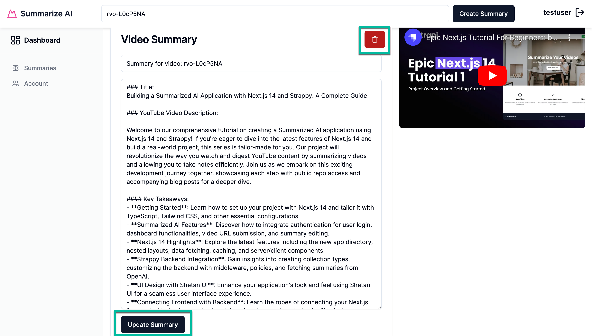

Today, we'll take a look at how to update and delete our summaries while ensuring that only an authorized user can do this.

We must ensure that only the right people can change or delete information.

We'll tackle this challenge using Strapi's route middleware, ensuring only authorized users can interact with their summaries.

## Quick CRUD Refresher

Let's briefly revisit the basics of CRUD—Create, Read, Update, and Delete—essential operations for any web application:

**Create (POST)**: This method sends data to the server to create a new resource, like a summary.

**Read (GET)**: GET requests to retrieve data from the server, such as loading summary details.

**Update (PUT)**: Used for modifying an existing resource, like updating a user's bio.

**Delete (DELETE)**: Removes resources, such as deleting a user's summary.

### Implementing CRUD Operations

To better understand how to interact with our database, here's how Strapi maps CRUD operations to specific HTTP methods and routes:

Create Summary: POST `/api/summaries`
Find Summaries: GET `/api/summaries`
Find One Summary: GET `/api/summaries/:id`
Update Summary: PUT `/api/summaries/:id`
Delete Summary: DELETE `/api/summaries/:id`

### Strapi Workflow Explained

Here's a basic breakdown of what happens in Strapi when a request is made:

**Make a Request**: A client (like a browser or mobile app) sends a request to the server.

**Hit a Route**: The request reaches Strapi and matches one of the predefined routes.

**Call the Controller**: The route triggers a controller function that handles the specifics of the request, such as retrieving data, updating a record, or deleting an item.

**Managing Authorized Requests with JWT Tokens**

Strapi uses JSON Web Tokens (JWT) to ensure that each request is legitimate. Here's how it works:

Users who log in receive a JWT, which must be included as a 'Bearer token' in the header of subsequent requests.

This token is validated on each request to ensure it's still valid and that the user is authenticated.

However, authenticating a request doesn't automatically mean it's authorized.

Just because a user is logged in and has a token doesn't mean they should be able to modify any data they want.

We need to define the logic that will prevent users from modifying data that isn't theirs.

**Note**: Strapi does not handle this out of the box, so we need to write custom logic within our middleware.

## Understanding Route Middleware

Route middleware in Strapi acts as a security checkpoint for each request, where we can add additional checks, such as such as whether the user is authorized to update or delete content.

**How Route Middleware Works**

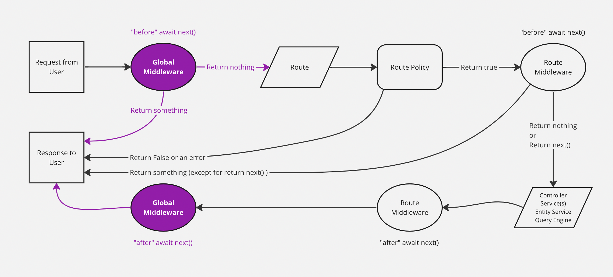

**Intercept Requests**: Middleware functions intercept incoming requests before they reach their final destination.

**Check Permissions**: It assesses whether the user's token grants them the right to perform the requested action.

**Allow or Deny Access**: If the user lacks necessary permissions, the middleware denies access and may return a response like "403 Forbidden".

Read more about Strapi middlewares [here](https://docs.strapi.io/dev-docs/backend-customization/middlewares).

This system prevents unauthorized data modification and helps maintain a clear separation of duties within the application, simplifying management and enhancing security.

This approach enhances security and helps maintain a clean separation of concerns within the application, making the codebase more straightforward to manage and scale.

Now that we know we need to create our own middleware to handle the authorization check, let's implement our form logic first, then add the middleware.

## Setting Up Summary Update Logic

In your project's front end, navigate to the following file `SummaryCardForm.tsx`.

You should see the following code that we added in the previous tutorial.

```tsx
// import { updateSummaryAction, deleteSummaryAction } from "@/data/actions/summary-actions";

import { Input } from "@/components/ui/input";
import { Textarea } from "@/components/ui/textarea";
import { cn } from "@/lib/utils";

import {
  Card,
  CardContent,
  CardFooter,
  CardHeader,
  CardTitle,
} from "@/components/ui/card";

import { SubmitButton } from "@/components/custom/SubmitButton";
import { DeleteButton } from "@/components/custom/DeleteButton";

export function SummaryCardForm({
  item,
  className,
}: {
  readonly item: any;
  readonly className?: string;
}) {
  // const deleteSummaryById = deleteSummaryAction.bind(null, item.id);

  return (
    <Card className={cn("mb-8 relative h-auto", className)}>
      <CardHeader>
        <CardTitle>Video Summary</CardTitle>
      </CardHeader>
      <CardContent>
        <div>
          <form>
            <Input
              id="title"
              name="title"
              placeholder="Update your title"
              required
              className="mb-4"
              defaultValue={item.title}
            />
            <Textarea
              name="summary"
              className="flex w-full rounded-md bg-transparent px-3 py-2 text-sm shadow-sm placeholder:text-muted-foreground focus-visible:outline-none focus-visible:bg-gray-50 focus-visible:ring-1 focus-visible:ring-ring disabled:cursor-not-allowed disabled:opacity-50 mb-4 h-[calc(100vh-245px)] "
              defaultValue={item.summary}
            />
            <input type="hidden" name="id" value={item.id} />
            <SubmitButton
              text="Update Summary"
              loadingText="Updating Summary"
            />
          </form>
          <form>
            <DeleteButton className="absolute right-4 top-4 bg-red-700 hover:bg-red-600" />
          </form>
        </div>
      </CardContent>
      <CardFooter></CardFooter>
    </Card>
  );
}
```

In the code above, we have yet to implement our `updateSummaryAction` and `deleteSummaryAction.`

Let's start with adding our new server actions; let's navigate to our `src/data/actions` folder, and, in the file name `summary-actions.ts,`, add the following code.

```tsx
export async function updateSummaryAction(prevState: any, formData: FormData) {
  const rawFormData = Object.fromEntries(formData);
  const id = rawFormData.id as string;

  const payload = {
    data: {
      title: rawFormData.title,
      summary: rawFormData.summary,
    },
  };

  const responseData = await mutateData("PUT", `/api/summaries/${id}`, payload);

  if (!responseData) {
    return {
      ...prevState,
      strapiErrors: null,
      message: "Oops! Something went wrong. Please try again.",
    };
  }

  if (responseData.error) {
    return {
      ...prevState,
      strapiErrors: responseData.error,
      message: "Failed to update summary.",
    };
  }

  const flattenedData = flattenAttributes(responseData);

  return {
    ...prevState,
    message: "Summary updated successfully",
    data: flattenedData,
    strapiErrors: null,
  };
}

export async function deleteSummaryAction(id: string, prevState: any) {
  const responseData = await mutateData("DELETE", `/api/summaries/${id}`);

  if (!responseData) {
    return {
      ...prevState,
      strapiErrors: null,
      message: "Oops! Something went wrong. Please try again.",
    };
  }

  if (responseData.error) {
    return {
      ...prevState,
      strapiErrors: responseData.error,
      message: "Failed to delete summary.",
    };
  }

  redirect("/dashboard/summaries");
}
```

Now that we have both server actions to handle update and delete let's navigate back to our `SummaryCardForm.tsx` file.

Let's start by uncommenting our server actions import.

```tsx
import {
  updateSummaryAction,
  deleteSummaryAction,
} from "@/data/actions/summary-actions";
```

Then, let's import the following to access the form state for error handling.

```tsx
import { useFormState } from "react-dom";
```

Don't forget, since we are using `useFormState` we need to add `"use client";` at the top of the file.

Now, let's set the default state to the following:

```tsx
const INITIAL_STATE = {
  strapiErrors: null,
  data: null,
  message: null,
};
```

Let's connect our actions with our formState by adding the following.

```tsx
const deleteSummaryById = deleteSummaryAction.bind(null, item.id);

const [deleteState, deleteAction] = useFormState(
  deleteSummaryById,
  INITIAL_STATE
);

const [updateState, updateAction] = useFormState(
  updateSummaryAction,
  INITIAL_STATE
);
```

Based on what we have already covered, this should all start looking familiar. We are using `useFormState` to get our return from our server actions to display our errors on our front end front end.

Now that we have our `deleteAction` and `updateAction,` we must add these to the respectful forms via the action attribute.

```tsx
<form action={updateAction}>
  <Input
    id="title"
    name="title"
    placeholder="Update your title"
    required
    className="mb-4"
    defaultValue={item.title}
  />
  <Textarea
    name="summary"
    className="flex w-full rounded-md bg-transparent px-3 py-2 text-sm shadow-sm placeholder:text-muted-foreground focus-visible:outline-none focus-visible:bg-gray-50 focus-visible:ring-1 focus-visible:ring-ring disabled:cursor-not-allowed disabled:opacity-50 mb-4 h-[calc(100vh-245px)] "
    defaultValue={item.summary}
  />
  <input type="hidden" name="id" value={item.id} />
  <SubmitButton text="Update Summary" loadingText="Updating Summary" />
</form>
```

```tsx
<form action={deleteAction}>
  <DeleteButton className="absolute right-4 top-4 bg-red-700 hover:bg-red-600" />
</form>
```

Finally, let's import our `StrapiError` component with the following.

```tsx
import { StrapiErrors } from "@/components/custom/StrapiErrors";
```

And use it in our card footer.

```tsx
<CardFooter>
  <StrapiErrors
    error={deleteState?.strapiErrors || updateState?.strapiErrors}
  />
</CardFooter>
```

The completed code should look like the following.

```tsx
"use client";
import { useFormState } from "react-dom";
import {
  updateSummaryAction,
  deleteSummaryAction,
} from "@/data/actions/summary-actions";

import { Input } from "@/components/ui/input";
import { Textarea } from "@/components/ui/textarea";
import { StrapiErrors } from "@/components/custom/StrapiErrors";

import { cn } from "@/lib/utils";

import {
  Card,
  CardContent,
  CardFooter,
  CardHeader,
  CardTitle,
} from "@/components/ui/card";

import { SubmitButton } from "@/components/custom/SubmitButton";
import { DeleteButton } from "@/components/custom/DeleteButton";

const INITIAL_STATE = {
  strapiErrors: null,
  data: null,
  message: null,
};

export function SummaryCardForm({
  item,
  className,
}: {
  readonly item: any;
  readonly className?: string;
}) {
  const deleteSummaryById = deleteSummaryAction.bind(null, item.id);

  const [deleteState, deleteAction] = useFormState(
    deleteSummaryById,
    INITIAL_STATE
  );

  const [updateState, updateAction] = useFormState(
    updateSummaryAction,
    INITIAL_STATE
  );

  return (
    <Card className={cn("mb-8 relative h-auto", className)}>
      <CardHeader>
        <CardTitle>Video Summary</CardTitle>
      </CardHeader>
      <CardContent>
        <div>
          <form action={updateAction}>
            <Input
              id="title"
              name="title"
              placeholder="Update your title"
              required
              className="mb-4"
              defaultValue={item.title}
            />
            <Textarea
              name="summary"
              className="flex w-full rounded-md bg-transparent px-3 py-2 text-sm shadow-sm placeholder:text-muted-foreground focus-visible:outline-none focus-visible:bg-gray-50 focus-visible:ring-1 focus-visible:ring-ring disabled:cursor-not-allowed disabled:opacity-50 mb-4 h-[calc(100vh-245px)] "
              defaultValue={item.summary}
            />
            <input type="hidden" name="id" value={item.id} />
            <SubmitButton
              text="Update Summary"
              loadingText="Updating Summary"
            />
          </form>
          <form action={deleteAction}>
            <DeleteButton className="absolute right-4 top-4 bg-red-700 hover:bg-red-600" />
          </form>
        </div>
      </CardContent>
      <CardFooter>
        <StrapiErrors
          error={deleteState?.strapiErrors || updateState?.strapiErrors}
        />
      </CardFooter>
    </Card>
  );
}
```

Now, let's test out our front end. I disabled `delete` and `update` under user permission for authenticated users.

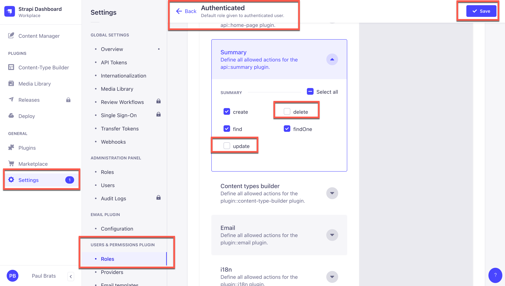

So, if we try to `delete` or `update` our summary, we should see the `forbidden` message in our card footer.

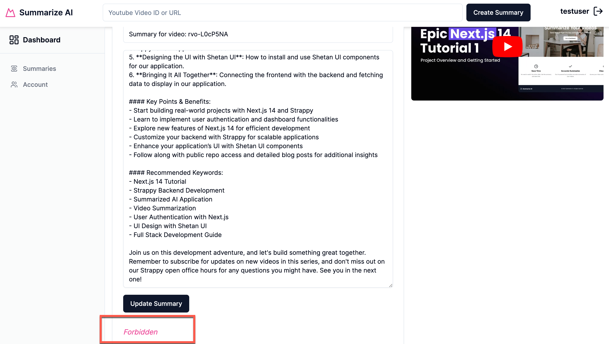

Excellent, we can tell our errors are working. Let's set the following permissions again and see if our update and delete functions work.

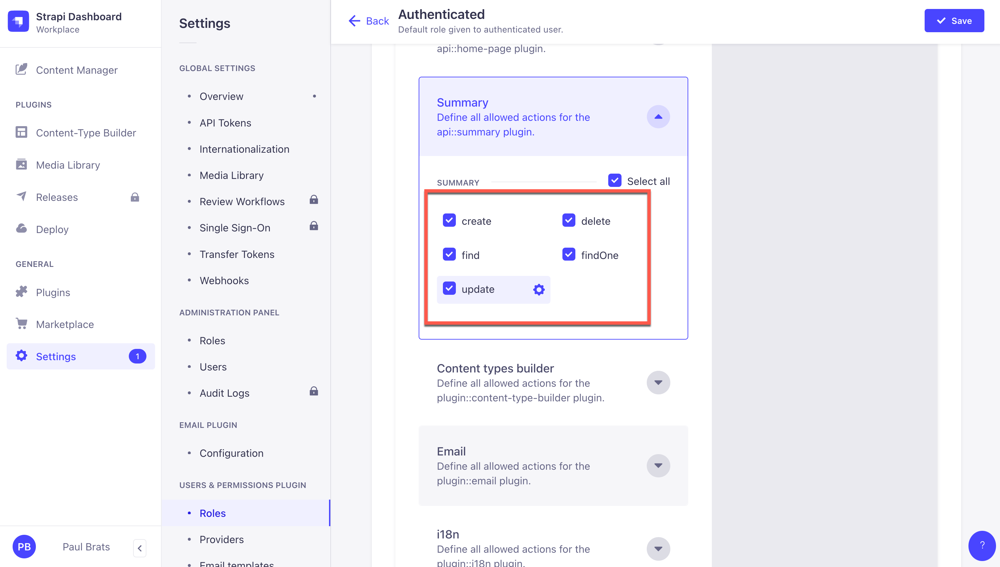

You should now see that you can update and delete your content.

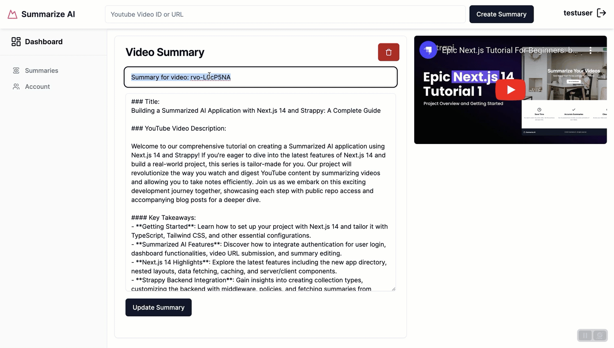

## Create Is Owner Middleware In Strapi

For the following few examples, I will use **Insomnia** since it will be easier to test our API responses.

Let's start with the first case: What happens if I am authenticated and make a request to the following endpoint: GET `/api/summaries`?

Believe it or not, I will get all the users' summaries, Right. I know.

This could be better. We want only the owners of the summaries to see their own summaries.

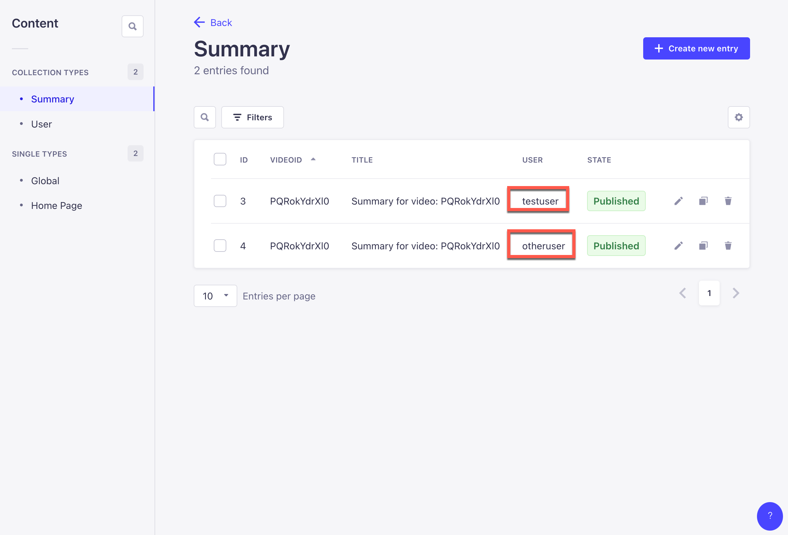

Here in Strapi Admin, you can see that I have two summaries from two different users. Still, in the front end, you can see that I have access to all the summaries.

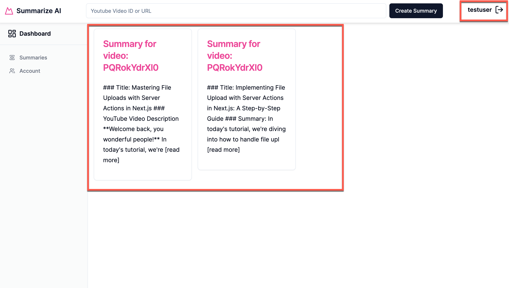

We can also confirm this via **Insomnia**. You can see that I am returning both summaries even though I should only return one summary for the user I am logged in with.


Let's create a new middleware to only show summaries from the user who is logged in by applying a filter inside of our middleware.

### Using Strapi CLI To Generate Middleware

Let's start in our Strapi project folder, so make sure you are on the back end of your project and run the following command.

```bash
yarn strapi generate
```

Select the `middleware` option.

```bash
yarn run v1.22.19
$ strapi generate
? Strapi Generators
  content-type - Generate a content type for an API
  plugin - Generate a basic plugin
  policy - Generate a policy for an API
❯ middleware - Generate a middleware for an API
  migration - Generate a migration
  service - Generate a service for an API
  api - Generate a basic API
(Move up and down to reveal more choices)
```

I am going to call my middleware `is-owner.`

```bash
$ strapi generate
? Strapi Generators middleware - Generate a middleware for an API
? Middleware name is-owner
```

We are going to add this middleware to the root of the project.

```bash
? Where do you want to add this middleware? Add middleware to root of project
✔  ++ /middlewares/is-owner.js
✨  Done in 327.55s.
```

Our middleware is located in the root of our project, in a folder called `src/middlewares` inside the `is-owner` file.

It will have this basic template code.

```js
"use strict";

/**
 * `is-owner` middleware
 */

module.exports = (config, { strapi }) => {
  // Add your own logic here.
  return async (ctx, next) => {
    strapi.log.info("In is-owner middleware.");

    await next();
  };
};
```

Let's update the code with the following.

```js
"use strict";

module.exports = (config, { strapi }) => {
  return async (ctx, next) => {
    const entryId = ctx.params.id;
    const user = ctx.state.user;
    const userId = user?.id;

    if (!userId) return ctx.unauthorized(`You can't access this entry`);

    const apiName = ctx.state.route.info.apiName;

    function generateUID(apiName) {
      const apiUid = `api::${apiName}.${apiName}`;
      return apiUid;
    }

    const appUid = generateUID(apiName);

    if (entryId) {
      const entry = await strapi.entityService.findOne(appUid, entryId, {
        populate: "*",
      });

      if (entry && entry.user.id !== userId)
        return ctx.unauthorized(`You can't access this entry`);
    }

    if (!entryId) {
      ctx.query = {
        ...ctx.query,
        filters: { ...ctx.query.filters, user: userId },
      };
    }

    await next();
  };
};
```

The code above will check for two cases. If entryId exists, that means we are calling the findOne route. In this case, we search for the entry and check if the userId is the same as the logged-in user. If that is the case, go ahead and return the entry.

In the second case, if there is no entryId, we assume that we are making a find request, in which case filter the content by userId.

Before we can test the middleware, we need to add the appropriate routes.

In Strapi, navigate to the following folder and file `src/api/summary/routes/summary.js,` and you should see this code.

```js
"use strict";

/**
 * summary router
 */

const { createCoreRouter } = require("@strapi/strapi").factories;

module.exports = createCoreRouter("api::summary.summary", {
  config: {
    create: {
      middlewares: ["api::summary.on-summary-create"],
    },
  },
});
```

We have already added middleware to our create route. Let's do the same for find, findOne, update, and delete.

Completed code with the changes should look like the following.

```js
"use strict";

/**
 * summary router
 */

const { createCoreRouter } = require("@strapi/strapi").factories;

module.exports = createCoreRouter("api::summary.summary", {
  config: {
    create: {
      middlewares: ["api::summary.on-summary-create"],
    },
    find: {
      middlewares: ["global::is-owner"],
    },
    findOne: {
      middlewares: ["global::is-owner"],
    },
    update: {
      middlewares: ["global::is-owner"],
    },
    delete: {
      middlewares: ["global::is-owner"],
    },
  },
});
```

Whenever any of these routes get called, it will trigger our middleware that will either reject the request or approve it based on our logic.

Let's restart our Strapi backend and retry our previous example.

And...

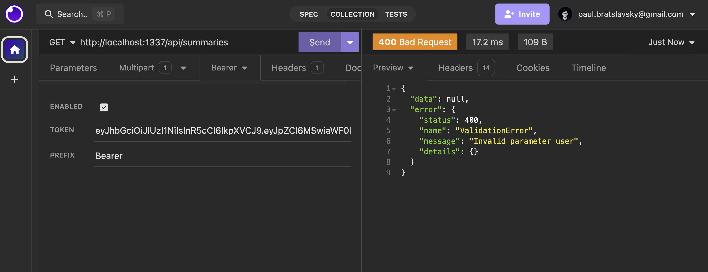

This fails because, in our middleware, we are trying to filter on the user.

```js
if (!entryId) {
  ctx.query = {
    ...ctx.query,
    filters: { ...ctx.query.filters, user: userId },
  };
}
```

But we can't access it unless we enable the user `find` permission in Strapi Admin. This will bring us one step closer but open up another issue we will handle.

But first, let's make the following change, save, and try it out.

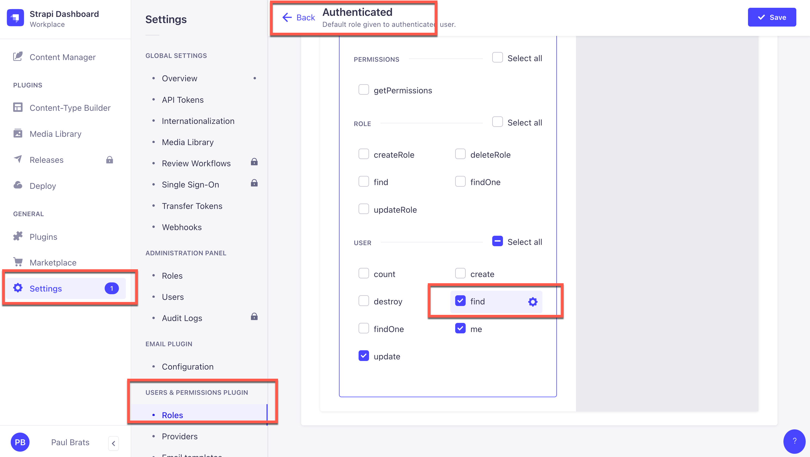

As you can see, our `is-owner` middleware is working.

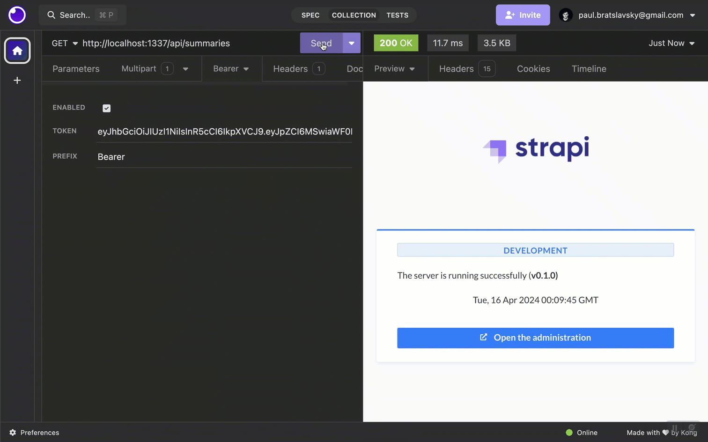

But we have another problem now. Let's see what it is and how to fix it.

## Protecting User Route Via Middleware

Since we enable `find` permission for the user, Let's see what happens when we make a `GET` request to the following endpoint: `/api/users.`

Oh no. We see all the users.

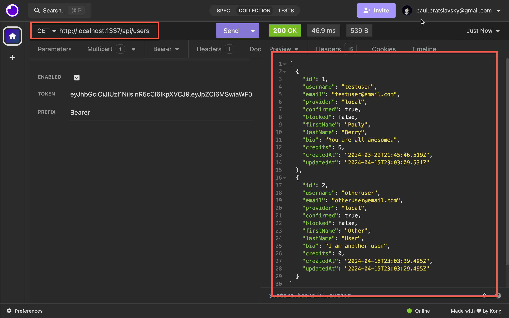

We need to apply middleware to the user permissions plugin. Since user permissions are one of our core routes that is not exposed like our API routes, we need to set the middleware programmatically.

We must cover this in the documentation, so I will request a PR. However, you can now use this blog post as a reference.

In Strapi, you can access the `register` function that programmatically injects you with functionality. You can read about it [here](https://docs.strapi.io/dev-docs/configurations/functions).

We are going to use it to inject our middleware.

First, let's create a new middleware via the CLI; I will call it `user-find-many.` We will add it to the root of our project.

```bash
➜  backend git:(main) ✗ yarn strapi generate
yarn run v1.22.19
$ strapi generate
? Strapi Generators middleware - Generate a middleware for an API
? Middleware name user-find-many
? Where do you want to add this middleware? Add middleware to root of project
✔  ++ /middlewares/user-find-many.js
✨  Done in 10.57s.
```

Our middleware is in the `src/middlewares/user-find-many.`

We will keep the code to hook everything up and see if we get the console log.

```js
"use strict";

/**
 * `user-find-many` middleware
 */

module.exports = (config, { strapi }) => {
  // Add your own logic here.
  return async (ctx, next) => {
    strapi.log.info("######### In user-find-many middleware. #########");

    await next();
  };
};
```

The first step to hooking up our middleware is to navigate to the `index.js` file in the `src` folder at the root of our Strapi project.

You should see the following code.

```js
"use strict";

module.exports = {
  /**
   * An asynchronous register function that runs before
   * your application is initialized.
   *
   * This gives you an opportunity to extend code.
   */
  register(/*{ strapi }*/) {},

  /**
   * An asynchronous bootstrap function that runs before
   * your application gets started.
   *
   * This gives you an opportunity to set up your data model,
   * run jobs, or perform some special logic.
   */
  bootstrap(/*{ strapi }*/) {},
};
```

We are going to make the following changes in the `register()` function.

```js
"use strict";

module.exports = {
  /**
   * An asynchronous register function that runs before
   * your application is initialized.
   *
   * This gives you an opportunity to extend code.
   */
  register({ strapi }) {
    // Getting all the users permissions routes
    const userRoutes =
      strapi.plugins["users-permissions"].routes["content-api"].routes;

    // Set the UUID for our middleware
    const isUserOwnerMiddleware = "global::user-find-many";

    // Find the route where we want to inject the middleware
    const findUser = userRoutes.findIndex(
      (route) => route.handler === "user.find" && route.method === "GET"
    );

    // helper function that will add the required keys and set them accordingly
    function initializeRoute(routes, index) {
      routes[index].config.middlewares = routes[index].config.middlewares || [];
      routes[index].config.policies = routes[index].config.policies || [];
    }

    // Check if we found the find one route if so push our middleware on to that route
    if (findUser) {
      initializeRoute(userRoutes, findUser);
      userRoutes[findUser].config.middlewares.push(isUserOwnerMiddleware);
    }

    // Should see the console log of our modified route
    console.log(userRoutes[findUser], "userRoutes[findUser]");
  },

  /**
   * An asynchronous bootstrap function that runs before
   * your application gets started.
   *
   * This gives you an opportunity to set up your data model,
   * run jobs, or perform some special logic.
   */
  bootstrap(/*{ strapi }*/) {},
};
```

When you restart your Strapi app, you should see the following console log.

```bash
✔ Building build context (54ms)
✔ Creating admin (6179ms)
⠹ Loading Strapi{
  method: 'GET',
  path: '/users',
  handler: 'user.find',
  config: { prefix: '', middlewares: [ 'global::user-find-many' ], policies: [] }
} userRoutes[findUser]
```

Before continuing, here is a way to explore the Strapi API and see all the available methods.

Stop your Strapi application and start it up again with the following command.

```bash
yarn strapi console
```

It will start strapi with the interactive shell. Type `strapi` and press enter. You should see a long list of all the available methods and objects.

Now, type this `strapi. plugins["users-permissions"].routes["content-api"].routes`.

This is the command in our `register` function we used to get all the routes associated with the `users-permission` plugin.

There is a lot to cover here; if you have any questions, feel free to ask in this post's comments.

Now that we have added our middleware to our `find` route in the user permissions plugin let's run the previous request in the postman and see if we can get our console log within our `user-find-many` middleware.

```bash
To access the server ⚡️, go to:
http://localhost:1337

[2024-04-15 19:49:49.275] info: ######### In user-find-many middleware. #########
[2024-04-15 19:49:49.278] http: GET /api/users (24 ms) 200

```

Excellent. Now that we can see our console let's update our middleware accordingly. In our case, we will check if the user making the request is the same user; if so, we will only return that user's data.

Let's replace the code in our `user-find-many.js` file with the following.

```js
"use strict";

/**
 * `user-find-many-owner` middleware
 */

module.exports = (config, { strapi }) => {
  // Add your own logic here.
  return async (ctx, next) => {
    strapi.log.info("In user-find-many-owner middleware.");

    const currentUserId = ctx.state?.user?.id;

    if (!currentUserId) {
      strapi.log.error("You are not authenticated.");
      return ctx.badRequest("You are not authenticated.");
    }

    ctx.query.filters.id = currentUserId;

    await next();
  };
};
```

Now, let's try our request once more in **Insomnia**.

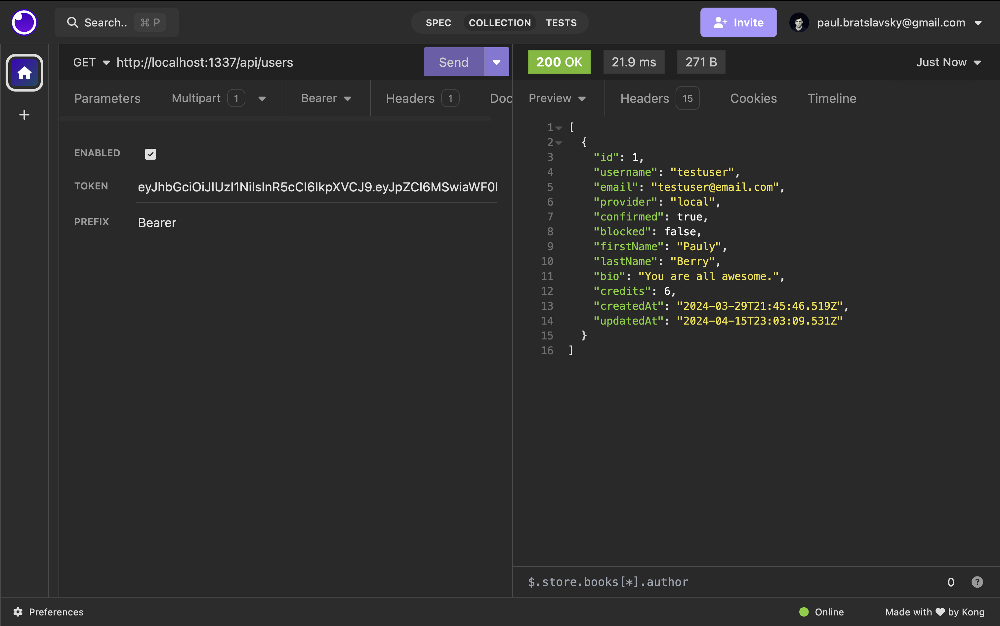

Nice. We are now **ONLY** getting one user, and it is the logged-in user. So, there is no way to get any other user's data.

And when we check our front end. We are only getting that user's summaries.

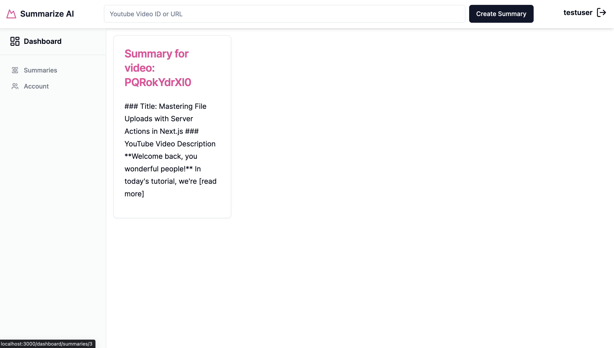

Now, let's test our update and delete.

In our current implementation, we should only be able to update and delete our summaries.

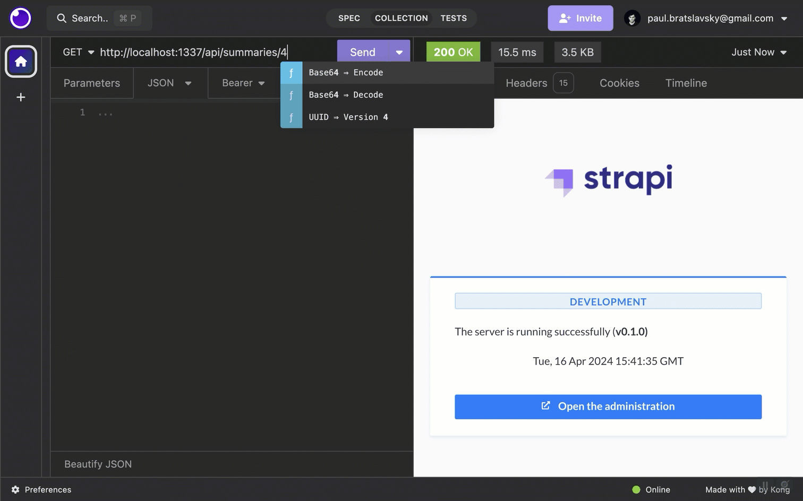

Nice. We now have one more issue to handle.

In our admin area, we are updating users' images and bios.

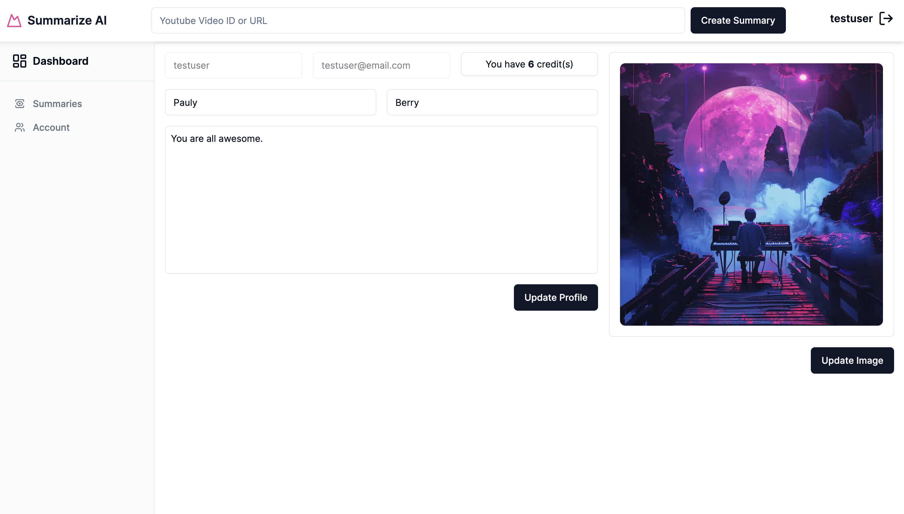

Currently, we have the following permissions set for our users.

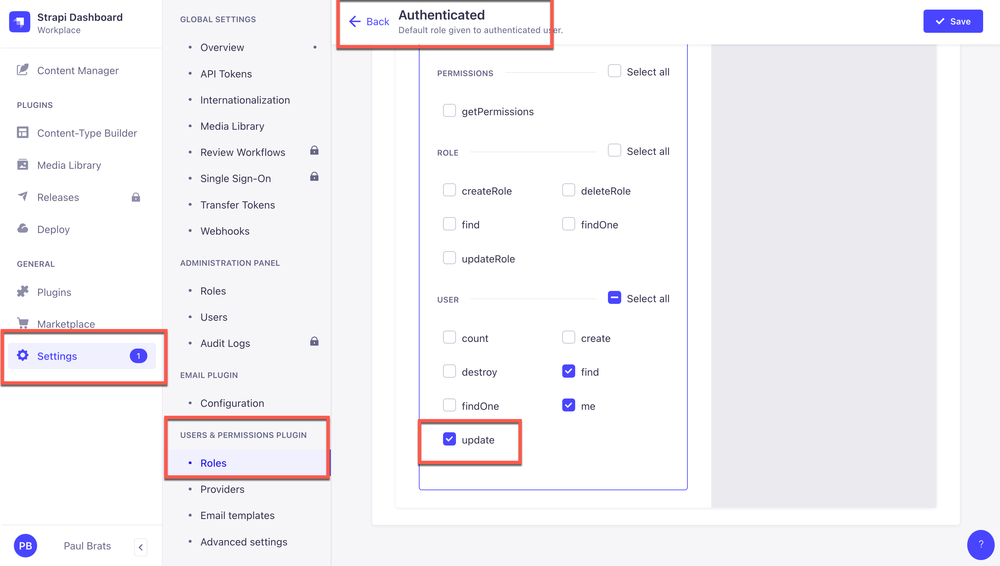

Since we need a middleware to check if the user is updating their content, we will have the following issues.

Suppose I authenticated to the following endpoint but passed other users' IDs. In that case, I can update their con, which differs from our intended use case. So, let's create another middleware that allows users to update their own content only.

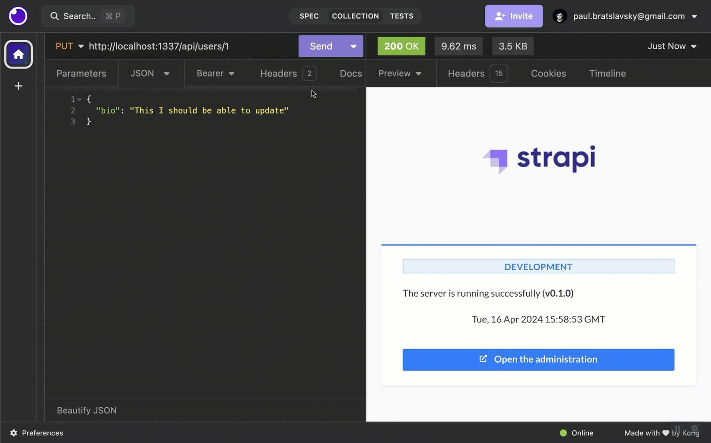

In the previous section, we discussed how to use the strapi generate command, but in this example, we will create it directly.

Let's first navigate to our middlewares folder, which is found in `src/middlewares,` and create a new file called `user-can-update.js.`

We will add the following code with our logic.

```js
"use strict";
const _ = require("lodash");

/**
 * `user-can-update` middleware
 */

module.exports = (config, { strapi }) => {
  // Add your own logic here.
  return async (ctx, next) => {
    strapi.log.info("In user-can-update middleware.");

    console.log("ctx", ctx.req.body);

    // use lodash pick

    if (!ctx.state?.user) {
      strapi.log.error("You are not authenticated.");
      return ctx.badRequest("You are not authenticated.");
    }

    const params = ctx.params;
    const currentUserId = ctx.state?.user?.id;
    const requestedUserId = params?.id;

    console.log("params", ctx);

    console.log("currentUserId", Number(currentUserId));
    console.log("requestedUserId", Number(requestedUserId));

    if (!requestedUserId) {
      strapi.log.error("Missing user ID.");
      return ctx.badRequest("Missing or invalid user ID.");
    }

    if (Number(currentUserId) !== Number(requestedUserId)) {
      return ctx.unauthorized("You are not authorized to perform this action.");
    }

    ctx.request.body = _.pick(ctx.request.body, [
      "firstName",
      "lastName",
      "bio",
      "image",
    ]);

    await next();
  };
};
```

In the code above we are checking if userId and requested user Id match than we will continue, otherwise we will return the unauthorized message.

We are also using `lodash` to modify the body to only allow the user to change `firstName`, `lastName`, `bio`, and `image`.

Finally, let's reference this new middleware inside our register function, which is found in the src/index.js file.

We will add the following lines.

```js
const isUserCanUpdateMiddleware = "global::user-can-update";

// Find the route where we want to inject the middleware
const updateUser = userRoutes.findIndex(
  (route) => route.handler === "user.update" && route.method === "PUT"
);

// Check if we found the find one route if so push our middleware on to that route
if (updateUser) {
  initializeRoute(userRoutes, updateUser);
  userRoutes[updateUser].config.middlewares.push(isUserCanUpdateMiddleware);
}
```

The completed `register` file should look like the following.

```js
  register({ strapi }) {
    // Getting all the users permissions routes
    const userRoutes =
      strapi.plugins["users-permissions"].routes["content-api"].routes;

    // Set the UUID for our middleware
    const isUserOwnerMiddleware = "global::user-find-many";
    const isUserCanUpdateMiddleware = "global::user-can-update";

    // Find the route where we want to inject the middleware
    const findUser = userRoutes.findIndex(
      (route) => route.handler === "user.find" && route.method === "GET"
    );

    // Find the route where we want to inject the middleware
    const updateUser = userRoutes.findIndex(
      (route) => route.handler === "user.update" && route.method === "PUT"
    );

    // helper function that will add the required keys and set them accordingly
    function initializeRoute(routes, index) {
      routes[index].config.middlewares = routes[index].config.middlewares || [];
      routes[index].config.policies = routes[index].config.policies || [];
    }

    // Check if we found the find one route if so push our middleware on to that route
    if (findUser) {
      initializeRoute(userRoutes, findUser);
      userRoutes[findUser].config.middlewares.push(isUserOwnerMiddleware);
    }

    // Check if we found the find one route if so push our middleware on to that route
    if (updateUser) {
      initializeRoute(userRoutes, updateUser);
      userRoutes[updateUser].config.middlewares.push(isUserCanUpdateMiddleware);
    }

    // Should see the console log of our modified route
    console.log(userRoutes[findUser], "userRoutes[findUser]");
  },

```

Here is an excellent console command in your terminal to list all the available middleware.

```bash
yarn strapi middlewares:list
```

This is helpful if you want to look up the UUID for your newly created middleware.

You should see a similar output when running the above command.

```bash

┌─────────────────────────────────────┐
│ Name                                │
├─────────────────────────────────────┤
│ admin::rateLimit                    │
├─────────────────────────────────────┤
│ admin::data-transfer                │
├─────────────────────────────────────┤
│ global::is-owner                    │
├─────────────────────────────────────┤
│ global::user-can-update             │
├─────────────────────────────────────┤
│ global::user-find-many              │
├─────────────────────────────────────┤
│ strapi::compression                 │
├─────────────────────────────────────┤
More items...

```

Now that we have our `user-can-update` middleware let's try to update the wrong user again.


Nice. We did it.

## Conclusion

This tutorial covered essential aspects of CRUD operations and permission handling in Next.js 14 using Strapi as our backend.

Starting with a basic understanding of CRUD—Create, Read, Update, and Delete—we implemented these operations with Strapi's HTTP methods and routes.

We then focused on security, emphasizing the importance of managing authenticated requests with JWT tokens via custom middleware to ensure that users are authorized to interact with their data by verifying user permissions before allowing data manipulation.

This approach enhances both the security and manageability of the application.

This post scratches the surface, but it should be a great starting point for anyone looking to dive deeper into Strapi middleware, especially as it relates to using the `users-permission` plugin.

We hope you enjoyed the content. We will see you in the next one, where we will cover pagination and search in Next.js.
