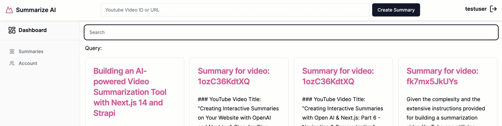
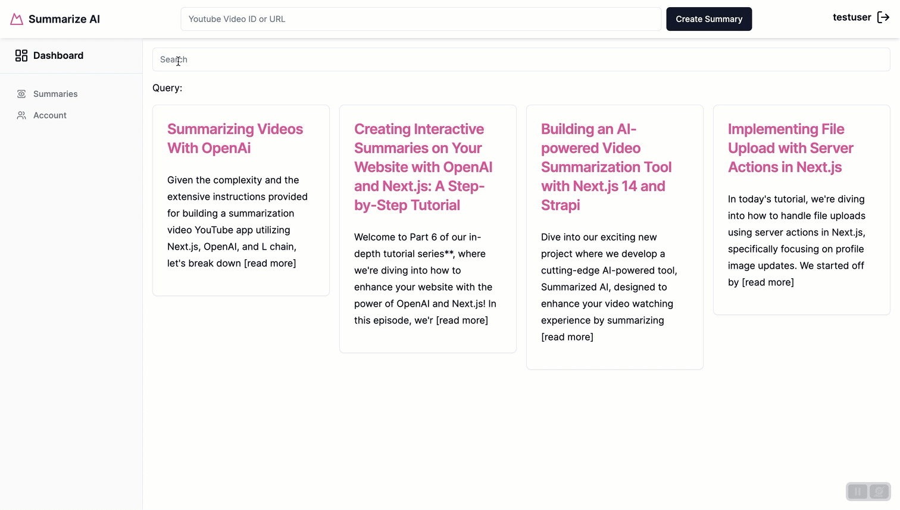

# Epic Next JS 14 Tutorial Part 8: Search and Pagination.

We are making amazing progress, we are now in the final stretch, in this section we will take a look at Search and Pagination.


## How To Handle Search In Next.js

Let's jump right in and taka a look at how to implement search with Next.js and Strapi.

First, let's create a new file inside of our `src/components/custom` folder called `Search.tsx` and add the following code.

```tsx
"use client";
import { usePathname, useRouter, useSearchParams } from "next/navigation";
import { useDebouncedCallback } from "use-debounce";
import { Input } from "@/components/ui/input";

export function Search() {
  const searchParams = useSearchParams();
  const { replace } = useRouter();
  const pathname = usePathname();

  const handleSearch = useDebouncedCallback((term: string) => {
    console.log(`Searching... ${term}`);
    const params = new URLSearchParams(searchParams);
    params.set("page", "1");

    if (term) {
      params.set("query", term);
    } else {
      params.delete("query");
    }

    replace(`${pathname}?${params.toString()}`);
  }, 300);

  return (
    <div>
      <Input
        type="text"
        placeholder="Search"
        onChange={(e) => handleSearch(e.target.value)}
        defaultValue={searchParams.get("query")?.toString()}
      />
    </div>
  );
}
```

The secret to understanding how our **Search** component works is to be familiar with the following hooks from Next.js.

**useSearchParams** [docs reference](https://nextjs.org/docs/app/api-reference/functions/use-search-params) It is a Client Component hook that lets you read the current URL's query string.

We are using it in our code to get our current parameters from our url.

Then, we use new `URLSearchParams` to update our search parameters. You can learn more about it [here](https://developer.mozilla.org/en-US/docs/Web/API/URLSearchParams).

**useRouter** [docs reference](https://nextjs.org/docs/pages/api-reference/functions/use-router) Allows us to access the router object inside any function component in your app. We will use the replace method to prevent adding a new URL entry into the history stack.

**usePathname** [docs reference](https://nextjs.org/docs/app/api-reference/functions/use-pathname) This is a Client Component hook that lets you read the current URL's pathname. We use it to find our current path before concatenating our new search parameters.

**useDebouncedCallback** [npm reference](https://www.npmjs.com/package/use-debounce) Used to prevent making an api call on every keystroke when using our Search component.

Make sure to install the `use-debounce` package from [npm](https://www.npmjs.com/package/use-debounce) with the following command.

```bash
yarn add use-debounce
```

Now, let's take a look at the flow of how our Search component works by looking at the following.

```tsx
return (
  <div>
    <Input
      type="text"
      placeholder="Search"
      onChange={(e) => handleSearch(e.target.value)}
      defaultValue={searchParams.get("query")?.toString()}
    />
  </div>
);
```

We are using the `defaultValue` prop to set the current search parameters from our URL.

When the `onChange` fires, we pass the value to our `handleSearch` function.

```tsx
const handleSearch = useDebouncedCallback((term: string) => {
  console.log(`Searching... ${term}`);
  const params = new URLSearchParams(searchParams);
  params.set("page", "1");

  if (term) {
    params.set("query", term);
  } else {
    params.delete("query");
  }

  replace(`${pathname}?${params.toString()}`);
}, 300);
```

Inside the `handleSearch` function, we use `replace` to set our new search parameters in our URL.

So whenever we type the query in our input field, it will update our URL.

Let's now add our Search component to our code.

Navigate to the `src/app/dashboard/summaries/page.tsx` file replace with the following code.

```tsx
import Link from "next/link";
import { getSummaries } from "@/data/loaders";
import { Search } from "@/components/custom/Search";

import { Card, CardContent, CardHeader, CardTitle } from "@/components/ui/card";

interface LinkCardProps {
  id: string;
  title: string;
  summary: string;
}

function LinkCard({ id, title, summary }: Readonly<LinkCardProps>) {
  return (
    <Link href={`/dashboard/summaries/${id}`}>
      <Card className="relative">
        <CardHeader>
          <CardTitle className="leading-8 text-pink-500">
            {title || "Video Summary"}
          </CardTitle>
        </CardHeader>
        <CardContent>
          <p className="w-full mb-4 leading-7">
            {summary.slice(0, 164) + " [read more]"}
          </p>
        </CardContent>
      </Card>
    </Link>
  );
}

interface SearchParamsProps {
  searchParams?: {
    query?: string;
  };
}

export default async function SummariesRoute({
  searchParams,
}: Readonly<SearchParamsProps>) {
  // this will gran our search params from the URL that we will pass to our getSummaries function
  const query = searchParams?.query ?? "";

  const { data } = await getSummaries();

  if (!data) return null;
  return (
    <div className="grid grid-cols-1 gap-4 p-4">
      <Search />
      <span>Query: {query}</span>
      <div className="grid grid-cols-1 sm:grid-cols-2 md:grid-cols-3 lg:grid-cols-4 gap-4">
        {data.map((item: LinkCardProps) => (
          <LinkCard key={item.id} {...item} />
        ))}
      </div>
    </div>
  );
}
```



Nice, now that our Search component is working, let's move on to the second part and pass our query search into our `getSummaries` function and update it accordingly to allow us to search our queries.

To make search work, we will rely on the following params.

**sorting**: we will sort all of our summaries in descending order, ensuring that the newest summary appear first.

**filters**: The filters we will use `$or` operator to combine our search conditions. This means the search will return summaries based on the fields we will filter on using `$containsi` which will ignore case sensitivity.

Let's take a look inside of our `src/data/loaders.ts` file and update the following code inside our our `getSummaries` function.

```ts
export async function getSummaries() {
  const url = new URL("/api/summaries", baseUrl);
  return fetchData(url.href);
}
```

Here are the changes we are going to make.

```ts
export async function getSummaries(queryString: string) {
  const query = qs.stringify({
    sort: ["createdAt:desc"],
    filters: {
      $or: [
        { title: { $containsi: queryString } },
        { summary: { $containsi: queryString } },
      ],
    },
  });
  const url = new URL("/api/summaries", baseUrl);
  url.search = query;
  return fetchData(url.href);
}
```

We are going to create a `query` that will filter our summaries on the `title` and `summary`.

Now, we have one more step before we can test out our search. Let's navigate back to `src/app/dashboard/summaries` folder and inside of our `page.tsx` file make the following changes.

Since we just updated our `getSummaries` function, we can not pass and utilize our query params.

```jsx
const { data } = await getSummaries(query);
```

Now let's see if our search is working.



Great now that our search is working we can move to implementing our pagination.

## How To Handle Pagination In Your Next.js Project

### Pagination Basics

Pagination involves dividing content into separate pages and providing users with controls to navigate to the first, last, previous, next, or a specific page.

This method not only improves performance by reducing the amount of data loaded at one time but also makes it easier for users to find specific information by browsing through a smaller subset of data.

Let's implement our pagination, but first, let's walk through the code example found bellow that we will use for our **PaginationComponent** inside of our Next.js project.

It is based on the Shadcn UI component that you can take a look at [here](https://ui.shadcn.com/docs/components/pagination);

So make sure to run the following command to get all the necessary dependencies.

```bash
npx shadcn-ui@latest add pagination
```

```tsx
"use client";
import { FC } from "react";
import { usePathname, useSearchParams, useRouter } from "next/navigation";

import {
  Pagination,
  PaginationContent,
  PaginationItem,
} from "@/components/ui/pagination";

import { Button } from "@/components/ui/button";

interface PaginationProps {
  pageCount: number;
}

interface PaginationArrowProps {
  direction: "left" | "right";
  href: string;
  isDisabled: boolean;
}

const PaginationArrow: FC<PaginationArrowProps> = ({
  direction,
  href,
  isDisabled,
}) => {
  const router = useRouter();
  const isLeft = direction === "left";
  const disabledClassName = isDisabled ? "opacity-50 cursor-not-allowed" : "";

  return (
    <Button
      onClick={() => router.push(href)}
      className={`bg-gray-100 text-gray-500 hover:bg-gray-200 ${disabledClassName}`}
      aria-disabled={isDisabled}
      disabled={isDisabled}
    >
      {isLeft ? "«" : "»"}
    </Button>
  );
};

export function PaginationComponent({ pageCount }: Readonly<PaginationProps>) {
  const pathname = usePathname();
  const searchParams = useSearchParams();
  const currentPage = Number(searchParams.get("page")) || 1;

  const createPageURL = (pageNumber: number | string) => {
    const params = new URLSearchParams(searchParams);
    params.set("page", pageNumber.toString());
    return `${pathname}?${params.toString()}`;
  };

  return (
    <Pagination>
      <PaginationContent>
        <PaginationItem>
          <PaginationArrow
            direction="left"
            href={createPageURL(currentPage - 1)}
            isDisabled={currentPage <= 1}
          />
        </PaginationItem>
        <PaginationItem>
          <span className="p-2 font-semibold text-gray-500">
            Page {currentPage}
          </span>
        </PaginationItem>
        <PaginationItem>
          <PaginationArrow
            direction="right"
            href={createPageURL(currentPage + 1)}
            isDisabled={currentPage >= pageCount}
          />
        </PaginationItem>
      </PaginationContent>
    </Pagination>
  );
}
```

Again, we are using our familiar hooks from before to make this work, `usePathname` and `searchParams`, `useRouter` in a similar way as we did before.

We are receiving `pageCount` via props to see our available pages. Inside the `PaginationArrow` component, we use `useRouter` to programmatically update our URL via the `push` method on click.

Let's add this component to our project, inside our our `components/custom` folder create a file called `PaginationComponent.tsx` and paste in the above code.

Now, that we have our component, let's navigate to `src/app/dashboard/summaries/page.tsx` and import it.

```tsx
import { PaginationComponent } from "@/components/custom/Pagination";
```

Now update our `SearchParamsProps` interface to the following.

```tsx
interface SearchParamsProps {
  searchParams?: {
    page?: string;
    query?: string;
  };
}
```

Now let's create a `currentPage` variable to store our current page that we get form our URL params.

```tsx
const currentPage = Number(searchParams?.page) || 1;
```

Now, we can pass our `currentPage` to our `getSummaries` function.

```tsx
const { data } = await getSummaries(query, currentPage);
```

Now, let's go back to our `loaders.tsx` file and update the `getSummaries` with the following code in order to utilize our pagination.

```tsx
export async function getSummaries(queryString: string, currentPage: number) {
  const PAGE_SIZE = 4;

  const query = qs.stringify({
    sort: ["createdAt:desc"],
    filters: {
      $or: [
        { title: { $containsi: queryString } },
        { summary: { $containsi: queryString } },
      ],
    },
    pagination: {
      pageSize: PAGE_SIZE,
      page: currentPage,
    },
  });
  const url = new URL("/api/summaries", baseUrl);
  url.search = query;
  return fetchData(url.href);
}
```

In the above example we are using Strapi's `pagination` fields and passing `pageSize` and `page` fields. You can learn more about Strapi's pagination [here](https://docs.strapi.io/dev-docs/api/rest/sort-pagination);

Now back in our `src/app/dashboard/summaries/page.tsx` let's make few more small changes before hooking everything up.

If we take a look our `getSummaries` call, we have access to another field that is being returned from Strapi called `meta`, let's make sure we are getting it from our response with the following.

```tsx
const { data, meta } = await getSummaries(query, currentPage);
console.log(meta);
```

If we console log our `meta` field we will see the following date.

```js
{ pagination: { page: 1, pageSize: 4, pageCount: 1, total: 4 } }
```

Notice that we have our `pageCount` property, we will use it tell our **PaginationComponent** the number of pages we have available.

So let's extract it from our `meta` data with the following.

```tsx
const pageCount = meta.pagination.pageCount;
```

And finally let's use our **PaginationComponent** with the following.

```tsx
<PaginationComponent pageCount={pageCount} />
```

The completed code should look like the following.

``` tsx
import Link from "next/link";
import { getSummaries } from "@/data/loaders";
import { Search } from "@/components/custom/Search";
import { PaginationComponent } from "@/components/custom/Pagination";

import { Card, CardContent, CardHeader, CardTitle } from "@/components/ui/card";

interface LinkCardProps {
  id: string;
  title: string;
  summary: string;
}

function LinkCard({ id, title, summary }: Readonly<LinkCardProps>) {
  return (
    <Link href={`/dashboard/summaries/${id}`}>
      <Card className="relative">
        <CardHeader>
          <CardTitle className="leading-8 text-pink-500">
            {title || "Video Summary"}
          </CardTitle>
        </CardHeader>
        <CardContent>
          <p className="w-full mb-4 leading-7">
            {summary.slice(0, 164) + " [read more]"}
          </p>
        </CardContent>
      </Card>
    </Link>
  );
}

interface SearchParamsProps {
  searchParams?: {
    page?: string;
    query?: string;
  };
}

export default async function SummariesRoute({
  searchParams,
}: Readonly<SearchParamsProps>) {
  const query = searchParams?.query ?? "";
  const currentPage = Number(searchParams?.page) || 1;

  const { data, meta } = await getSummaries(query, currentPage);
  const pageCount = meta.pagination.pageCount;

  if (!data) return null;
  return (
    <div className="grid grid-cols-1 gap-4 p-4">
      <Search />
      <div className="grid grid-cols-1 sm:grid-cols-2 md:grid-cols-3 lg:grid-cols-4 gap-4">
        {data.map((item: LinkCardProps) => (
          <LinkCard key={item.id} {...item} />
        ))}
      </div>
      <PaginationComponent pageCount={pageCount} />
    </div>
  );
}

```

Now, the moment of truth, let's see if it works, make sure you add more summaries since our page size is currently set to 4 items. So you need to have at least 5 items.


Nice, it is working.

## Conclusion

In this Next.js tutorial we covered how to implement search and pagination functionalities. Hope you enjoying this tutorial.  

We are almost done, we have two more sections to go, deploying our project to Strapi Cloud and Vercel.

See you in the next post.

